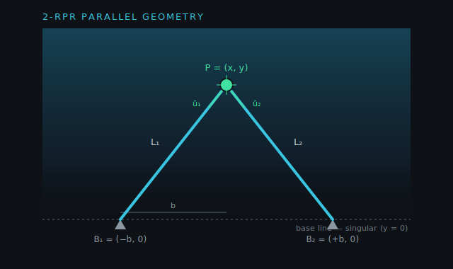

# 1 · Kinematics & the Math of Motion

This is the heart of the machine: how we know *where the platform is*, and how we
turn "go there" into "make each cylinder this long." A **parallel** mechanism does
this very differently from a robot arm, and the math is worth understanding
properly because everything else — control, pressure, singularities — builds on
it.

---

## 1.1 What "parallel" means

A serial robot arm is a chain: joint, link, joint, link. Each joint moves one part
of the arm, and they stack. A **parallel** machine instead connects the moving
platform to the fixed base through **several legs at once**, all acting together.

In this testbed the legs are **hydraulic cylinders** that change length. Because
several cylinders share the load, parallel machines are stiff and strong for their
weight — but they pay for it with a more tangled relationship between leg lengths
and platform pose, and with **singularities** (Section 1.6).

Two configurations:

- **2-DOF (the midterm machine):** two cylinders, platform position `(x, y)`. This
  is a planar **2-RPR** mechanism (R = revolute base joint, P = prismatic/sliding
  cylinder, R = revolute platform joint).
- **3-DOF (the final machine):** three cylinders, platform pose `(x, y, θ)` —
  position *and* orientation. A planar **3-RPR**.



> ▶ **Interactive:** [**Kinematics Explorer**](demos/kinematics-explorer.html) —
> drag the platform and watch the leg lengths, the Jacobian determinant,
> manipulability, and the singularity update live over a real dexterity heatmap.
> It's the rest of this chapter, made tangible.

---

## 1.2 Inverse kinematics — pose → leg lengths (the easy direction)

Inverse kinematics (IK) answers: *given where I want the platform, how long must
each leg be?* For parallel machines this is the **easy** direction — it's a direct
calculation, no iteration.

**2-DOF.** Put the base anchors symmetric about the origin:

```
B1 = (−b, 0)        B2 = (+b, 0)        b = half the base spacing
```

A leg's length is just the distance from its anchor to the platform point
`P = (x, y)`:

```
L1 = | P − B1 | = √[ (x + b)² + y² ]
L2 = | P − B2 | = √[ (x − b)² + y² ]
```

That's it. Any reachable platform position gives exactly one pair of leg lengths.

**3-DOF.** Now the platform can rotate, so each leg attaches to a point that moves
*with* the platform. If leg `i` attaches at body-frame point `p_i`, its world
position after the platform moves to `(x, y, θ)` is:

```
P_i = (x, y) + R(θ) · p_i           where  R(θ) = [ cos θ  −sin θ ]
                                                  [ sin θ   cos θ ]
L_i = | P_i − B_i |
```

`R(θ)` rotates the attachment point by the platform angle; then it's the same
distance formula. Still a direct calculation.

> **In the code:** the kinematics solver's `ik()` method (2-DOF closed-form, 3-DOF Newton).

---

## 1.3 Forward kinematics — leg lengths → pose (the hard direction)

Forward kinematics (FK) answers the reverse: *given the measured leg lengths,
where is the platform?* For parallel machines this is the **hard** direction.

**2-DOF (closed form).** We have two circle equations:

```
L1² = (x + b)² + y²
L2² = (x − b)² + y²
```

Subtract the second from the first. The `y²` cancels, and `(x+b)² − (x−b)² = 4bx`:

```
L1² − L2² = 4 b x        →        x = (L1² − L2²) / (4 b)
```

Then back-substitute for `y`:

```
y = √[ L1² − (x + b)² ]          (take the positive root — platform above the base)
```

Two circles can meet at two points; we keep the upper one. Clean and exact.

**3-DOF (iterative).** Three legs, three unknowns `(x, y, θ)`, three nonlinear
length equations. There's no tidy closed form, so we solve it numerically with
**Newton's method**: start from a guess (the previous pose makes an excellent
"warm start"), linearize, step, repeat until the leg-length residuals vanish.
Because we always have a recent pose to start from, this converges in a handful of
iterations.

> **In the code:** `fk()`. The 2-DOF version is algebraic; the 3-DOF version runs
> Newton iterations using the Jacobian from Section 1.4. Tested by
> The automated tests check "FK(IK(P)) round-trip < 1e-9" (2-DOF) and "< 1e-7" (3-DOF)
> — i.e. going pose → lengths → pose returns the original pose.

---

## 1.4 The Jacobian — relating *motion* of platform and legs

Knowing positions isn't enough for control; we need to relate **velocities**: if
the platform moves a little, how fast does each leg change length? That
relationship is the **Jacobian** `J`.

Start from the squared length, `L_i² = (P − B_i) · (P − B_i)`, and differentiate:

```
2 L_i · L̇_i = 2 (P − B_i) · Ṗ
L̇_i = û_i · Ṗ              where  û_i = (P − B_i) / L_i   is the unit leg vector
```

So the rate of change of a leg's length is simply the platform velocity
**projected onto that leg's direction**. Stacking all legs:

```
L̇ = J · q̇          J's row i = û_iᵀ   (2-DOF)
```

For **3-DOF**, platform motion includes rotation, so each row gains a third term
for how rotating the platform stretches that leg:

```
J row i = [ û_ix ,  û_iy ,  û_i · (E · R(θ) · p_i) ]      E = [ 0  −1 ]
                                                              [ 1   0 ]
```

The `E·R·p_i` term is the velocity of attachment point `i` due to a unit rotation
rate — the moment arm of the leg about the platform centre.

> **In the code:** `jacobian()`. Verified against a finite-difference Jacobian in
> The automated tests ("Jacobian == finite-difference") confirm the analytic matrix
> matches a numerical one to 1e-5.

### Why the Jacobian is the workhorse

It runs in both directions and ties together three things the controller needs:

```
velocity:   L̇ = J q̇          and        q̇ = J⁻¹ L̇
force:      F = Jᵀ f          and        f  = J⁻ᵀ F
```

- **Velocity:** convert a desired platform velocity into leg-speed commands
  (`q̇ → L̇`), or estimate platform velocity from leg speeds (`L̇ → q̇`).
- **Force (from virtual work):** a set of leg forces `f` produces platform wrench
  `F = Jᵀ f`; conversely, to make the platform exert force `F` you need leg forces
  `f = J⁻ᵀ F`. This is how the simulator turns the platform's load (gravity,
  acceleration, external force) into the pressure each cylinder must supply — see
  [Hydraulic Design §2.5](02-hydraulic-design.md#25-load-pressure).

---

## 1.5 Manipulability — one number for "how healthy is this pose"

Both inversions above need `J⁻¹` (or `J⁻ᵀ`). When `J` is close to non-invertible,
those inversions blow up — small leg errors cause huge pose errors, and required
forces skyrocket. **Manipulability `w`** measures how far you are from that cliff.

For the 2-DOF machine it has a beautifully simple closed form. With
`û_1 = ((x+b)/L1, y/L1)` and `û_2 = ((x−b)/L2, y/L2)`, the determinant of `J` is:

```
det(J) = û_1 × û_2 = (x+b)/L1 · y/L2 − y/L1 · (x−b)/L2
       = y · [ (x+b) − (x−b) ] / (L1 L2)
       = 2 b y / (L1 L2)
```

So `det(J) = 2by / (L1·L2)`. Read it: manipulability is **proportional to the
platform height `y`**. High up, the machine is dexterous; as the platform
approaches the base line (`y → 0`), `det(J) → 0` and it goes singular. That dark
band along the bottom of the on-screen heatmap *is* this equation.

For 3-DOF, `w` comes from the singular values of the 3×3 Jacobian (it can't be a
one-liner), but it means the same thing: `w → 0` signals a singularity.

> ▶ **Interactive:** in the [Kinematics Explorer](demos/kinematics-explorer.html),
> drag the platform straight down toward the base line and watch `det(J)` and `w`
> collapse to zero — the equation above, live.

> **In the code:** `manipulability()`. The workspace heatmap samples it
> across the workspace; the automated tests assert "heatmap shows base-line dead zone."

---

## 1.6 Singularities — where a degree of freedom vanishes

A **singularity** is a pose where the mechanism instantaneously **loses control of
a direction of motion**. At such a pose:

- The Jacobian is non-invertible (`det J = 0`, `w = 0`).
- Some platform motion becomes impossible no matter how the legs move, **or** the
  platform can twitch even with the legs locked.
- Required leg forces/pressures for an ordinary load tend toward infinity.

For the 2-DOF machine the singular locus is the **base line** `y = 0`: there, both
legs pull horizontally and neither can produce vertical motion. The 3-DOF
`singular_3rpr_diamond` preset is a geometry chosen to be singular whenever
`θ = 0`, which is why the rotation axis becomes uncontrollable there — a vivid
lesson in *why geometry choice matters*.

Designers keep the **usable workspace away from singularities**. The simulator
flags them at two levels — `NEAR_SINGULAR` (a warning band) and `SINGULAR`
(`w` essentially zero) — so you can see the danger zone before you reach it.

---

## 1.7 Reachability — staying out of NaN territory

Not every commanded pose is physically possible. A leg can only be between its
**minimum and maximum length** (closed length to closed-plus-stroke), and the FK
square-root must have a non-negative argument. Before trusting any pose the code
checks:

```
L_min ≤ L_i ≤ L_max        for every leg          (stroke limits)
and the platform lies in the legs' common reachable region
```

If a target fails these tests it's flagged `UNREACHABLE` and the platform holds at
the boundary instead of producing `NaN`. (the automated tests check "FK no-intersection
→ ok:false," "never emits NaN.")

---

## 1.8 Worked example — locating the platform and moving the cylinders

Let's make it concrete with the 2-DOF defaults: base half-spacing **b = 0.6 m**
(1.2 m spacing), cylinders with closed length 0.4 m and 0.6 m stroke, so each leg
length lives in **[0.4 m, 1.0 m]**.

**Where are the legs when the platform is at P₀ = (0, 0.70)?** (IK)

```
L1 = √[ (0 + 0.6)² + 0.70² ] = √[0.36 + 0.49] = √0.85 = 0.922 m
L2 = √[ (0 − 0.6)² + 0.70² ] = √[0.36 + 0.49] = √0.85 = 0.922 m   (symmetric)
strokes: s = L − 0.4 = 0.522 m   (inside the 0.6 m range ✓)
```

**Now command a move to P₁ = (0.10, 0.70).** (IK again)

```
L1' = √[ (0.10 + 0.6)² + 0.70² ] = √[0.49 + 0.49] = √0.98 = 0.990 m
L2' = √[ (0.10 − 0.6)² + 0.70² ] = √[0.25 + 0.49] = √0.74 = 0.860 m

ΔL1 = +0.068 m   → cylinder 1 must EXTEND 68 mm
ΔL2 = −0.062 m   → cylinder 2 must RETRACT 62 mm
```

To shift the platform 100 mm sideways, one cylinder extends and the other
retracts — they cooperate. **This is the parallel machine's signature: every
platform move is a coordinated change of all legs**, computed exactly by IK.

**How long does the move take?** Using the cylinder speeds derived in
[Hydraulic Design §2.3](02-hydraulic-design.md#23-flow-and-speed) (extend ≈
0.20 m/s, retract ≈ 0.28 m/s at rated flow):

```
cylinder 1 (extend):  0.068 m ÷ 0.20 m/s ≈ 0.34 s
cylinder 2 (retract): 0.062 m ÷ 0.28 m/s ≈ 0.22 s
```

They'd finish at *different times* if run open-loop — a direct consequence of the
area asymmetry φ — which is exactly why we need the closed-loop controller of
[Document 3](03-control-system.md) to keep them coordinated.

**Health check — manipulability at P₁:**

```
w ∝ det(J) = 2 b y / (L1' L2') = 2 · 0.6 · 0.70 / (0.990 · 0.860) = 0.84 / 0.851 ≈ 0.987
```

A healthy, dexterous pose (well away from the `y = 0` singularity). Drag the same
target down toward `y = 0.05` and recompute — you'll watch `w` collapse, which is
precisely what the on-screen readout shows.

---

**Next:** [Hydraulic Design & Calculations →](02-hydraulic-design.md) — how those
leg-length commands become oil flow, pressure, and force.
