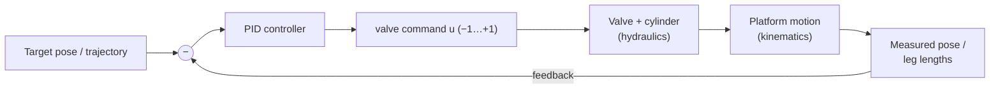

# 3 · The Control System

The kinematics tell us *what* leg lengths we need; the hydraulics tell us *how*
oil produces motion. The control system is what closes the gap between them every
fraction of a second: it measures where the platform actually is, compares it to
where it should be, and computes the valve command **u** that drives the error to
zero.

---

## 3.1 The closed loop



Everything to the right of the controller is "the plant" — the physical machine.
The controller's only job is to choose `u` so that **measured** tracks
**commanded**. It runs at a fixed rate (a fixed timestep `dt`), which keeps the
behaviour deterministic and repeatable — the same inputs always give the same
output (verified by the automated tests: "deterministic: identical pose after
same steps").

---

## 3.2 PID — the core law

The controller is a **PID** loop. For each controlled quantity it forms an error
`e = commanded − measured` and computes:

```
u = Kp · e  +  Ki · ∫e dt  +  Kd · d(measurement)/dt
     │            │              │
  proportional  integral      derivative
  "push harder  "erase steady  "damp the approach,
   when far"     offsets"        prevent overshoot"
```

- **Kp (proportional)** — the main gain. Bigger = faster response, but too big
  causes overshoot and oscillation.
- **Ki (integral)** — accumulates past error to eliminate steady-state offset
  (e.g. a constant gravity sag the proportional term alone can't fully cancel).
- **Kd (derivative)** — adds damping, smoothing the approach to the target.

### Two refinements that matter on real machines

**Derivative on *measurement*, not error.** A naive `Kd · de/dt` produces a
violent "derivative kick" the instant you change the target (because the error
jumps). Differentiating the *measurement* instead gives identical damping without
the kick — standard practice on industrial controllers, and what this code does.

**Anti-windup.** When the valve is saturated (`|u|` already at its limit), the
integral term keeps accumulating error it can't act on — it "winds up," then
overshoots badly when the valve finally has authority again. The fix is to
**clamp the integrator** so it can't grow past a bound while saturated.

> Verified by the automated tests: "integrator stays within clamp under
> saturation."

---

## 3.3 Two ways to control a parallel machine

There are two philosophies for *what* the PID loops act on, and the testbed lets
you switch between them:

### Joint-space control
The controller targets **individual leg lengths**. IK converts the desired pose to
target lengths `L*`, and one PID loop per leg drives each `L_i → L*_i`.

```
pose target → IK → L*  →  per-leg PID  →  u_i
```

Simple and robust: each cylinder just chases its own setpoint. The platform
arrives because, by kinematics, the right lengths *are* the right pose.

### Task-space control
The controller targets the **pose directly** `(x, y, θ)`, computes the pose error,
and uses the **Jacobian** to translate that into leg commands:

```
pose error e_pose  →  L̇* = J · (Kp · e_pose)  →  u_i
```

This reasons in the coordinates you actually care about (where the platform is),
which can give cleaner coordinated motion — at the cost of needing `J` every step
and behaving worse near singularities (where `J` misbehaves).

> Both are tested to converge: "2DOF joint-space converges (<2 mm)," "task-space
> converges (<5 mm)," "3DOF joint-space converges (<5 mm/rad)."

---

## 3.4 Feedforward — beating the lag on moving targets

Pure feedback is always *reactive*: it can only respond **after** an error
appears. So when the target is moving (a circle, a path), the platform
perpetually lags behind it.

**Feedforward** fixes this by adding the command we already know the motion
requires, *before* the error shows up:

```
u = feedforward(desired motion)  +  feedback(PID on remaining error)
```

The feedforward term supplies most of the command; the PID then only has to clean
up the small residual. On the `F3 — Trajectory tracking` assignment you can watch
the lag shrink dramatically when feedforward is switched on — the actual circle
snaps onto the commanded circle.

---

## 3.5 From controller to valve

The controller's output is the normalized command **u ∈ [−1, +1]**. In the
simulator this feeds straight into the valve flow law of
[Hydraulics §2.4](02-hydraulic-design.md#24-the-valve-controlling-the-flow). On
real hardware, `u` becomes an electrical signal to the valve driver:

```
u = +1   →   full extend   →   e.g. +10 V  / 20 mA  / 100% PWM duty
u =  0   →   neutral        →   e.g.   0 V  / 12 mA  /  50% PWM duty
u = −1   →   full retract   →   e.g. −10 V  /  4 mA  /   0% PWM duty
```

How that voltage/current/duty is physically wired and amplified is the subject of
[Document 4](04-electrical-and-control-wiring.md).

---

## 3.6 Discretization & update rate

The loop runs on a **fixed timestep** `dt`. Integrals become running sums and
derivatives become differences:

```
∫e dt   ≈   Σ e · dt           (accumulate each step)
de/dt   ≈   (e_now − e_prev) / dt
```

The update rate matters: too slow and the controller "sees" the machine only
intermittently, inviting instability; fast enough and it behaves like the
continuous ideal. Hydraulic position loops on real rigs typically run at **0.5–2
kHz**. The fixed-step design also makes the simulator reproducible — essential for
grading, where the same submission must always score the same.

---

## 3.7 A practical tuning procedure

The `M3 — Tuning trade-off` assignment is built around this. A reliable manual
recipe:

1. **Zero Ki and Kd.** Work with proportional only first.
2. **Raise Kp** until the response is fast and just begins to overshoot or ring.
3. **Add Kd** to damp that overshoot — increase until the ringing is gone.
4. **Add a little Ki** only if a steady-state offset remains (e.g. constant sag);
   keep it small to avoid sluggish, oscillatory windup behaviour.
5. **Re-check across the workspace** — gains good near the centre may be too hot
   near a singularity, where the plant gain changes. Verify at several poses.

The trade-off is fundamental: **fast response and low overshoot pull in opposite
directions**, and good tuning is the narrow band that satisfies both. That's why
the assignment demands settling time *and* overshoot limits simultaneously.

> ▶ **Interactive:** [**PID Tuning**](demos/pid-tuning.html) — drag Kp, Ki, and Kd
> and watch the step response redraw instantly, with live overshoot and settling
> readouts. Try the *too slow → too hot → well tuned* presets to feel the
> trade-off this section describes.

---

**Next:** [Electrical & Control Wiring →](04-electrical-and-control-wiring.md) —
turning these signals into real wires, sensors, and drivers.
