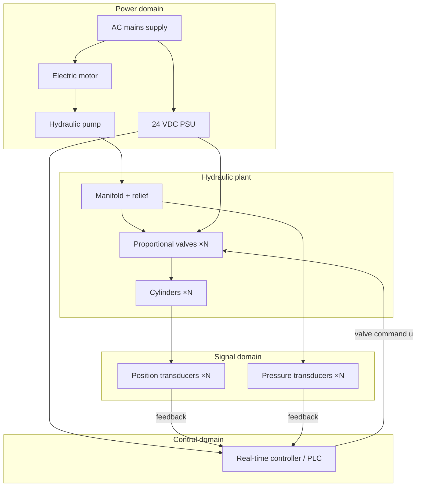
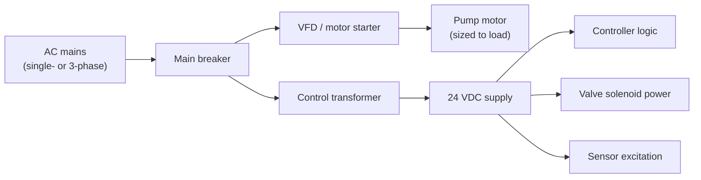
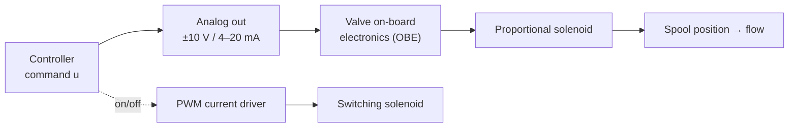
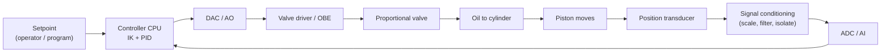

# 4 · Electrical & Control Wiring

The simulator works in clean abstractions: a command `u`, a load pressure
`p_load`, a stroke `s`. This document grounds those abstractions in **real
hardware** — the motors, sensors, valve drivers, controller, and wiring you would
actually assemble to build the machine. It's the bridge from "electrohydraulic in
principle" to "electrohydraulic on a bench."

> This is descriptive engineering, not a certified schematic. A real build must
> follow local electrical and machine-safety codes and a qualified review.

---

## 4.1 System overview

An electrohydraulic motion axis has three electrical domains: **power** (moves the
oil and the loads), **signal** (sensors reporting reality), and **control** (the
brain deciding valve commands). They meet at the controller.

The closed loop is the path **cylinder → position transducer → controller → valve
→ cylinder**. Everything else exists to power, protect, or inform that loop.

---

## 4.2 Power distribution

- **Pump motor.** Sized from the hydraulic power need. [Hydraulics §2.6](02-hydraulic-design.md#26-the-pump-and-the-relief-valve)
  found ≈ 9.6 kW of hydraulic power at full flow and pressure for *this* full-scale
  example; allowing for pump and motor efficiency (~80%), a motor of roughly that
  rating is appropriate. A variable-speed drive lets you vary pump speed (and thus
  flow) for efficiency.

!!! note "The power stage is a design choice — not a fixed 400 V / 3-phase assumption"
    The numbers above size *one* industrial-scale rig, which is why it lands on a
    large three-phase motor. **The control loop does not care how the pump is driven.**
    Pick the power stage to match your build:

    - **Bench / teaching rig (fractional to a few kW):** a single-phase AC motor, or a
      DC / brushless-DC motor from a low-voltage supply, driving a small gear or vane
      pump. Common for a 2-DOF demonstrator.
    - **Mid-size (a few to ~10 kW):** single- or three-phase induction motor on a
      variable-frequency drive (VFD), or a servo-pump.
    - **Large / industrial (≳ 10 kW):** three-phase induction or servo motor on a VFD,
      typically 400 V (Europe) or 480 V (North America).

    Whatever the motor and voltage, everything downstream of the pump — the manifold,
    valves, sensors, the controller, and the **PID logic from [Module 3](module03/index.md)** —
    is identical. The power stage only sets how much flow and pressure you can deliver.
- **24 VDC control supply.** Separate, regulated, for controller logic, valve
  electronics, and sensor excitation. Keeping control power isolated from the
  motor drive limits electrical noise into the sensitive signal domain.
- **Grounding & isolation.** Power and signal grounds are kept separate and joined
  at a single star point; sensor cables are shielded; the VFD output is the main
  noise source and is routed away from signal wiring.

---

## 4.3 Sensors — measuring reality

The controller can only close the loop on what it can measure. Two quantities
matter most:

### Position feedback (one per cylinder) — the critical sensor
This is what the position loop runs on. Common choices:

| Sensor | Output | Notes |
|--------|--------|-------|
| **Magnetostrictive linear transducer** (e.g. Temposonics-style) | analog 0–10 V / 4–20 mA, or digital **SSI** | absolute, robust, fits inside the cylinder — the industrial default |
| **LVDT** | analog AC → conditioned DC | very precise over short strokes |
| **Linear potentiometer** | analog 0–10 V | cheap; good for a teaching rig |
| **Draw-wire encoder** | quadrature pulses | easy to retrofit externally |

The transducer reports the piston position, which the controller reads as the
measured stroke `s_i` (and hence leg length `L_i = L_closed + s_i`).

### Pressure feedback (per line)
Pressure transducers on the cap/rod lines (or the manifold) report load pressure,
typically as **4–20 mA** current loops (noise-immune over long cable runs). These
feed the over-pressure / load monitoring that the simulator models as `p_load`.

### Why 4–20 mA is common
A current loop is immune to voltage drop and picks up far less noise than a
voltage signal over a long cable — and **4 mA = live zero**, so a broken wire
(0 mA) is instantly distinguishable from a genuine zero reading.

---

## 4.4 Valve drivers — turning `u` into flow

The controller's command `u ∈ [−1, +1]` must become an electrical drive to the
valve. How depends on valve type (the three the simulator models):

- **Proportional / servo valve.** Most have **on-board electronics (OBE)** that
  accept a ±10 V or 4–20 mA command and internally regulate spool position
  (often with their own spool-position feedback). Map: `u = +1 → +10 V`,
  `u = 0 → 0 V`, `u = −1 → −10 V`. This is the smooth `proportional` model.
- **PWM-driven solenoid.** A current driver switches the solenoid with a
  **pulse-width-modulated** signal; the mechanical/hydraulic system averages the
  pulses. Map: `u → PWM duty`. This is the `pwm` model.
- **On/off solenoid DCV.** Simple digital outputs energize "extend" or "retract"
  solenoids fully — no metering, hence the deadband behaviour of the `bangbang`
  model. Drive via relay or solid-state digital outputs.

Solenoids are inductive loads: drivers include **flyback diodes** to clamp the
switch-off voltage spike, and current sensing for proportional valves so the
delivered current (and thus spool position) is regulated, not just commanded.

---

## 4.5 The controller and its I/O

The brain is a **real-time controller** — an industrial PLC/motion controller
(Beckhoff, B&R, Bosch Rexroth) for a production rig, or a microcontroller
(STM32, Teensy) for a low-cost teaching bench. Whatever the platform, it needs:

| I/O type | Count (per axis) | Purpose | Typical spec |
|----------|------------------|---------|--------------|
| **Analog input (AI)** | 1 position + 1 pressure | read transducers | 12–16-bit ADC, ±10 V / 4–20 mA |
| **Analog output (AO)** | 1 | proportional valve command | 12–16-bit DAC, ±10 V / 4–20 mA |
| **Digital output (DO)** | 1–2 | on/off solenoids, enable | 24 V, flyback-protected |
| **Digital input (DI)** | as needed | limit/pressure switches, E-stop status | 24 V |
| **PWM** | optional | PWM valve drive | sufficient frequency for the solenoid |

**Signal conditioning** sits between the field and the ADC: scaling (e.g. 4–20 mA
across a 250 Ω resistor → 1–5 V), low-pass anti-alias filtering, and **galvanic
isolation** so a fault in the power domain can't reach the controller.

The controller runs the loop of [Document 3](03-control-system.md) at a fixed rate
(0.5–2 kHz): read AIs → run IK + PID → write AO/PWM, every cycle.

---

## 4.6 The closed-loop wiring, end to end

Tracing one axis around the full electrical loop:

Read it as a continuous cycle: the CPU commands the valve through the DAC and
driver; oil moves the piston; the transducer measures the new position; the ADC
returns it to the CPU; the CPU recomputes the error and adjusts — thousands of
times per second.

---

## 4.7 The safety chain

Safety is mostly **hard-wired**, independent of software, so a controller crash
can't defeat it:

- **E-stop loop.** A series circuit of emergency-stop buttons that, when broken,
  de-energizes the pump motor contactor and dumps the valves to a safe state —
  wired in hardware, not just read by the controller.
- **Relief valve.** The hydraulic pressure cap ([Hydraulics §2.6](02-hydraulic-design.md#26-the-pump-and-the-relief-valve));
  purely mechanical, always present.
- **Pressure switches.** Hardware switches that trip the E-stop loop on
  overpressure, independent of the analog pressure transducer.
- **Limit switches.** Hardware end-of-travel detection backing up the soft
  stroke limits the controller enforces.
- **Fail-safe valve state.** Valves are chosen so that **loss of power = safe**
  (e.g. blocked or vented), never an uncommanded move.

---

## 4.8 Simulator signal ↔ real channel map

This is the table that makes the testbed a true digital twin — every quantity in
the simulator corresponds to a physical wire:

| Simulator quantity | Meaning | Real-world signal | Direction |
|--------------------|---------|-------------------|-----------|
| `u[i]` | valve command, −1…+1 | ±10 V / 4–20 mA / PWM duty to valve | controller → valve |
| `stroke[i]` / `Lact[i]` | piston position / leg length | position transducer (0–10 V / SSI) | sensor → controller |
| `pLoad[i]` | load pressure in leg | pressure transducer (4–20 mA) | sensor → controller |
| `Q[i]` | oil flow to leg | (derived, or flow meter) | — |
| `pumpSaturated` | flow demand > pump | pump/flow monitoring, drive status | sensor/logic → controller |
| `strokeEnd[i]` | end of travel | limit switch (DI) | sensor → controller |
| `faults[]` | condition flags | controller logic + hard-wired interlocks | computed |
| logged CSV row | one control cycle | the controller's data-acquisition record | logged |

Because the data format is identical, a log captured from a **real rig** drops
straight into the <a href="../app/grade.html" target="_blank">Grading Console</a> and the digital-twin tools — the
same analysis runs on simulated and physical data, which is the whole point of the
"twin" design.

---

## 4.9 A minimal teaching-bench bill of materials

If you wanted to build a small physical version for a lab, one cylinder/axis at a
time:

- 1 small hydraulic power unit (pump + motor + tank + relief), e.g. ~1.5 kW
- 1 double-acting cylinder per axis (small bore, e.g. 25 mm)
- 1 proportional directional valve per axis (with OBE)
- 1 linear position transducer per cylinder
- 1 pressure transducer per line (optional but instructive)
- 1 microcontroller or PLC with AI/AO (or PWM)
- 1 24 VDC supply, signal-conditioning interface, E-stop + relief safety
- Hoses, fittings, manifold, and a sturdy frame

Start with **one axis** to master the position loop, then add a second cylinder
and a shared platform to build the 2-DOF parallel machine the simulator models.

---

**Next:** [Worked Design Example →](05-design-worked-example.md) — putting
Documents 1–4 together into one complete design.
