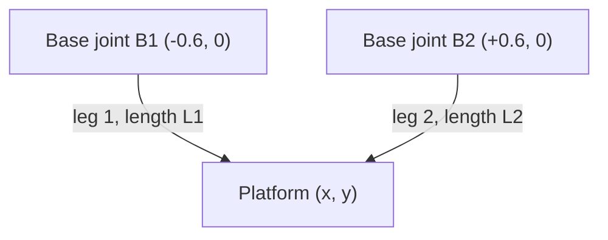

# End-to-End Design — the 2-DOF Machine

This page builds **one complete machine** from a written specification all the way
to a wired, tunable system. Every number here is produced by the same formulas you
met in Modules 1–4, and you can reproduce all of them in the
[Python notebooks](../notebooks/index.md). Work through it top to bottom: each step
feeds the next, exactly as a real design review would.

The machine is a **2-RPR planar parallel manipulator** — a platform positioned in a
vertical plane by two hydraulic legs. It is the midterm machine of this course.

---

## Step 1 — Write the specification

Design starts with requirements, not with parts. Ours:

| Requirement | Value | Drives… |
|---|---|---|
| Degrees of freedom | 2 (translation \(x, y\)) | architecture |
| Workspace | a region roughly \(0.7\,\text{m}\) wide, centred near \(y = 0.7\,\text{m}\) | leg geometry & stroke |
| Payload | \(12\ \text{kg}\) plus motion loads | actuator force |
| Peak platform speed | \(\approx 0.2\ \text{m/s}\) | valve & pump flow |
| Positioning | settle a \(100\ \text{mm}\) move with no sustained overshoot | control design |

!!! note "Why a *parallel* machine?"
    Two legs share the load in tension/compression, so each cylinder carries only
    part of the force and the moving mass is tiny (no motor riding on a motor). The
    cost is a workspace shaped by the geometry and bounded by singularities — which
    is exactly what the next steps quantify. See [Lesson 1.1](../module01/1-1-what-is-a-pkm.md).

---

## Step 2 — Fix the geometry

Place the two base joints symmetrically on the \(x\)-axis at \(\mathbf{B}_1=(-b,0)\)
and \(\mathbf{B}_2=(+b,0)\) with half-base \(b = 0.6\ \text{m}\). The platform is the
point \((x,y)\); each leg is the straight line from its base joint to the platform.

---

## Step 3 — Kinematics: pose ↔ leg lengths

**Inverse kinematics** (pose → leg lengths) is a direct application of the distance
formula, and it is what the controller runs every cycle to turn a target pose into
target leg lengths:

\[
L_1 = \sqrt{(x+b)^2 + y^2}, \qquad L_2 = \sqrt{(x-b)^2 + y^2}.
\]

At the workspace centre \((x,y) = (0.10, 0.70)\):

\[
L_1 = \sqrt{0.70^2 + 0.70^2}\big|_{x=0.1} = 0.990\ \text{m}, \qquad L_2 = 0.860\ \text{m}.
\]

**Forward kinematics** (leg lengths → pose) has a closed form here because two circles
intersect analytically:

\[
x = \frac{L_1^2 - L_2^2}{4b}, \qquad y = \sqrt{L_1^2 - (x+b)^2}\ \ (y>0).
\]

See [Lessons 2.1–2.2](../module01/2-1-inverse-kinematics.md).

---

## Step 4 — Size the workspace and choose the stroke

A pose is reachable only if **both** legs stay within the cylinder's length range
\([L_\text{closed},\, L_\text{closed}+\text{stroke}]\). Working backwards from the
required workspace, a closed length of \(L_\text{closed}=0.4\ \text{m}\) and a
**stroke of \(0.6\ \text{m}\)** put the leg lengths we computed above (0.86–0.99 m)
comfortably inside the band, with margin for the corners of the workspace.

!!! tip "Check the corners, not just the centre"
    Run inverse kinematics at the four extremes of the desired workspace and confirm
    every leg length lands inside the stroke band. The widest and lowest poses are
    usually the binding cases. ([Lesson 2.3](../module01/2-3-reachability.md))

---

## Step 5 — Check dexterity and stay clear of singularities

The Jacobian \(J\) maps platform velocity to leg-rate, \(\dot{\mathbf L} = J\,\dot{\mathbf p}\).
For this machine

\[
\det J = \frac{2\,b\,y}{L_1 L_2}.
\]

At \((0.10, 0.70)\), \(\det J = 0.9864\) — healthy. Notice \(\det J \to 0\) as
\(y \to 0\): near the base line the legs become nearly parallel, the machine loses
the ability to move vertically, and forces blow up. **Keep the whole workspace well
above the base line** — our centre at \(y = 0.7\ \text{m}\) does exactly that.
([Lessons 3.1–3.2](../module01/3-1-jacobian.md))

---

## Step 6 — Size the cylinders (force)

The worst-case leg force comes from the payload and motion loads resolved through the
Jacobian. For this class of machine that lands around \(F \approx 20\ \text{kN}\) per
leg on extension. Sizing a cylinder to deliver that from the available supply pressure
\(p_s = 16\ \text{MPa}\):

\[
A_\text{cap} = \frac{F}{p_s} \approx \frac{20{,}100\ \text{N}}{16\times10^{6}\ \text{Pa}}
= 1.26\times10^{-3}\ \text{m}^2 \;\Rightarrow\; \text{bore } D \approx 40\ \text{mm}.
\]

A single-rod cylinder is **asymmetric**: the rod (here \(d = 22\ \text{mm}\)) blocks
part of the piston on the return side.

| Quantity | Cap (extend) | Rod (retract) |
|---|---|---|
| Area | \(A_\text{cap} = 1257\ \text{mm}^2\) | \(A_\text{rod} = 877\ \text{mm}^2\) |
| Force at 16 MPa | \(20.1\ \text{kN}\) | \(14.0\ \text{kN}\) |

The asymmetry ratio is \(\varphi = A_\text{cap}/A_\text{rod} = 1.43\): the same pressure
gives **43 % more force extending than retracting**, and (Step 7) the speeds differ too.
([Lessons 1.1–1.3 of Module 2](../module02/1-1-the-hydraulic-cylinder.md))

---

## Step 7 — Size the valve (speed and flow)

Speed is set by flow into the cylinder, \(v = Q/A\). For the extend speed target:

\[
Q = v \cdot A_\text{cap} = 0.20 \times 1257\times10^{-6} = 2.5\times10^{-4}\ \text{m}^3/\text{s}
= 15\ \text{L/min}.
\]

So a proportional valve **rated at 15 L/min** (at its rated drop \(\Delta p_\text{rated}=3.5\ \text{MPa}\))
fits. Crucially, valve flow is **not** linear in pressure — it follows the orifice law

\[
Q = u\,Q_\text{rated}\sqrt{\frac{\Delta p}{\Delta p_\text{rated}}},
\]

so at half the rated drop you still get \(\approx 7.4\ \text{L/min}\) at full command, not
\(5.25\). The controller must account for this. Because of the area asymmetry, the same
15 L/min gives \(0.20\ \text{m/s}\) extending but \(0.29\ \text{m/s}\) retracting.
([Lessons 2.1–2.2 of Module 2](../module02/2-1-valve-flow-law.md))

---

## Step 8 — Size the pump and set protection

The pump must supply the **summed** worst-case demand of both legs, plus margin.
A pump delivering \(36\ \text{L/min}\) at \(16\ \text{MPa}\) covers two legs moving at
full speed with headroom. The hydraulic power is

\[
P = p_s\,Q_\text{pump} = 16\times10^{6} \times 6\times10^{-4} = 9.6\ \text{kW}.
\]

A **relief valve set at \(21\ \text{MPa}\)** (above supply, below component ratings) caps
the worst-case pressure. ([Lesson 2.3 of Module 2](../module02/2-3-pump-and-relief.md))

---

## Step 9 — Design the control loop

Each leg gets its **own PID** driving its cylinder to the target length. Inverse
kinematics (Step 3) is the **setpoint generator**: the operator commands a pose, IK
converts it to two target lengths every cycle, and each PID closes its own loop.

- **Feedback** trims the error \(e = L^\star - L\).
- **Feedforward** pre-commands the flow a known motion needs, so feedback only cleans
  up the remainder — essential when tracking a moving target.
- **Anti-windup** keeps the integral from charging up while a valve is saturated.

For a \(100\ \text{mm}\) move, a well-chosen gain set settles cleanly with no sustained
overshoot; too much proportional gain rings, too little is sluggish.
([Module 3](../module03/index.md))

!!! info "Where this loop is physically wired"
    The control law here is realized in hardware in [Module 4](../module04/index.md)
    and the handbook chapter [Electrical & Control Wiring](../04-electrical-and-control-wiring.md).
    You tune in simulation first; the same gains transfer to the rig.

---

## Step 10 — Realize it electrically

The wired system has three domains that meet at the controller:

- **Power** — a motor drives the pump; the power stage is a **design choice** (a small
  DC or single-phase motor for a bench rig, a three-phase motor on a VFD for a full-size
  machine). The control loop is identical regardless.
- **Signal** — a position transducer per leg (e.g. 0–10 V over the 0.6 m stroke) and a
  pressure transducer per leg report reality to the controller.
- **Control** — the real-time controller/PLC runs IK + the two PIDs and outputs a
  normalized command \(u\in[-1,1]\) to each valve driver.

An independent **safety chain** (over-pressure, over-travel, near-singularity) forces a
safe state regardless of the controller. ([Module 4](../module04/1-3-wiring-and-safety.md))

---

## Step 11 — Validate

Drive the finished design in the simulator and judge it from its log alone:

1. **Reachability sweep** — IK over the whole workspace; every leg length inside the stroke band.
2. **Step + tracking** — command moves and ramps; check settling time and overshoot against the spec.
3. **Worst case** — full-speed two-leg move; confirm pump flow and relief setting hold.
4. **Grade** — the same rubric scores a simulator log or a hardware log identically, so a
   passing simulation is a meaningful predictor of the rig.

---

## The finished 2-DOF design at a glance

| Decision | Value | Set in |
|---|---|---|
| Architecture | 2-RPR, base half-width \(b=0.6\) m | Steps 1–2 |
| Stroke | \(L_\text{closed}=0.4\) m, stroke \(0.6\) m | Step 4 |
| Operating region | centred \((0.1, 0.7)\), \(\det J = 0.99\) | Step 5 |
| Cylinder | bore 40 mm / rod 22 mm, \(\varphi = 1.43\) | Step 6 |
| Forces | 20.1 kN extend / 14.0 kN retract @ 16 MPa | Step 6 |
| Valve | 15 L/min rated, orifice-law flow | Step 7 |
| Pump / power | 36 L/min, 9.6 kW, relief 21 MPa | Step 8 |
| Control | per-leg PID + IK setpoints + feedforward | Step 9 |

Continue to the **[3-DOF design](3dof-design.md)**, which adds orientation control and a
genuine singularity you have to design around.
