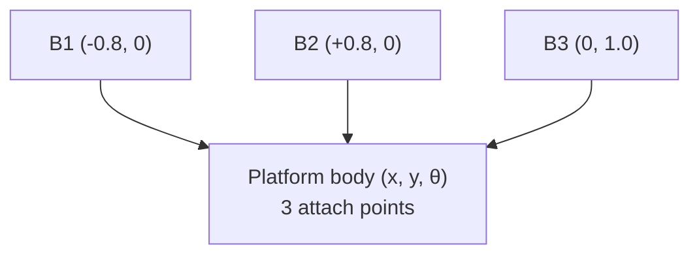

# End-to-End Design — the 3-DOF Machine

The 2-DOF machine positioned a *point*. The **3-DOF** machine — the final-project
machine — positions and **orients** a rigid platform: pose \((x, y, \theta)\). It does
this with **three** hydraulic legs. Everything you sized for one leg in the
[2-DOF design](2dof-design.md) still applies per leg; this page focuses on what is
genuinely new. All numbers are reproducible in the [Python notebooks](../notebooks/index.md).

---

## Step 1 — Specification (now with orientation)

| Requirement | Value | New vs. 2-DOF |
|---|---|---|
| Degrees of freedom | 3 — \(x, y, \theta\) | **orientation added** |
| Workspace | translation around \(y\approx0.5\) m **plus** \(\pm\) a few tenths of a radian | a 3-D pose envelope |
| Payload | platform + load, off-centre allowed | loads now create **moments** |
| Per-leg force / speed | as 2-DOF | reuse Module 2 sizing |

Adding rotation means the platform is no longer a point — it is a body with three
attachment points, and a load can now twist it, not just push it.

---

## Step 2 — Geometry: a triangle on a triangle

Three fixed base joints and three platform attachment points (in the platform's own frame):

| Leg | Base joint \(\mathbf B_i\) | Platform point \(\mathbf p_i\) (body frame) |
|---|---|---|
| 1 | \((-0.8,\ 0.0)\) | \((-0.12,\ -0.07)\) |
| 2 | \((+0.8,\ 0.0)\) | \((+0.12,\ -0.07)\) |
| 3 | \((0.0,\ 1.0)\) | \((0.0,\ +0.14)\) |

The frame is wider and taller than the 2-DOF rig because a third leg must reach the
platform from above.

---

## Step 3 — Kinematics: the rotation changes everything

Each platform point must first be placed in the **world frame** by rotating it by
\(\theta\) and translating by the platform origin \(\mathbf o = (x,y)\):

\[
\mathbf P_i = \mathbf o + R(\theta)\,\mathbf p_i, \qquad
R(\theta) = \begin{bmatrix}\cos\theta & -\sin\theta\\ \sin\theta & \cos\theta\end{bmatrix}.
\]

Then each leg length is just a distance, as before:

\[
L_i = \lVert \mathbf P_i - \mathbf B_i \rVert.
\]

At the **home pose** \((x,y,\theta) = (0,\ 0.45,\ 0)\):

\[
L_1 = L_2 = 0.779\ \text{m}, \qquad L_3 = 0.410\ \text{m}.
\]

!!! warning "No closed-form forward kinematics"
    For 2-DOF, leg lengths → pose had a clean formula. With rotation coupling all three
    legs, **there is no closed form** — the engine solves it with **Newton–Raphson**,
    warm-started from the previous pose, where the iteration's Jacobian *is* the
    kinematic Jacobian below. This is the practical reason real parallel machines lean
    so heavily on a good Jacobian.

---

## Step 4 — Workspace and stroke

With three legs the reachable set is a **3-D envelope** in \((x,y,\theta)\). A pose is
valid only if all three legs lie in the stroke band, here
\([0.3,\ 1.0]\ \text{m}\) (closed length 0.3 m, **stroke 0.7 m**). Leg 3 — reaching down
from the top joint — is usually the binding constraint as the platform rises or rotates,
so check it first. At home all three (0.779, 0.779, 0.410 m) sit inside the band.

---

## Step 5 — The singularity you cannot ignore

The Jacobian is now \(3\times3\): row \(i\) is the leg's unit direction plus its
sensitivity to rotation,

\[
J_i = \big[\ \hat{u}_{ix}\quad \hat{u}_{iy}\quad \hat{u}_i \cdot (R'(\theta)\,\mathbf p_i)\ \big].
\]

Evaluate \(\det J\) and you find something important:

| Pose \((x,y,\theta)\) | \(\det J\) | Meaning |
|---|---|---|
| \((0,\ 0.45,\ 0)\) — home | \(0.000\) | **rotation singular** |
| \((0,\ 0.55,\ 0)\) | \(0.000\) | still singular |
| \((0.05,\ 0.55,\ 0.10)\) | \(0.034\) | healthy |

The perfectly symmetric, un-rotated configuration **cannot control orientation** — the
three legs have no infinitesimal authority over \(\theta\) there, so \(\det J = 0\) along
the whole \(x=0,\ \theta=0\) line. This is not a modelling artifact; it is a real property
of a symmetric 3-RPR platform.

!!! danger "Design consequence"
    **Do not place the operating point, or the home pose, on the symmetry line.** Bias the
    nominal pose slightly (a small \(x\) or \(\theta\)) so the machine always has rotational
    authority. The example operating pose \((0.05,\ 0.55,\ 0.10)\) gives
    \(L = (0.874,\ 0.795,\ 0.313)\ \text{m}\) with \(\det J = 0.034\) — reachable and
    non-singular. A real controller also monitors \(\det J\) and trips a near-singularity
    fault before it gets close.

---

## Step 6–8 — Hydraulics: reuse the per-leg design

Each of the three legs is an independent hydraulic axis, so the cylinder, valve, pump,
and protection sizing from the [2-DOF design](2dof-design.md#step-6-size-the-cylinders-force)
**carry over directly** — same bore/rod logic, same orifice-law valve, same relief
strategy. Two things scale up:

- **Pump flow** must now cover the worst-case **three**-leg demand simultaneously, not two.
- **Force resolution** runs through the \(3\times3\) Jacobian, so an off-centre payload that
  creates a **moment** is shared across all three legs — and that share spikes near the
  singularity, which is the other reason to stay away from it.

---

## Step 9 — Control: three loops plus a coordination choice

You again run **one PID per leg**, with 3-DOF inverse kinematics as the setpoint generator
turning a target pose \((x,y,\theta)\) into three target lengths each cycle.

There is one new decision — **where** the loop closes:

- **Joint space** — regulate each leg length to its IK target (simple, robust; the default).
- **Task space** — regulate the pose directly through the Jacobian (tighter coordinated
  motion; needs \(J^{-1}\), so it must respect the singularity).

Feedforward and anti-windup apply exactly as before. ([Module 3](../module03/index.md))

---

## Step 10–11 — Wiring and validation

Electrically it is the 2-DOF system with **three** of everything: three valve drivers,
three position transducers, three pressure transducers, all meeting at one controller.
The power-stage choice and the independent safety chain are unchanged
([Module 4](../module04/index.md)). Validation adds two checks specific to 3-DOF:

1. **Orientation sweep** — command \(\theta\) moves across the envelope; confirm all three
   legs stay in stroke and \(\det J\) never approaches zero.
2. **Singularity guard** — verify the controller trips and holds when a commanded path
   would cross the symmetry line.

---

## The finished 3-DOF design at a glance

| Decision | Value | Note |
|---|---|---|
| Architecture | 3-RPR, anchors at \((\pm0.8,0)\) and \((0,1.0)\) | wider/taller frame |
| Stroke | closed 0.3 m, stroke 0.7 m | leg 3 binds first |
| Home pose | \((0, 0.45, 0)\), \(L=(0.779,0.779,0.410)\) | **on a singularity** |
| Operating pose | \((0.05, 0.55, 0.10)\), \(\det J = 0.034\) | biased off symmetry |
| Forward kinematics | Newton–Raphson | no closed form |
| Hydraulics | per-leg, as 2-DOF, ×3 | pump covers 3 legs |
| Control | 3× PID + IK setpoints; joint or task space | guard \(\det J\) |

Together with the [2-DOF design](2dof-design.md), this is the full path from a written
spec to a wired, tunable, validated parallel-kinematics machine — the goal of the whole
course.
