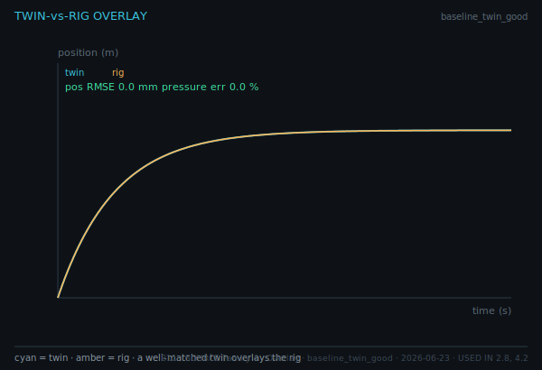
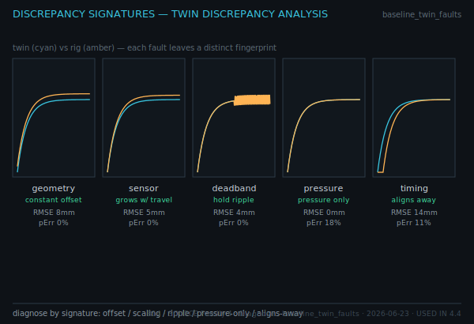

# Chapter 5 — Validation Twin (M4)

*Operational reference. Produces the twin accuracy report, the discrepancy analysis, and the final integration.*

## 1. Stage Goal
Validate the twin against the rig: measure accuracy, and when it fails, **explain** the
discrepancy from its signature.

## 2. Artifact Produced
**Twin Accuracy Report** · **Twin Discrepancy Analysis** · **Final Integration Report**.

## 3. Required Inputs
Synchronized twin and rig logs (position and pressure over time).

| Parameter | Value |
|---|---|
| N / DT | 400 / 0.005 s |
| Target / τ | 0.10 m / 0.25 s |
| Position threshold | 10 mm |
| Pressure threshold | 15 % |

## 4. Key Figures

Also: `B12-sync-replay`, `B13-accuracy-report`, `A9-twin-sync-workflow`, `A10-validation-workflow`.

## 5. Key Equations (reference)
- Position RMSE: `√mean((x_twin − x_rig)²)`
- Pressure error: `100 · rmse(P_twin, P_rig) / mean(P_rig)`
- Time alignment: best shift minimizing RMSE (cross-correlation)
- Settling difference: `|settle(twin) − settle(rig)|`

## 6. Procedure
1. Synchronize the logs (apply the best time shift).
2. Compute position RMSE and pressure error.
3. Compare to thresholds → PASS/FAIL.
4. If FAIL, match the residual to a discrepancy signature (Section 8) and explain the cause.
5. Assemble the Final Integration Report from all stage artifacts.

## 7. Acceptance Test
- Position **RMSE ≤ 10 mm** · Pressure error **≤ 15 %**.
- Any residual discrepancy is **diagnosed**, not just measured.
- Run **N4** (accuracy) and **N5** (integration); all gates pass.

## 8. Common Failure Modes — Twin Discrepancy Analysis
| Signature | Cause | Distinguishing cue |
|---|---|---|
| Constant position offset | **geometry** mismatch (wrong anchor/length) | offset constant across travel; pressure unaffected |
| Error grows with travel | **sensor scaling** error | error ∝ position; zero near home |
| Large hold ripple | **deadband** mismatch | ripple during hold; mean unchanged |
| Pressure-only error | **pressure-model** mismatch | position fine; pressure error high |
| Error vanishes after alignment | **timing** mismatch | best-shift collapses RMSE; others do not |

(Reference values: geometry ≈ 8.0 mm offset · sensor ≈ 5.4 mm growing · deadband ≈ 12.1 mm ripple ·
pressure ≈ 18.4 % only · timing ≈ 13.6 mm that aligns away.)

## 9. Related Demo Views
Family 4 — Overlay, Sync, Replay, Accuracy, Diagnose. The Diagnose view emits the Twin
Discrepancy Analysis artifact. Export the twin/rig logs for N4/N5.

## 10. Related Notebook
**N4 — Validation** (accuracy metrics) and **N5 — Integration** (full gate bundle).

## 11. Related Quiz
**Q6** (twin validation & discrepancy diagnosis).

## 12. Exit Criteria
Accuracy thresholds pass, any discrepancy is explained, and the Final Integration Report is
assembled. The validated 3-DOF system is the **final**.
