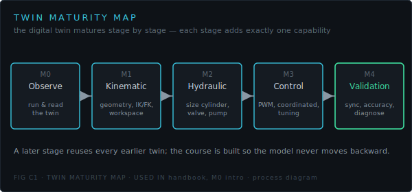
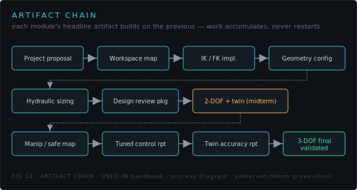

# PKM Engineer's Handbook

> **The handbook is the operational reference for producing and verifying artifacts.**
> It answers *how do I do this?* The lessons own the motivation, story, and progression; this is
> the desk reference you keep open while you build.

## Scope

| In scope | Out of scope (see lessons) |
|---|---|
| procedures · approved equations · ISO 1219 schematics | new theory · new learning outcomes |
| acceptance tests · parameter tables | new competencies · new artifacts |
| troubleshooting · artifact checklists · interpretation guides | new workflows · derivations |

Every number and symbol here is single-sourced from the engine and the committed figures.
Nothing in the handbook introduces content the curriculum does not already define.

## How the handbook is organized

One chapter per **twin-maturity stage**, which is also one segment of the **artifact chain**.
You move down the chain by producing and verifying each stage's artifact.

| Chapter | Stage | Artifact(s) | Demo | Notebook | Quiz |
|---|---|---|---|---|---|
| 1 · (this page) | M0 Observe | — | all | — | — |
| [2 · Kinematic Twin](02-kinematic-twin.md) | M1 | Geometry, IK/FK, Workspace map | Family 1 | N1 | Q1, Q4 |
| [3 · Hydraulic Twin](03-hydraulic-twin.md) | M2 | Sizing Report, Design Review | Family 2 | N2 | Q2 |
| [4 · Control Twin](04-control-twin.md) | M3 | Duty characterization, Tuned Control Report | Family 3 | N3 | Q3, Q5 |
| [5 · Validation Twin](05-validation-twin.md) | M4 | Twin Accuracy Report, Discrepancy Analysis, Final Integration | Family 4 | N4, N5 | Q6 |

## How to use a chapter

Each chapter is the same shape, mirroring the build loop:

1. **Stage Goal** — what this stage adds.
2. **Artifact Produced** — the deliverable.
3. **Required Inputs** — what you need first.
4. **Key Figures** — what to read.
5. **Key Equations** — the approved relations (reference only).
6. **Procedure** — the steps.
7. **Acceptance Test** — the gate, with thresholds.
8. **Common Failure Modes** — symptoms → cause → fix.
9. **Related Demo Views** — where to explore.
10. **Related Notebook** — where to verify.
11. **Related Quiz** — where to self-check.
12. **Exit Criteria** — when you may proceed.

## Acceptance gates (single source)

| Stage | Gate |
|---|---|
| Kinematic | IK→FK round-trip < 1e-6 m (2-DOF) / < 1e-4 m (3-DOF); \|det J\| ≥ 0.02 |
| Hydraulic | φ ≤ 1.6; F_ext ≥ load; required flow ≤ pump max; hold pressure ≤ relief |
| Control | duty monotonic above deadband; tracking RMSE ≤ 10 mm; settling ≤ 2.5 s |
| Validation | position RMSE ≤ 10 mm; pressure error ≤ 15%; discrepancy explained |

Read the chapters in order: a later stage reuses every earlier artifact.
