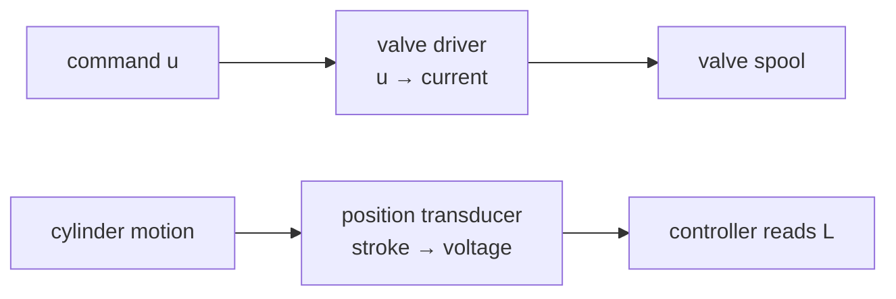

!!! abstract "Hardware Integration · signal-domain infrastructure · Milestone: cross-cutting (supports all stages)"
    **Artifact contribution:** design-review inputs: sensor & driver selection (Appendix A)

# Lesson 1.2 — Sensors & Valve Drivers

!!! note "Why you need this — before the theory"
    Sensors and valve drivers are the signal-domain boundary every twin stage depends on. Choosing them correctly is what makes the logged data trustworthy.

!!! info "Cross-cutting infrastructure"
    This is **Hardware Integration** — shared infrastructure every twin stage relies on, not a twin
    stage itself. The wiring, I/O, signal↔channel map, and safety chain live in
    **[Handbook Appendix A — Wiring & I/O](../handbook/06-wiring-and-io-appendix.md)**.

---

## 1. Why This Matters

These two parts are where the loop touches the physical world. A sensor that's noisy,
slow, or miscalibrated poisons every control decision downstream. A driver that can't
deliver enough current, or that lags, throttles the whole machine. Choosing and
understanding them is the difference between a loop that works on paper and one that
works on a bench.

## 2. Physical Intuition

The **sensor** is the machine's eye: as the cylinder moves, a position transducer
produces a voltage proportional to the stroke, which the controller reads as a
length. The **valve driver** is the machine's muscle amplifier: the controller's
small command can't move a solenoid, so the driver takes that signal and pushes the
real current the valve needs — like a small finger on a light switch that controls a
powerful lamp.

## 3. Mathematical Foundations

**Sensor:** a linear transducer maps physical stroke to voltage, and the controller
inverts it:

\[
V_\text{sensor} = k\,(L - L_\text{closed}), \qquad L = L_\text{closed} + \frac{V_\text{sensor}}{k}.
\]

**Driver:** maps the normalized command to a drive level (voltage or PWM duty), then
to solenoid current:

\[
u \in [-1,1] \;\to\; V = 10\,u \;\to\; I = \frac{V}{R}\ \text{(solenoid)}.
\]

The sign of \(u\) selects spool direction (extend vs retract); its magnitude sets the
opening. Resolution, noise, and bandwidth of both devices set the practical limits of
the loop.

!!! quote "Reference provenance"
    **Source:** Handbook Appendix A · Engine

## 4. Visual Explanation

See **[Handbook Appendix A — Wiring & I/O](../handbook/06-wiring-and-io-appendix.md)** for the signal-domain components (tables and signal↔channel map).

The middle (signal) column of the figure is this lesson: the **valve driver**
carrying the command into the power domain, and the **position sensor** carrying the
measurement back into the control domain.



## 5. Engineering Example

For our machine, the sensor is the cylinder's built-in length transducer — its
reading is exactly the `L_i` the simulator uses, after the linear scaling above.
The driver is a proportional-valve amplifier whose input is the controller's `u` and
whose output is the solenoid current that positions the spool, realizing the valve
flow law from Module 2. The simulator abstracts both as ideal; real ones add noise,
deadband, and lag — which the fault engine (Lesson 1.3) is designed to catch.

## 6. Worked Example

A transducer outputs 0–10 V over a 0–0.6 m stroke, so \(k = 10/0.6 = 16.7\ \text{V/m}\).
The controller reads 7.5 V. What length?

\[
L = L_\text{closed} + \frac{V}{k} = 0.4 + \frac{7.5}{16.7} = 0.4 + 0.449 = 0.849\ \text{m}.
\]

And on the command side, \(u = -0.4\) becomes \(V = 10 \times (-0.4) = -4\ \text{V}\)
— the negative sign tells the driver to open the spool toward *retract* at 40%.

## 7. Interactive Demonstration

<iframe src="../../demos/hydraulic-explorer.html" title="Hydraulic Explorer — interactive demo" loading="lazy" style="width:100%;height:700px;border:1px solid var(--md-default-fg-color--lightest);border-radius:8px;background:#0e1217"></iframe>

[Open this demo full-screen in a new tab](../demos/hydraulic-explorer.html){ target=_blank }

The demo's extend/retract animation is what the *driver* commands and the *sensor*
measures on real hardware: the driver sets the direction and speed of the piston you
see, and a real transducer would report exactly the stroke the animation shows.

## 8. Code & Computation

```python
# sensor: voltage -> length (linear);  driver: command -> direction + opening
k = 10 / 0.6                     # 0-10 V over 0-0.6 m  ->  16.7 V/m
print(f"sensor 7.5 V -> L = {0.4 + 7.5/k:.3f} m")     # 0.849 m
u = -0.4
print(f"command u={u} -> {'retract' if u < 0 else 'extend'} at {abs(u)*100:.0f}% opening, {10*u:+.1f} V")
```

!!! tip "Run it"
    The code above is self-contained Python (standard library only) — paste it into any Python 3 prompt to run it. To run the whole module interactively with nothing to install, open it in Google Colab (opens in a new browser tab): [Open Module 4 in Colab](https://colab.research.google.com/github/alibulentkoc/parallel-kinematics-hydraulics/blob/main/docs/notebooks/module04.ipynb){ target=_blank }.

!!! success "Verify at design review"
    Hardware Integration is **design-review gated**, not notebook-verified: confirm sensor/driver/safety selections against **[Handbook Appendix A](../handbook/06-wiring-and-io-appendix.md)** and the Design Review checklist. (No twin acceptance test applies to infrastructure.)

## 9. Knowledge Check

[Related check — Quiz 2](../quizzes/quiz-2-hydraulic-sizing.md)

## 10. Challenge Problem

A position transducer is specified as 0–10 V over 0–0.5 m, but your cylinder's stroke
is 0.6 m. What goes wrong, and how would you fix the scaling (or the sensor choice)?
What reading would you get at full extension, and why is that a problem?

## 11. Common Mistakes

- **Driving a valve straight from the controller.** The logic-level command can't
  supply solenoid current; the driver is mandatory.
- **Skipping sensor calibration.** A wrong \(k\) makes every length reading wrong,
  and the loop confidently controls to the wrong place.
- **Ignoring sensor noise and lag.** Real transducers aren't ideal; the derivative
  term especially amplifies noise.

## 12. Key Takeaways

- The **sensor** turns stroke into a voltage the controller reads back as length
  (linear scaling).
- The **valve driver** amplifies the command into solenoid current; sign sets
  direction, magnitude sets opening.
- Both sit in the **signal domain**, between control and power.
- Their resolution, noise, and bandwidth set the loop's practical limits.

## AI Learning Companion

**Tutor**
```
Explain what a position sensor and a valve driver do in a hydraulic control loop,
and the linear scaling that converts between controller numbers and real voltages.
```
**Practice**
```
Give me 5 scaling problems: convert sensor voltages to lengths and commands to
driver voltages, given the ranges. Include answers.
```

---

*Next lesson: [Wiring & Safety Chain](wiring-and-safety.md), where it all connects — safely.*
