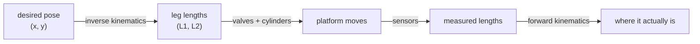

!!! abstract "You are here"
    **Module 1 — Kinematics** · **Unit 1 — The Parallel Machine** · **Lesson 1.1 — What Is a Parallel Kinematics Machine?**

# Lesson 1.1 — What Is a Parallel Kinematics Machine?

> **Module 1 · Unit 1 · Lesson 1.1** · Pilot lesson
> This first lesson carries no heavy mathematics. Its job is to build the mental
> model — a **moving platform held by hydraulic cylinders** — that every later
> lesson returns to, and to explain *why* the mathematics is coming.

---

## 1. Why This Matters

You have almost certainly seen a robot arm: a chain of motors and links that
reaches out like a human arm. A **parallel kinematics machine** is the opposite
idea, and once you see it you'll notice it everywhere — flight simulators on their
six hissing legs, precision machine tools, car suspension rigs, rocket-engine test
stands.

Instead of stacking joints end to end, a parallel machine connects a single moving
**platform** to a fixed **base** through *several legs working at the same time*.
In our machine the legs are **hydraulic cylinders** that get longer and shorter.
To move the platform, every cylinder has to change length together, in a
coordinated way.

That "together" is the whole story. It makes parallel machines **stiff, strong,
and precise** — but it also tangles the relationship between what you can measure
(cylinder lengths) and what you care about (where the platform is). Sorting out
that relationship is what this entire module is for.

## 2. Physical Intuition

Picture a tabletop held up by two hydraulic rams, each pinned to the floor at one
end and to the table at the other. Pump oil into one ram and it extends; the table
tips and slides. Pump both and the table rises. **The table's position is the
combined result of both ram lengths at once.**

Now flip the question around. If you only knew the two ram lengths — say from a
sensor inside each cylinder — could you say exactly where the tabletop is? Yes,
but only by reasoning geometrically: each ram length pins the table to a circle
around its floor anchor, and the table sits where those circles cross. Hold that
image. It is the seed of *forward kinematics* (Lesson 2.2).

Two defining traits fall out of this picture:

- **Coordination:** no leg moves the platform alone; they share the job.
- **Constraint:** the legs can only be so short or so long, so the platform can
  only reach a limited region — the *workspace* (Lesson 2.3).

## 3. Mathematical Foundations

*(Light by design — this lesson motivates the mathematics rather than deriving it.
The tools named here are built in full across Units 2–3.)*

The machine's core questions are two, and they're inverses of each other:

- **Inverse kinematics:** given a desired platform pose, what leg lengths achieve
  it? \(\;\text{pose} \rightarrow (L_1, L_2)\). For a parallel machine this is the
  *easy* direction — a direct distance calculation (Lesson 2.1).
- **Forward kinematics:** given the leg lengths, where is the platform?
  \(\;(L_1, L_2) \rightarrow \text{pose}\). For a parallel machine this is the
  *hard* direction (Lesson 2.2).

A platform's **pose** is just the numbers needed to say where it is. For our 2-DOF
machine that's a position \((x, y)\); for the 3-DOF machine it also includes an
orientation angle \(\theta\). You're not expected to compute anything yet — only to
believe the claim this lesson makes: *moving a parallel machine correctly is, at
bottom, a geometry problem about distances and circles.*

## 4. Visual Explanation


The figure is the whole machine in one picture: two ground **anchors** \(B_1,
B_2\), two **cylinder legs** of length \(L_1, L_2\), and the **platform** point
\(P\). The faint wash is *manipulability* — bright where the machine is dexterous,
dark near the base line where it is about to lose control (Lesson 3.2).

The mental model to carry forward is a one-way chain you'll learn to run in both
directions:



## 5. Engineering Example

Where you meet parallel machines in the wild, and why they're chosen:

- **Flight & driving simulators** ride on a *Stewart platform* — six hydraulic
  legs giving full 6-DOF motion. Hydraulics are used because the legs must hold a
  whole cab and still respond crisply.
- **Machine tools & 3D printers** (delta robots, hexapods) use parallel geometry
  for stiffness: the platform is braced from several directions, so it deflects far
  less under cutting loads than a cantilevered arm.
- **Test rigs** — suspension shakers, engine mounts — use exactly our setup:
  cylinders driving a platform to reproduce real forces.

The through-line: parallel machines are chosen when you need **force and stiffness
in a compact space**, and you accept a more complex kinematics in return.

## 6. Worked Example

Let's narrate one move qualitatively, to feel where the math will enter.

You want the platform to slide 10 cm to the right.

1. **State the goal as a pose.** "10 cm right of here" becomes a target \((x, y)\).
2. **Inverse kinematics.** Compute the leg lengths that place the platform there —
   one leg must get longer, the other shorter (Lesson 2.1 makes this exact).
3. **Actuate.** Command the valves to drive each cylinder toward its new length.
4. **Verify.** Read the cylinder sensors and run forward kinematics to confirm the
   platform actually arrived (Lesson 2.2).

We solved nothing numerically — yet every step pointed at a specific upcoming
tool. That's the point: you can already *narrate* the pipeline correctly. The rest
of the module replaces each narrated step with a calculation you can run.

## 7. Interactive Demonstration

<iframe src="../../demos/kinematics-explorer.html" title="Kinematics Explorer — interactive demo" loading="lazy" style="width:100%;height:780px;border:1px solid var(--md-default-fg-color--lightest);border-radius:8px;background:#0e1217"></iframe>

[Open this demo full-screen in a new tab ↗](../demos/kinematics-explorer.html){ target=_blank }

Drag the green platform around the workspace. Watch the two leg lengths
\(L_1, L_2\) update, see the dexterity heatmap, and notice the status flip toward
**SINGULAR** as you push the platform down toward the base line. You don't need to
understand the numbers yet — just build the feel: *every platform position
corresponds to a specific pair of leg lengths, and some regions are "healthier"
than others.*

## 8. Code & Computation

```python
from math import hypot
b = 0.6                         # half base-width
def ik(x, y):                   # pose -> leg lengths (the easy direction)
    return hypot(x + b, y), hypot(x - b, y)
print(ik(0.10, 0.70))           # -> (0.990, 0.860)
```

!!! tip "Run this yourself — three ways"
    The Python above is a ready-to-run cell from the **Module 1 notebook**. Pick whichever is easiest:

    1. **Run in your browser, no setup —** open it in Google Colab and press the ▶ button on each cell: [Open Module 1 in Colab ↗](https://colab.research.google.com/github/alibulentkoc/parallel-kinematics-hydraulics/blob/main/docs/notebooks/module01.ipynb){ target=_blank }
    2. **Run locally —** [view/download the notebook on GitHub ↗](https://github.com/alibulentkoc/parallel-kinematics-hydraulics/blob/main/docs/notebooks/module01.ipynb){ target=_blank }, then open it in Jupyter, JupyterLab, or VS Code (`pip install notebook`, then `jupyter notebook`).
    3. **Just try the snippet —** copy the code above into any Python 3 prompt; it needs only the standard library.

## 9. Knowledge Check

[Open the Lesson 1.1 check ↗](../quizzes/m1-l11.html){ target=_blank }

*Formative — unlimited attempts, immediate feedback. Not graded. Check your
understanding, not your score.*

## 10. Challenge Problem

Pick a machine you've seen that you suspect is parallel (a flight simulator, a
delta 3D printer, a hexapod camera rig). In a short paragraph: name its **base**
and its **moving platform**, count how many **legs** connect them, and predict one
**advantage** the parallel design gives it over a serial robot arm doing the same
job. There's no single right answer — the goal is to recognize the pattern in a new
system.

## 11. Common Mistakes

- **Thinking of it as an arm.** A parallel machine has no "elbow" you move
  independently. Every leg affects the platform at once; you cannot reason about
  one leg in isolation.
- **Assuming any position is reachable.** Cylinders have a fixed stroke. Large
  regions of the plane are simply unreachable — a fact we make precise in
  Lesson 2.3.
- **Treating geometry as a formality.** The geometry *is* the machine's behaviour.
  Skipping the "why" now makes the Jacobian feel arbitrary two lessons from here.

## 12. Key Takeaways

- A **parallel kinematics machine** connects one platform to the base through
  several legs acting together; ours uses **hydraulic cylinders** as the legs.
- **Coordination and constraint** are its defining traits: every move is shared
  across all legs, and the legs' length limits bound a finite **workspace**.
- The two core operations are **inverse kinematics** (pose → leg lengths, easy) and
  **forward kinematics** (leg lengths → pose, hard).
- A platform's **pose** is \((x, y)\) for 2-DOF, \((x, y, \theta)\) for 3-DOF.
- You don't need the math yet — you need the **map**: pose ↔ leg lengths, with
  geometry as the translator. Units 2–3 fill it in.

## AI Learning Companion

Copy any prompt into ChatGPT, Claude, or another assistant.

**Tutor** — explain it another way
```
Re-explain "what is a parallel kinematics machine" using a real example that is
NOT a hydraulic platform. Contrast it with a serial robot arm, and say why
coordination between legs makes the kinematics harder.
```

**Practice** — more exercises
```
Give me 5 short questions that test whether I can tell a parallel mechanism from
a serial one, and identify the base, platform, and legs in each. Include answers.
```

**Explore** — connect to the real world
```
Show me 3 real machines that use parallel kinematics, and for each explain what
advantage (stiffness, force, precision) the parallel design buys.
```

---

*Next lesson: [1.2 — The 2-RPR Geometry & Pose](1-2-geometry-and-pose.md), where we make this machine precise with coordinates.*
