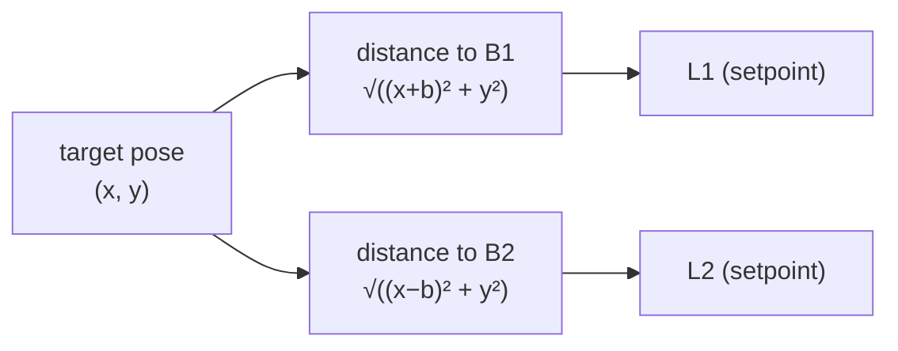

!!! abstract "You are here"
    **Module 1 — Kinematics** · **Unit 2 — Solving the Motion** · **Lesson 2.1 — Inverse Kinematics**

# Lesson 2.1 — Inverse Kinematics — Pose to Leg Lengths

> **Module 1 · Unit 2 · Lesson 2.1** · interactive
> The first calculation you can actually run: given where you want the platform,
> exactly how long must each cylinder be? For a parallel machine this is the *easy*
> direction — and it's the command the controller sends thousands of times a second.

---

## 1. Why This Matters

Every motion the machine makes starts here. You tell it *where* (a pose); inverse
kinematics turns that into *how long each leg must be* — the setpoints the
hydraulics chase. Get this wrong and the platform goes to the wrong place; get it
right and everything downstream (control, tracking, grading) has a correct target
to aim at.

## 2. Physical Intuition

You already have the intuition from Lesson 1.1: a leg's length is simply the
straight-line distance from its base anchor to the platform. So "what length?" is
the same question as "how far apart are these two points?" — and you've measured
distances since grade school.

The reason it's *easy* for a parallel machine (and *hard* for a robot arm) is that
each leg's length depends only on the platform position and that leg's own fixed
anchor. No chain of joint angles to unwind — just one distance per leg.

## 3. Mathematical Foundations

With anchors \(B_1 = (-b, 0)\) and \(B_2 = (+b, 0)\) and platform \(P = (x, y)\),
inverse kinematics is two distance formulas:

\[
L_1 = \sqrt{(x + b)^2 + y^2}, \qquad
L_2 = \sqrt{(x - b)^2 + y^2}.
\]

In vector form, for any leg \(i\):

\[
L_i = \lVert P - B_i \rVert.
\]

That's the complete method. It is **closed-form** (a direct formula, no iteration),
**unique** (one length per leg for a given pose), and **fast** — which is why it can
run every control cycle.

For the 3-DOF machine the only change is that each leg attaches to a point that
rotates with the platform: \(P_i = (x, y) + R(\theta)\, p_i\), and then
\(L_i = \lVert P_i - B_i\rVert\) — still a direct calculation.

## 4. Visual Explanation



Each leg length is an independent distance from the platform to that leg's anchor.
The two computations don't talk to each other — that independence is exactly what
makes inverse kinematics trivial for a parallel machine.

## 5. Engineering Example

In the real control loop, inverse kinematics is the **setpoint generator**. The
operator (or a trajectory) supplies a target pose; IK converts it to target leg
lengths \(L_1^\*, L_2^\*\); the per-leg controllers then drive each cylinder to its
target. When you drag the target in any of the simulator dashboards, IK is running
on every frame to keep the leg setpoints current.

## 6. Worked Example

Move the platform from \(P_0 = (0,\ 0.70)\) to \(P_1 = (0.10,\ 0.70)\), with
\(b = 0.6\).

**Before:**
\[
L_1 = L_2 = \sqrt{0.6^2 + 0.7^2} = \sqrt{0.85} = 0.922\ \text{m}.
\]

**After:**
\[
L_1' = \sqrt{0.7^2 + 0.7^2} = 0.990\ \text{m}, \qquad
L_2' = \sqrt{0.5^2 + 0.7^2} = 0.860\ \text{m}.
\]

**Commanded change:** \(\Delta L_1 = +0.068\) m (extend 68 mm),
\(\Delta L_2 = -0.062\) m (retract 62 mm). One cylinder out, one in — a 100 mm
sideways slide costs a coordinated push-and-pull. This is the exact number the
controller would chase.

## 7. Interactive Demonstration

<iframe src="../../demos/kinematics-explorer.html" title="Kinematics Explorer — interactive demo" loading="lazy" style="width:100%;height:780px;border:1px solid var(--md-default-fg-color--lightest);border-radius:8px;background:#0e1217"></iframe>

[Open this demo full-screen in a new tab ↗](../demos/kinematics-explorer.html){ target=_blank }

Drag the platform and read \(L_1, L_2\) directly. Try to **reproduce the worked
example**: park near \((0, 0.70)\) and confirm \(L_1 = L_2 \approx 0.922\); then
move to \((0.10, 0.70)\) and watch \(L_1\) grow to ~0.990 while \(L_2\) shrinks to
~0.860. The equation panel shows the distance formula with your live numbers.

## 8. Code & Computation

```python
from math import hypot
b = 0.6
def ik(x, y):
    return hypot(x + b, y), hypot(x - b, y)
before = ik(0.0, 0.70)          # (0.922, 0.922)
after  = ik(0.10, 0.70)         # (0.990, 0.860)
print(f"d L1 = {1000*(after[0]-before[0]):+.0f} mm,  d L2 = {1000*(after[1]-before[1]):+.0f} mm")
# -> +68 mm, -62 mm: one leg extends, one retracts
```

!!! tip "Run this yourself — three ways"
    The Python above is a ready-to-run cell from the **Module 1 notebook**. Pick whichever is easiest:

    1. **Run in your browser, no setup —** open it in Google Colab and press the ▶ button on each cell: [Open Module 1 in Colab ↗](https://colab.research.google.com/github/alibulentkoc/parallel-kinematics-hydraulics/blob/main/docs/notebooks/module01.ipynb){ target=_blank }
    2. **Run locally —** [view/download the notebook on GitHub ↗](https://github.com/alibulentkoc/parallel-kinematics-hydraulics/blob/main/docs/notebooks/module01.ipynb){ target=_blank }, then open it in Jupyter, JupyterLab, or VS Code (`pip install notebook`, then `jupyter notebook`).
    3. **Just try the snippet —** copy the code above into any Python 3 prompt; it needs only the standard library.

## 9. Knowledge Check

[Open the Lesson 2.1 check ↗](../quizzes/m1-l21.html){ target=_blank }

## 10. Challenge Problem

A target sits at \((0.4, 0.3)\). With \(b = 0.6\), compute \(L_1\) and \(L_2\) by
hand, then the strokes (using \(L_\text{closed} = 0.4\) m). If the stroke limit is
0.6 m (so \(L \le 1.0\) m), is this pose reachable? Check your arithmetic in the
explorer.

## 11. Common Mistakes

- **Sign of the anchor offset.** \(L_1\) uses \((x + b)\), \(L_2\) uses
  \((x - b)\). Swapping them mirrors the machine.
- **Reporting length when the hardware wants stroke.** The controller commands
  \(s_i = L_i - L_\text{closed}\); don't hand it raw length.
- **Assuming the result is always valid.** IK will happily return a length that's
  longer than the cylinder can reach. Whether it's *reachable* is a separate check
  (Lesson 2.3).

## 12. Key Takeaways

- Inverse kinematics is **one distance per leg**: \(L_i = \lVert P - B_i\rVert\).
- It is **closed-form, unique, and fast** — the easy direction for parallel
  machines, and the controller's setpoint generator.
- A sideways platform move becomes a **coordinated extend/retract** of the legs.
- IK doesn't check feasibility; reachability is a separate test.

## AI Learning Companion

**Tutor**
```
Explain why inverse kinematics is the EASY direction for a parallel (2-RPR)
machine but the HARD direction for a serial robot arm. Use the idea that each
leg length is a single distance.
```
**Practice**
```
Give me 5 inverse-kinematics drills for a 2-RPR machine (b = 0.6 m): a target
position, compute L1 and L2 and the strokes. Include answers.
```

---

*Next lesson: [2.2 — Forward Kinematics](2-2-forward-kinematics.md), the harder reverse problem: leg lengths back to pose.*
