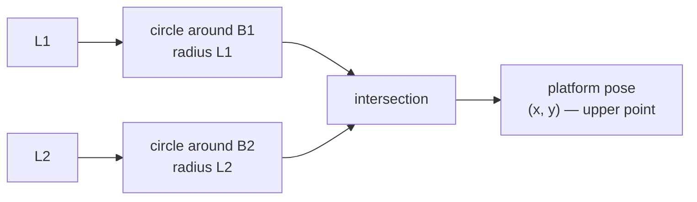

!!! abstract "Kinematic Twin · C3 · forward kinematics · Milestone: kinematic model → midterm 2-DOF build"
    **Artifact contribution:** the FK half of the IK/FK Implementation artifact

# Lesson 2.2 — Forward Kinematics — Leg Lengths to Pose

!!! note "Why you need this — before the theory"
    After the cylinders move you must know where the platform actually went — from measured lengths back to pose. Forward kinematics closes the loop and completes the IK/FK Implementation the Workspace map and twin are built on.

---

## 1. Why This Matters

Sensors live in the cylinders, not on the platform. A linear transducer inside each
cylinder reports its length — but what you actually want to know is *where the
platform is*. Forward kinematics is the conversion, and it's how the machine
"knows" its own pose: for display, for verification, and (in the 3-DOF case) for
the controller itself.

## 2. Physical Intuition

Each leg length pins the platform somewhere on a **circle** around that leg's
anchor (every point that distance away). With two legs you have two circles, and the
platform must lie on *both* — so it sits where the circles **intersect**. Two
circles generally cross at two points; the platform is the upper one (the legs don't
fold under the base). Find that intersection and you've found the pose.

## 3. Mathematical Foundations

Write the two length constraints:

\[
L_1^2 = (x + b)^2 + y^2, \qquad L_2^2 = (x - b)^2 + y^2.
\]

**Subtract** the second from the first. The \(y^2\) cancels, and
\((x+b)^2 - (x-b)^2 = 4bx\):

\[
L_1^2 - L_2^2 = 4bx \quad\Longrightarrow\quad \boxed{\,x = \dfrac{L_1^2 - L_2^2}{4b}\,}.
\]

Then back-substitute to get \(y\) (taking the positive root for the upper
intersection):

\[
\boxed{\,y = \sqrt{L_1^2 - (x + b)^2}\,}.
\]

Two formulas, exact — no iteration. That clean result is special to the symmetric
2-RPR. The **3-DOF** machine has three nonlinear length equations in three unknowns
\((x, y, \theta)\) with no tidy closed form, so it's solved numerically with
**Newton's method**, warm-started from the previous pose (which converges in a few
steps because the pose barely changes between control cycles).

!!! quote "Equation provenance"
    **Source:** Engine (src/kinematics, fk) · A1 · Family 1

## 4. Visual Explanation



Two circles, one platform: the pose is the upper crossing point. If the circles
don't reach each other, there is no real intersection — the lengths are
inconsistent, and the machine reports "no solution" instead of inventing one
(Lesson 2.3).

## 5. Engineering Example

On the real rig, forward kinematics runs on the **measured** lengths every cycle to
display the live platform pose and to verify a move actually landed where commanded.
In the grading tools, it's also how a recorded log of leg lengths is turned back
into a platform trajectory you can score — the same FK, whether the data came from
the simulator or a physical bench.

## 6. Worked Example

Take the lengths from Lesson 2.1's destination: \(L_1 = 0.990\), \(L_2 = 0.860\),
\(b = 0.6\). Recover the pose:

\[
x = \frac{0.990^2 - 0.860^2}{4 \cdot 0.6} = \frac{0.980 - 0.740}{2.4} = \frac{0.240}{2.4} = 0.100\ \text{m}.
\]
\[
y = \sqrt{0.990^2 - (0.100 + 0.6)^2} = \sqrt{0.980 - 0.490} = \sqrt{0.490} = 0.700\ \text{m}.
\]

So \(P = (0.10,\ 0.70)\) — exactly the pose we started from. **Forward kinematics
undoes inverse kinematics**, which is the round-trip the test suite verifies to
\(10^{-9}\).

## 7. Interactive Demonstration

<iframe src="../../demos/kinematics-explorer.html" title="Kinematics Explorer — interactive demo" loading="lazy" style="width:100%;height:780px;border:1px solid var(--md-default-fg-color--lightest);border-radius:8px;background:#0e1217"></iframe>

[Open this demo full-screen in a new tab](../demos/kinematics-explorer.html){ target=_blank }

The explorer runs IK as you drag, but you can verify FK by reading the numbers:
position the platform so \(L_1 \approx 0.99\) and \(L_2 \approx 0.86\), and confirm
the displayed \((x, y)\) matches the worked example. Notice that pushing the
platform toward the base line makes the two circles meet at a shallow angle — the
geometric warning sign of a singularity (Lesson 3.2).

!!! tip "Use the demo — Observe → Interpret → Apply"
    - **Observe:** Set leg lengths and watch the platform snap to where the two length-circles cross.
    - **Interpret:** x = (L1²−L2²)/4b falls straight out of subtracting the two circle equations.
    - **Apply:** Feed your IK output back through FK and confirm the pose returns.

## 8. Code & Computation

```python
from math import sqrt
b = 0.6
def fk(L1, L2):                 # leg lengths -> pose (upper half-plane)
    x = (L1**2 - L2**2) / (4*b)
    y = sqrt(max(0.0, L1**2 - (x + b)**2))
    return x, y
print(fk(0.990, 0.860))         # -> (0.100, 0.700)
```

!!! tip "Run it"
    The code above is self-contained Python (standard library only) — paste it into any Python 3 prompt to run it. To run the whole module interactively with nothing to install, open it in Google Colab (opens in a new browser tab): [Open Module 1 in Colab](https://colab.research.google.com/github/alibulentkoc/parallel-kinematics-hydraulics/blob/main/docs/notebooks/module01.ipynb){ target=_blank }.

!!! success "Verify with the notebook"
    Run **[Notebook N1 — Kinematics](../notebooks/index.md)** to reproduce these values from the exported CSV. The acceptance test (**IK→FK round-trip < 1e-6 m**) is owned by the artifact and stated in **[Handbook Ch 2 — Kinematic Twin](../handbook/02-kinematic-twin.md)**; this lesson references it, it is not re-defined here.

## 9. Knowledge Check

[Check your understanding — Quiz 1](../quizzes/quiz-1-kinematics.md)

## 10. Challenge Problem

Given \(L_1 = 0.922\), \(L_2 = 0.922\), \(b = 0.6\), compute the pose by hand. (What
does \(L_1 = L_2\) tell you about \(x\) before you even start?) Then explain, in one
sentence, why the 3-DOF machine can't use this tidy formula.

## 11. Common Mistakes

- **Taking the wrong root for \(y\).** The negative root is the platform *below* the
  base — physically the legs folded backwards. Always take the positive (upper)
  root.
- **Ignoring the no-solution case.** If \(L_1^2 - (x+b)^2 < 0\) the circles don't
  meet; the lengths are inconsistent. Returning a number anyway produces `NaN` and
  lies to the controller.
- **Expecting a closed form in 3-DOF.** Adding orientation breaks the tidy algebra;
  you must iterate.

## 12. Key Takeaways

- Forward kinematics finds the platform at the **intersection of two circles** set
  by the leg lengths.
- For 2-DOF it's **exact**: \(x = (L_1^2 - L_2^2)/4b\), then \(y = \sqrt{L_1^2 -
  (x+b)^2}\) (upper root).
- **FK undoes IK** — the round-trip returns the original pose.
- 3-DOF has **no closed form**; it's solved by warm-started Newton iteration.
- A non-negative square-root argument is the built-in feasibility guard against
  `NaN`.

## AI Learning Companion

**Tutor**
```
Walk me through deriving the 2-RPR forward kinematics by subtracting the two
circle equations. Show why y² cancels and where x = (L1² − L2²)/(4b) comes from.
```
**Practice**
```
Give me 4 forward-kinematics problems for a 2-RPR machine (b = 0.6 m): given L1
and L2, find (x, y). Include one case where the circles don't intersect.
```

---

*Next lesson: [2.3 — Reachability & the Workspace](2-3-reachability.md), where we map exactly which poses the machine can and cannot reach.*

