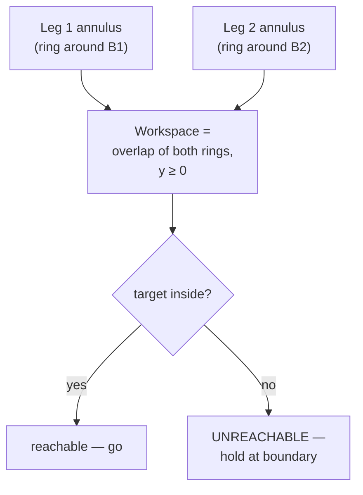

!!! abstract "You are here"
    **Module 1 — Kinematics** · **Unit 2 — Solving the Motion** · **Lesson 2.3 — Reachability & the Workspace**

# Lesson 2.3 — Reachability & the Workspace

> **Module 1 · Unit 2 · Lesson 2.3**
> Inverse kinematics will hand you a leg length for *any* target — even an
> impossible one. This lesson is about telling the possible from the impossible:
> the machine's reachable **workspace**, and how to guard against commands that
> would break the math.

---

## 1. Why This Matters

A controller that chases an impossible target wastes effort, slams into stroke
limits, or — worst — produces `NaN` and corrupts everything downstream. Knowing the
**workspace** (the set of reachable poses) lets the machine refuse impossible
commands gracefully, hold at the boundary, and tell the operator *why* it stopped.

## 2. Physical Intuition

Each cylinder can only be between its shortest and longest length. So each leg
confines the platform to an **annulus** — a ring between a minimum-radius circle and
a maximum-radius circle around its anchor. The platform must satisfy *both* legs at
once, so the reachable region is the **overlap of the two rings**. Anywhere outside
that overlap, at least one cylinder would have to be impossibly short or long.

## 3. Mathematical Foundations

A pose \(P\) is **reachable** when every leg length lands inside its stroke band and
the platform is above the base line:

\[
L_\text{closed} \le L_i(P) \le L_\text{closed} + \text{stroke} \quad \text{for each } i,
\qquad y \ge 0.
\]

Two failure modes have names you'll see as faults:

- **stroke-max:** \(L_i > L_\text{closed} + \text{stroke}\) — target too far; the
  cylinder can't extend that far.
- **stroke-min:** \(L_i < L_\text{closed}\) — target too close; the cylinder can't
  retract that far.

And the forward-kinematics guard from Lesson 2.2 — a negative square-root argument —
catches length pairs whose circles don't intersect at all. Together these keep the
machine in the land of real, finite numbers.

## 4. Visual Explanation



In the Kinematics Explorer the boundary is drawn for you: drag the target past the
edge and the crosshair turns **red** (unreachable); near the base line it turns
**amber** (reachable but nearly singular — Lesson 3.2).

## 5. Engineering Example

Workspace shape is a design driver. A short stroke gives a thin, shallow workspace;
a longer stroke deepens it but needs bigger, heavier, more expensive cylinders. When
you size a machine you choose stroke and base spacing so the *task's* working
region sits comfortably inside the reachable set — with margin, so the platform
never operates right at a stroke limit where it has no headroom to correct.

## 6. Worked Example

Default machine: \(b = 0.6\), \(L_\text{closed} = 0.4\), stroke 0.6, so each leg
must satisfy \(0.4 \le L_i \le 1.0\).

**Target \((0, 0.7)\):** \(L_1 = L_2 = 0.922\) m — both inside \([0.4, 1.0]\).
**Reachable.** ✓

**Target \((0, 1.05)\):** \(L_1 = L_2 = \sqrt{0.6^2 + 1.05^2} = \sqrt{1.4625} =
1.209\) m — **greater than 1.0**. Both legs hit *stroke-max*. **Unreachable** —
this is exactly the target the "Workspace limits" assignment commands to show
graceful handling.

## 7. Interactive Demonstration

<iframe src="../../demos/kinematics-explorer.html" title="Kinematics Explorer — interactive demo" loading="lazy" style="width:100%;height:780px;border:1px solid var(--md-default-fg-color--lightest);border-radius:8px;background:#0e1217"></iframe>

[Open this demo full-screen in a new tab ↗](../demos/kinematics-explorer.html){ target=_blank }

Drag the platform slowly toward the top of the view and watch the crosshair turn
red the moment a leg would exceed 1.0 m — the workspace boundary made visible. Then
shrink the **stroke** slider and watch the reachable region (and the bright dexterity
zone) shrink with it.

## 8. Code & Computation

```python
from math import hypot
b, L_CLOSED, STROKE = 0.6, 0.4, 0.6
def ik(x, y): return hypot(x + b, y), hypot(x - b, y)
def reachable(x, y):
    return all(L_CLOSED <= L <= L_CLOSED + STROKE for L in ik(x, y))
for p in [(0.0, 0.70), (0.10, 0.70), (0.0, 1.2)]:
    print(p, "->", "reachable" if reachable(*p) else "OUT OF RANGE")
```

!!! tip "Run this yourself — three ways"
    The Python above is a ready-to-run cell from the **Module 1 notebook**. Pick whichever is easiest:

    1. **Run in your browser, no setup —** open it in Google Colab and press the ▶ button on each cell: [Open Module 1 in Colab ↗](https://colab.research.google.com/github/alibulentkoc/parallel-kinematics-hydraulics/blob/main/docs/notebooks/module01.ipynb){ target=_blank }
    2. **Run locally —** [view/download the notebook on GitHub ↗](https://github.com/alibulentkoc/parallel-kinematics-hydraulics/blob/main/docs/notebooks/module01.ipynb){ target=_blank }, then open it in Jupyter, JupyterLab, or VS Code (`pip install notebook`, then `jupyter notebook`).
    3. **Just try the snippet —** copy the code above into any Python 3 prompt; it needs only the standard library.

    Stroke limits live in the presets and [`src/hydraulics/hydraulics.js`](https://github.com/alibulentkoc/parallel-kinematics-hydraulics/blob/main/src/hydraulics/hydraulics.js).

## 9. Knowledge Check

[Open the Lesson 2.3 check ↗](../quizzes/m1-l23.html){ target=_blank }

## 10. Challenge Problem

With the default limits (\(0.4 \le L \le 1.0\), \(b = 0.6\)), find the **highest**
point straight above the origin (\(x = 0\)) the platform can reach, and the
**lowest**. (Hint: at \(x = 0\), \(L_1 = L_2 = \sqrt{b^2 + y^2}\); solve for the \(y\)
that makes \(L = 1.0\) and \(L = 0.4\).) What does the lower bound tell you about
why you can't sit exactly on the base line?

## 11. Common Mistakes

- **Trusting IK output blindly.** It returns a number for impossible targets too;
  always test reachability before acting.
- **Forgetting the minimum length.** Targets too *close* to an anchor are
  unreachable just as surely as ones too far.
- **Operating at the boundary.** Even reachable poses right at a stroke limit leave
  the controller no room to correct — keep a margin.

## 12. Key Takeaways

- The **workspace** is the overlap of each leg's reachable annulus, with \(y \ge 0\).
- A pose is reachable when **every** leg length is within \([L_\text{closed},
  L_\text{closed} + \text{stroke}]\).
- Failure modes: **stroke-max** (too far), **stroke-min** (too close), and the FK
  **no-intersection** guard — all of which prevent `NaN`.
- Workspace shape is a **design trade-off** between stroke (reach) and cylinder
  size/cost.

## AI Learning Companion

**Tutor**
```
Explain why the reachable workspace of a 2-RPR machine is the intersection of two
annuli (rings). What sets the inner and outer radius of each ring?
```
**Practice**
```
Give me 5 reachability problems for a 2-RPR machine with leg limits 0.4–1.0 m and
b = 0.6 m: a target, decide reachable or not, and name the failure mode if not.
```

---

*Next lesson: [3.1 — The Jacobian & Manipulability](3-1-jacobian.md), where we move from positions to motion and dexterity.*
