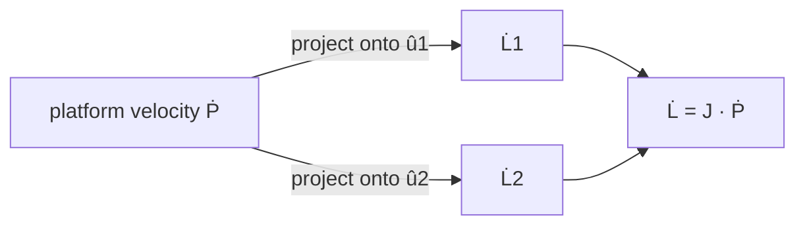

!!! abstract "You are here"
    **Module 1 — Kinematics** · **Unit 3 — Differential Motion** · **Lesson 3.1 — The Jacobian & Manipulability**

# Lesson 3.1 — The Jacobian & Manipulability

> **Module 1 · Unit 3 · Lesson 3.1** · interactive
> Positions tell you *where*; the Jacobian tells you *how things move*. It is the
> single most important object in robot kinematics — the bridge between platform
> motion and leg motion, and the source of the "dexterity" number you've seen
> glowing on the workspace.

---

## 1. Why This Matters

Holding a point is one thing; *moving* smoothly is another. To convert a desired
platform velocity into leg-speed commands — or to know how much force each cylinder
must push to support a load — you need the relationship between *small* changes of
the platform and *small* changes of the legs. That relationship is the **Jacobian**,
and it underlies velocity control, force/pressure, and the singularity warnings.

## 2. Physical Intuition

Nudge the platform a tiny bit. How much does a given leg stretch? Only the part of
your nudge that points *along* that leg changes its length; motion *across* the leg
barely changes it at all. So each leg's length-rate is the platform's velocity
**projected onto that leg's direction**. Collect those projections for all legs and
you have the Jacobian.

## 3. Mathematical Foundations

Start from the squared length \(L_i^2 = (P - B_i)\cdot(P - B_i)\) and differentiate:

\[
2 L_i \dot{L}_i = 2 (P - B_i)\cdot \dot{P}
\quad\Longrightarrow\quad
\dot{L}_i = \hat{u}_i \cdot \dot{P},
\]

where \(\hat{u}_i = (P - B_i)/L_i\) is the **unit leg vector** from Lesson 1.2.
Stacking both legs:

\[
\dot{L} = J\,\dot{P}, \qquad
J = \begin{bmatrix} \hat{u}_1^{\mathsf T} \\ \hat{u}_2^{\mathsf T} \end{bmatrix}.
\]

The Jacobian's rows *are* the unit leg directions. It works both ways and ties
together velocity and force:

\[
\dot{L} = J\,\dot{P}, \quad \dot{P} = J^{-1}\dot{L}, \qquad
F = J^{\mathsf T} f, \quad f = J^{-\mathsf T} F.
\]

The force relations come from virtual work: leg forces \(f\) produce platform wrench
\(F = J^{\mathsf T} f\); to make the platform push with force \(F\) you need leg
forces \(f = J^{-\mathsf T} F\) — which is how the next module turns load into
cylinder pressure.

**Manipulability** \(w\) measures how invertible \(J\) is. For the 2-DOF machine it
has a closed form:

\[
\det(J) = \frac{2\,b\,y}{L_1 L_2}.
\]

It's **proportional to the platform height \(y\)**: high up, the machine moves
freely in every direction; low down, \(\det(J)\to 0\) and it loses one.

## 4. Visual Explanation


The green arrows \(\hat{u}_1, \hat{u}_2\) at the platform are the Jacobian's rows.
The bright-to-dark wash *is* manipulability: \(\det(J) = 2by/(L_1L_2)\) is large
where the field is bright (high \(y\)) and fades to zero at the base line.



## 5. Engineering Example

The Jacobian is the workhorse of the control system. **Task-space control** uses it
to turn a pose error directly into leg commands; **velocity control** uses
\(J^{-1}\) to convert a desired platform speed into leg speeds; and the **pressure**
each cylinder needs to hold a load comes from \(f = J^{-\mathsf T}(M a - F_\text{ext})\).
One matrix, three jobs — which is why we spend a whole lesson on it.

## 6. Worked Example

At \(P = (0.10, 0.70)\), \(b = 0.6\), we found \(L_1 = 0.990\), \(L_2 = 0.860\).

**Unit leg vectors:**
\[
\hat{u}_1 = \frac{(x+b,\ y)}{L_1} = \frac{(0.70,\ 0.70)}{0.990} = (0.707,\ 0.707),
\]
\[
\hat{u}_2 = \frac{(x-b,\ y)}{L_2} = \frac{(-0.50,\ 0.70)}{0.860} = (-0.581,\ 0.814).
\]

**Manipulability:**
\[
\det(J) = \frac{2 \cdot 0.6 \cdot 0.70}{0.990 \cdot 0.860} = \frac{0.84}{0.851} = 0.987.
\]

A healthy, dexterous pose — close to its best possible value. Drag the platform down
toward \(y = 0.05\) and the same formula gives \(\det(J) \approx 0.07\): nearly
singular.

## 7. Interactive Demonstration

<iframe src="../../demos/kinematics-explorer.html" title="Kinematics Explorer — interactive demo" loading="lazy" style="width:100%;height:780px;border:1px solid var(--md-default-fg-color--lightest);border-radius:8px;background:#0e1217"></iframe>

[Open this demo full-screen in a new tab ↗](../demos/kinematics-explorer.html){ target=_blank }

Drag the platform and watch **det(J)** and **w** in the state panel, with the
formula \(2by/(L_1L_2)\) showing your live numbers. Confirm the worked example near
\((0.10, 0.70)\), then sweep vertically: manipulability tracks the platform height,
exactly as the formula predicts, and the heatmap is just this number painted across
the plane.

## 8. Code & Computation

```python
from math import hypot
b = 0.6
def jacobian(x, y):
    L1, L2 = hypot(x + b, y), hypot(x - b, y)
    return [[(x + b)/L1, y/L1], [(x - b)/L2, y/L2]]   # rows = unit leg vectors
def det(J): return J[0][0]*J[1][1] - J[0][1]*J[1][0]
J = jacobian(0.10, 0.70)
print("det(J) =", round(det(J), 4))      # 0.9864 (also equals 2*b*y/(L1*L2))
```

!!! tip "Run this yourself — three ways"
    The Python above is a ready-to-run cell from the **Module 1 notebook**. Pick whichever is easiest:

    1. **Run in your browser, no setup —** open it in Google Colab and press the ▶ button on each cell: [Open Module 1 in Colab ↗](https://colab.research.google.com/github/alibulentkoc/parallel-kinematics-hydraulics/blob/main/docs/notebooks/module01.ipynb){ target=_blank }
    2. **Run locally —** [view/download the notebook on GitHub ↗](https://github.com/alibulentkoc/parallel-kinematics-hydraulics/blob/main/docs/notebooks/module01.ipynb){ target=_blank }, then open it in Jupyter, JupyterLab, or VS Code (`pip install notebook`, then `jupyter notebook`).
    3. **Just try the snippet —** copy the code above into any Python 3 prompt; it needs only the standard library.

    See [`src/kinematics/kinematics2dof.js`](https://github.com/alibulentkoc/parallel-kinematics-hydraulics/blob/main/src/kinematics/kinematics2dof.js).

## 9. Knowledge Check

[Open the Lesson 3.1 check ↗](../quizzes/m1-l31.html){ target=_blank }

## 10. Challenge Problem

Show, from \(\det(J) = 2by/(L_1L_2)\), that for a fixed height \(y\) the
manipulability is *largest* directly above the centre (\(x = 0\)) and falls off as
you move sideways. (Hint: at fixed \(y\), how do \(L_1 L_2\) behave as \(|x|\)
grows?) Confirm by dragging horizontally in the explorer at constant height.

## 11. Common Mistakes

- **Reading \(J\) as positions, not rates.** The Jacobian relates *velocities*
  (small changes), not the positions themselves.
- **Forgetting it's pose-dependent.** \(J\) changes everywhere you move; there's no
  single Jacobian for the machine.
- **Ignoring the force side.** \(J^{\mathsf T}\) and \(J^{-\mathsf T}\) connect leg
  forces and platform wrench — that's where pressure comes from next module.

## 12. Key Takeaways

- The **Jacobian** maps platform motion to leg-length rates: \(\dot{L} = J\dot{P}\),
  with rows equal to the **unit leg vectors** \(\hat{u}_i\).
- It runs both ways and ties velocity to force: \(\dot{P} = J^{-1}\dot{L}\),
  \(f = J^{-\mathsf T} F\).
- **Manipulability** \(\det(J) = 2by/(L_1L_2)\) is the dexterity number —
  proportional to platform height.
- The on-screen heatmap is literally this quantity, painted across the workspace.

## AI Learning Companion

**Tutor**
```
Derive the 2-RPR Jacobian by differentiating L_i² = (P − B_i)·(P − B_i). Show why
each row ends up being the unit leg vector û_i, and what L̇ = J·Ṗ means physically.
```
**Practice**
```
Give me 4 problems computing the 2-RPR Jacobian and det(J) at given platform
positions (b = 0.6 m), and interpreting whether the pose is dexterous. With answers.
```

---

*Next lesson: [3.2 — Singularities](3-2-singularities.md), where det(J) → 0 and the machine loses a degree of freedom.*
