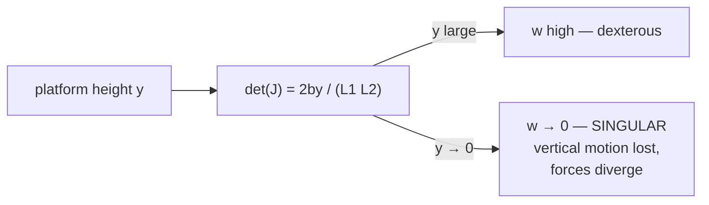

!!! abstract "You are here"
    **Module 1 — Kinematics** · **Unit 3 — Differential Motion** · **Lesson 3.2 — Singularities**

# Lesson 3.2 — Singularities

> **Module 1 · Unit 3 · Lesson 3.2** · interactive
> The deepest idea in parallel kinematics: a pose where the machine momentarily
> *loses a degree of freedom*. Recognizing — and avoiding — singularities is what
> separates a design that works from one that fights you.

---

## 1. Why This Matters

At a singularity the machine can't move in some direction no matter how you drive
the legs, the required forces blow up, and the controller "loses" an axis. Every
real parallel machine has them, and a huge part of design and operation is keeping
the working area *away* from them. This lesson is where the Jacobian's
manipulability number gets its physical teeth.

## 2. Physical Intuition

Recall that each leg can only change the platform's position *along its own
direction*. Now imagine a pose where both legs point in nearly the **same line** —
they can push the platform along that line, but they have almost no authority to
move it *perpendicular* to it. The platform has effectively lost the ability to move
in one direction: that's a singularity. Conversely, the platform might be able to
twitch even with the legs held fixed — the machine has gone "loose."

For our 2-DOF machine this happens at the **base line**: when the platform drops to
\(y = 0\), both legs lie flat along the x-axis and can't produce any vertical
motion.

## 3. Mathematical Foundations

A singularity is exactly where the Jacobian stops being invertible:

\[
\det(J) = 0 \quad\Longleftrightarrow\quad w = 0.
\]

Using the closed form from Lesson 3.1:

\[
\det(J) = \frac{2\,b\,y}{L_1 L_2} = 0 \quad\Longleftrightarrow\quad y = 0.
\]

So the singular locus of the 2-RPR is the **base line** \(y = 0\). As \(y \to 0\):

- velocity control needs \(J^{-1}\), which **blows up** (you'd need infinite leg
  speed for finite platform speed in the lost direction);
- force needs \(J^{-\mathsf T}\), so the **leg forces (and pressures) diverge** for
  an ordinary load.

The simulator flags two bands before disaster: **NEAR\_SINGULAR** (a warning as
\(w\) drops) and **SINGULAR** (\(w\) essentially zero).

## 4. Visual Explanation


The dark band along the bottom of the heatmap is the singular region. The legs
there are nearly horizontal — visually almost collinear — which is the geometric
signature of lost vertical authority.



## 5. Engineering Example

Geometry choices live or die on singularities. The simulator ships a deliberately
**broken 3-DOF preset** — a mirror-symmetric "diamond" that is singular whenever the
platform angle \(\theta = 0\). Command \(\theta = 0\) and the rotation axis becomes
uncontrollable; nudge \(\theta\) slightly and control returns. It exists to make one
lesson unforgettable: *a poorly chosen geometry can put a singularity right in the
middle of the workspace.* Good design pushes them to the edges.

## 6. Worked Example

Track manipulability as the platform descends straight down (\(x = 0\)), \(b = 0.6\):

| \(y\) (m) | \(L_1 = L_2 = \sqrt{0.36 + y^2}\) | \(\det(J) = 1.2\,y / (L_1 L_2)\) |
|----------:|----------------------------------:|---------------------------------:|
| 0.70 | 0.922 | 0.988 |
| 0.40 | 0.721 | 0.924 |
| 0.20 | 0.632 | 0.601 |
| 0.05 | 0.602 | 0.166 |
| 0.00 | 0.600 | **0.000 — singular** |

Manipulability collapses smoothly to zero as the platform reaches the base line.
The machine doesn't fail suddenly; it *warns* (the amber band) before it fails.

## 7. Interactive Demonstration

<iframe src="../../demos/kinematics-explorer.html" title="Kinematics Explorer — interactive demo" loading="lazy" style="width:100%;height:780px;border:1px solid var(--md-default-fg-color--lightest);border-radius:8px;background:#0e1217"></iframe>

[Open this demo full-screen in a new tab](../demos/kinematics-explorer.html){ target=_blank }

Drag the platform slowly straight down and watch the status pill march **OK →
NEAR SINGULAR → SINGULAR** while \(w\) falls toward zero, matching the table above.
Then explore sideways: notice the singular band hugs the base line everywhere. This
is the same warning the instructor and student dashboards raise during a real run.

## 8. Code & Computation

```python
from math import hypot
b = 0.6
def manip(x, y):                # manipulability = |det J| = 2*b*y/(L1*L2)
    L1, L2 = hypot(x + b, y), hypot(x - b, y)
    return abs(2*b*y/(L1*L2))
for y in [0.7, 0.4, 0.2, 0.05]:
    print(f"y={y:>4}:  manip = {manip(0.10, y):.4f}")   # collapses toward 0
```

!!! tip "Run it"
    The code above is self-contained Python (standard library only) — paste it into any Python 3 prompt to run it. To run the whole module interactively with nothing to install, open it in Google Colab (opens in a new browser tab): [Open Module 1 in Colab](https://colab.research.google.com/github/alibulentkoc/parallel-kinematics-hydraulics/blob/main/docs/notebooks/module01.ipynb){ target=_blank }.

## 9. Knowledge Check

[Open the Lesson 3.2 check](../quizzes/m1-l32.html)

## 10. Challenge Problem

Two machines have base half-spacings \(b = 0.6\) m and \(b = 0.3\) m. At the same
height \(y = 0.2\) m (and \(x = 0\)), which has the higher manipulability? Compute
both with \(\det(J) = 2by/(L_1L_2)\). What does this say about the trade-off between
a wide base (stiffness) and staying away from singularities?

## 11. Common Mistakes

- **Thinking a singularity is a software bug.** It's a *geometric* fact of the
  machine; the `NaN`-like blowups are the math correctly reporting a physical
  limit.
- **Only watching position.** You can be at a perfectly reachable pose and still be
  near-singular — reachability and manipulability are different checks.
- **Designing the workspace through a singularity.** The broken-diamond preset is
  the cautionary tale: keep the singular locus at the edge of the working region,
  never through its middle.

## 12. Key Takeaways

- A **singularity** is a pose where \(\det(J) = 0\): the machine loses a degree of
  freedom, and required forces/pressures diverge.
- For the 2-RPR the singular locus is the **base line** \(y = 0\); manipulability
  \(2by/(L_1L_2)\) falls smoothly to zero there.
- The simulator warns in two bands — **NEAR\_SINGULAR** then **SINGULAR** — before
  control is lost.
- **Geometry design** is largely the art of pushing singularities to the workspace
  edges; a bad choice puts one in the middle.

## AI Learning Companion

**Tutor**
```
Explain what a kinematic singularity is for a parallel machine, using the idea
that the legs become nearly collinear and lose authority in one direction.
Connect it to det(J) = 0.
```
**Explore**
```
Show me 3 real parallel machines (Stewart platform, delta robot, etc.) and where
their singularities are, and how designers keep the useful workspace away from them.
```

---

*Module 1 complete. Continue with the [reference handbook](../handbook/03-hydraulic-twin.md) for hydraulics, or see the [roadmap](../roadmap.md) for Modules 2–4.*
