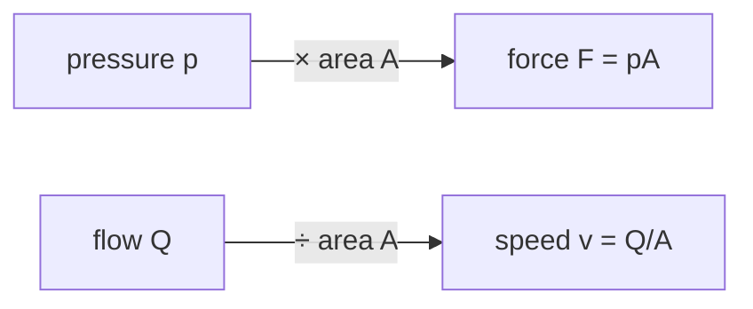

!!! abstract "You are here"
    **Module 2 — Hydraulic Actuation** · **Unit 1 — Cylinders & Asymmetry** · **Lesson 1.1 — The Hydraulic Cylinder**

# Lesson 1.1 — The Hydraulic Cylinder

> **Module 2 · Unit 1 · Lesson 1.1**
> Module 1 told us *how long* each leg must be. This module is about the device that
> actually changes that length — the hydraulic cylinder — and the physics that turns
> oil pressure and flow into force and motion.

---

## 1. Why This Matters

A leg length is just a number until something makes it happen. In our machine that
something is a **hydraulic cylinder**: a piston in a barrel, pushed by pressurized
oil. Everything about how the machine feels — how hard it can push, how fast it
moves, why it's stronger one way than the other — comes from the cylinder. Get the
cylinder model right and the control, the force, and the faults all follow.

## 2. Physical Intuition

Picture a bicycle pump sealed at both ends with oil instead of air. Push oil in one
port and the piston slides, lengthening the leg; push oil in the other port and it
retracts. Two quantities do all the work: **pressure** (force per unit area, how
*hard* the oil pushes) and **flow** (volume per unit time, how *fast* oil arrives,
which sets the speed). Force comes from pressure × area; speed comes from flow ÷
area. Hold those two sentences — the rest of the module is their consequences.

## 3. Mathematical Foundations

A cylinder of bore (piston) diameter \(D\) has a piston face area

\[
A = \frac{\pi D^2}{4}.
\]

The **force** the cylinder delivers is pressure times that area:

\[
F = p\,A.
\]

The **speed** of the piston is the volumetric flow divided by the area the oil must
fill:

\[
v = \frac{Q}{A}.
\]

These two relations are the whole actuator in miniature: pressure buys force, flow
buys speed, and area is the exchange rate for both. The twist — that the two sides
of the piston have *different* areas — is the subject of the next two lessons.

## 4. Visual Explanation


The piston splits the barrel into two chambers. Oil pressure on a face produces
force; oil flow into a chamber produces motion. The rod occupies part of one
chamber — which is exactly why the two sides aren't symmetric (Lesson 1.2).



## 5. Engineering Example

Our default cylinder has a 40 mm bore, giving a cap-side area of about
\(1257\ \text{mm}^2\). At the 16 MPa supply pressure that's a push of roughly
\(p A = 16\times10^6 \times 1257\times10^{-6} \approx 20\ \text{kN}\) — about two
tonnes of force from a cylinder you could hold in one hand. That force density is
exactly why hydraulics are chosen for heavy parallel machines over electric motors.

## 6. Worked Example

A 40 mm bore cylinder is fed 15 L/min of oil. How fast does the piston extend?

Area: \(A = \pi (0.040)^2/4 = 1.257\times10^{-3}\ \text{m}^2\).
Flow in SI: \(15\ \text{L/min} = 15/60000 = 2.5\times10^{-4}\ \text{m}^3/\text{s}\).

\[
v = \frac{Q}{A} = \frac{2.5\times10^{-4}}{1.257\times10^{-3}} = 0.199\ \text{m/s}.
\]

About 0.20 m/s — and notice we never needed the pressure to get the *speed*. Speed
is a flow story; force is a pressure story. Keeping them separate is the key habit
of this module.

## 7. Interactive Demonstration

<iframe src="../../demos/cylinder-asymmetry.html" title="Cylinder Asymmetry — interactive demo" loading="lazy" style="width:100%;height:700px;border:1px solid var(--md-default-fg-color--lightest);border-radius:8px;background:#0e1217"></iframe>

[Open this demo full-screen in a new tab ↗](../demos/cylinder-asymmetry.html){ target=_blank }

Set the bore to 40 mm and the flow to 15 L/min and confirm the extend speed reads
~0.20 m/s. Slide the pressure up and down and watch the *force* change while the
*speed* stays fixed — pressure and flow really are independent levers.

## 8. Code & Computation

```python
from math import pi
bore = 0.040
A_cap = pi * bore**2 / 4               # 1.257e-3 m^2
print(f"force @16 MPa = {16e6 * A_cap / 1e3:.1f} kN")   # F = pA  -> 20.1 kN
print(f"speed @15 L/min = {(2.5e-4) / A_cap:.2f} m/s")  # v = Q/A -> 0.20 m/s
```

!!! tip "Run this yourself — three ways"
    The Python above is a ready-to-run cell from the **Module 2 notebook**. Pick whichever is easiest:

    1. **Run in your browser, no setup —** open it in Google Colab and press the ▶ button on each cell: [Open Module 2 in Colab ↗](https://colab.research.google.com/github/alibulentkoc/parallel-kinematics-hydraulics/blob/main/docs/notebooks/module02.ipynb){ target=_blank }
    2. **Run locally —** [view/download the notebook on GitHub ↗](https://github.com/alibulentkoc/parallel-kinematics-hydraulics/blob/main/docs/notebooks/module02.ipynb){ target=_blank }, then open it in Jupyter, JupyterLab, or VS Code (`pip install notebook`, then `jupyter notebook`).
    3. **Just try the snippet —** copy the code above into any Python 3 prompt; it needs only the standard library.

    The cylinder model is in [`src/hydraulics/hydraulics.js`](https://github.com/alibulentkoc/parallel-kinematics-hydraulics/blob/main/src/hydraulics/hydraulics.js).

## 9. Knowledge Check

[Open the Lesson 2.1.1 check ↗](../quizzes/m2-l11.html){ target=_blank }

## 10. Challenge Problem

You need a cylinder to push 30 kN at a working pressure of 18 MPa. What bore
diameter \(D\) do you need? (Solve \(pA = F\) for \(A\), then \(D = \sqrt{4A/\pi}\).)
Round up to a standard bore and check the force you'd actually get.

## 11. Common Mistakes

- **Mixing up force and speed.** Pressure sets force; flow sets speed. They are
  independent — a cylinder can be fast and weak, or slow and strong.
- **Forgetting unit conversions.** L/min must become m³/s and mm² must become m²
  before the formulas give SI answers.
- **Assuming both sides are identical.** They aren't — the rod breaks the symmetry,
  as the next lesson shows.

## 12. Key Takeaways

- A hydraulic cylinder converts **pressure → force** (\(F = pA\)) and **flow →
  speed** (\(v = Q/A\)).
- **Area** is the exchange rate for both; bore diameter sets it via \(A = \pi
  D^2/4\).
- Force and speed are **independent levers** — pressure and flow.
- Hydraulics are chosen for their enormous **force density**.

## AI Learning Companion

**Tutor**
```
Explain how a hydraulic cylinder turns pressure and flow into force and speed,
using F = pA and v = Q/A. Stress why force and speed are independent.
```
**Practice**
```
Give me 5 cylinder sizing drills: given bore and pressure, find force; given bore
and flow, find speed. Mix the units (mm, MPa, L/min). Include answers.
```

---

*Next lesson: [1.2 — Area Asymmetry φ](1-2-area-asymmetry.md), where the rod makes the two sides unequal.*
