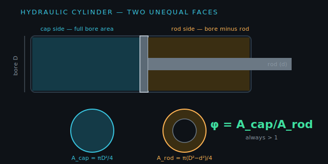
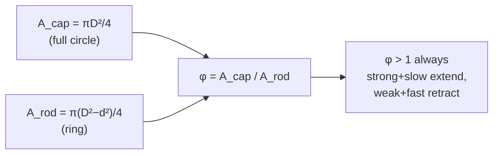

!!! abstract "You are here"
    **Module 2 — Hydraulic Actuation** · **Unit 1 — Cylinders & Asymmetry** · **Lesson 1.2 — Area Asymmetry φ**

# Lesson 1.2 — Area Asymmetry φ

> **Module 2 · Unit 1 · Lesson 1.2** · interactive
> The single most important quirk of a hydraulic cylinder: its two sides have
> different areas, so it is stronger and slower extending than retracting. One
> number — the ratio φ — captures the whole effect.

---

## 1. Why This Matters

If you assume a cylinder behaves the same in both directions, your force budget,
your speed estimates, and your controller's feedforward will all be wrong — by tens
of percent. The asymmetry is not a defect to ignore; it's a permanent feature of
any rod-on-one-side cylinder, and the ratio φ is how engineers account for it.

## 2. Physical Intuition

Look at the two faces of the piston. The **cap side** is a full circle of oil. The
**rod side** is a circle with a smaller circle (the rod) punched out of it — the rod
passes through that chamber, so oil can only press on the *ring* around it. Less
area on the rod side means: for the same pressure, **less force**; and for the same
flow, **more speed** (the oil has a smaller volume to fill). Extending (pushing on
the big cap face) is therefore strong and slow; retracting (pushing on the small
ring) is weaker and faster.

## 3. Mathematical Foundations

Cap-side (full bore) and rod-side (annulus) areas:

\[
A_\text{cap} = \frac{\pi D^2}{4}, \qquad
A_\text{rod} = \frac{\pi (D^2 - d^2)}{4},
\]

where \(D\) is the bore and \(d\) the rod diameter. The **asymmetry ratio** is their
quotient:

\[
\boxed{\;\varphi = \frac{A_\text{cap}}{A_\text{rod}} = \frac{D^2}{D^2 - d^2}\;}
\]

Because \(d > 0\), the denominator is always smaller than the numerator, so
\(\varphi > 1\) — always. A thicker rod (larger \(d\)) makes φ larger and the
asymmetry more severe.

## 4. Visual Explanation



The two circles at the bottom of the figure are the faces *to scale*: the rod
punches a hole in the rod-side face. The amount of "missing" area is exactly what
makes φ exceed 1.



## 5. Engineering Example

Our default cylinder: bore \(D = 40\) mm, rod \(d = 22\) mm.

\[
A_\text{cap} = \frac{\pi (40)^2}{4} = 1257\ \text{mm}^2, \quad
A_\text{rod} = \frac{\pi (40^2 - 22^2)}{4} = 877\ \text{mm}^2,
\]
\[
\varphi = \frac{1257}{877} = 1.43.
\]

So this cylinder pushes 43% harder than it pulls, and retracts 43% faster than it
extends. The test suite asserts exactly this — `hydraulics.test.js` checks
"asymmetry ≈ 1.43."

## 6. Worked Example

Keep the bore at 40 mm but use a *thicker* 28 mm rod. What happens to φ?

\[
A_\text{rod} = \frac{\pi (40^2 - 28^2)}{4} = \frac{\pi (1600 - 784)}{4}
= 641\ \text{mm}^2,
\]
\[
\varphi = \frac{1257}{641} = 1.96.
\]

A thicker rod nearly *doubled* the asymmetry. The rod isn't just a structural part —
its diameter is a design lever on how lopsided the cylinder behaves.

## 7. Interactive Demonstration

[Open the Cylinder Asymmetry demo ↗](../demos/cylinder-asymmetry.html){ target=_blank }

Set bore 40 mm, rod 22 mm and read φ = 1.43. Now drag the rod slider toward 28 mm
and watch φ climb toward ~1.96 while the cap and rod area circles redraw to scale —
the worked example, live.

## 8. Code Pointer

φ is computed in
[`src/hydraulics/hydraulics.js`](https://github.com/alibulentkoc/parallel-kinematics-hydraulics/blob/main/src/hydraulics/hydraulics.js):

```js
const D = 0.040, d = 0.022;
const Acap = Math.PI * D ** 2 / 4;
const Arod = Math.PI * (D ** 2 - d ** 2) / 4;
const phi  = Acap / Arod;          // 1.43
```

## 9. Knowledge Check

[Open the Lesson 2.1.2 check ↗](../quizzes/m2-l12.html){ target=_blank }

## 10. Challenge Problem

For what rod diameter \(d\) (with bore \(D = 40\) mm) would φ equal exactly 2.0?
(Set \(D^2/(D^2 - d^2) = 2\) and solve for \(d\).) What does φ = 2 mean for the
retract-versus-extend force?

## 11. Common Mistakes

- **Using bore area for both directions.** The rod side is an *annulus*; using the
  full bore overestimates retract force and underestimates retract speed.
- **Thinking φ < 1 is possible.** It never is for a single-rod cylinder — the rod
  can only remove area.
- **Ignoring the rod in speed estimates.** Retract is faster precisely because the
  rod-side area is smaller.

## 12. Key Takeaways

- The rod makes the two piston faces unequal: cap is a full circle, rod side is a
  ring.
- The **asymmetry ratio** \(\varphi = A_\text{cap}/A_\text{rod} = D^2/(D^2 - d^2)\)
  is **always > 1**.
- At defaults (40/22 mm), \(\varphi = 1.43\): 43% stronger and slower extending.
- **Rod diameter** is a design lever on how asymmetric the cylinder is.

## AI Learning Companion

**Tutor**
```
Explain why a hydraulic cylinder's rod side has less area than its cap side, and
why that makes φ = A_cap/A_rod always greater than 1. Use D and d.
```
**Practice**
```
Give me 5 problems computing A_cap, A_rod, and φ for various bore/rod pairs, and
interpreting what φ means for force and speed. Include answers.
```

---

*Next lesson: [1.3 — Force and Speed](1-3-force-and-speed.md), where φ turns into the actual numbers the machine produces.*
