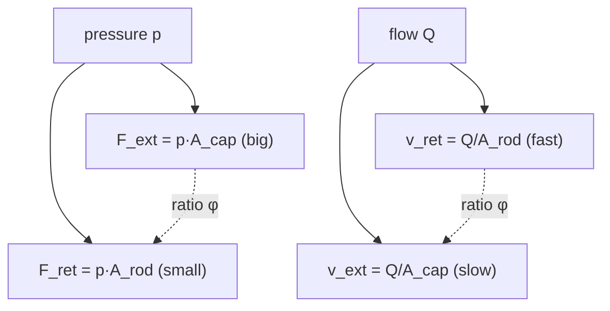

!!! abstract "You are here"
    **Module 2 — Hydraulic Actuation** · **Unit 1 — Cylinders & Asymmetry** · **Lesson 1.3 — Force and Speed**

# Lesson 1.3 — Force and Speed

> **Module 2 · Unit 1 · Lesson 1.3**
> Putting φ to work: the four numbers that define what a cylinder can do — extend
> force, retract force, extend speed, retract speed — and why they come in a
> strong-slow / weak-fast pair.

---

## 1. Why This Matters

When you size a machine or budget its performance, you need the *worst* case. A
cylinder's weakest push (retract) and its fastest move (retract) both matter for
safety and control. The asymmetry from Lesson 1.2 means you can't quote one force
and one speed — you must quote four, and know which direction is the limiting one
for your task.

## 2. Physical Intuition

Two levers, two areas, four outcomes. **Force** uses pressure on an area, so the
big cap area gives the big (extend) force and the small rod area gives the small
(retract) force. **Speed** uses flow divided by an area, so the small rod area
gives the *high* (retract) speed and the big cap area gives the low (extend) speed.
Strength and quickness trade off through the same areas — and they trade in
opposite directions.

## 3. Mathematical Foundations

With supply pressure \(p\) and supply flow \(Q\):

\[
F_\text{ext} = p\,A_\text{cap}, \qquad F_\text{ret} = p\,A_\text{rod},
\qquad \frac{F_\text{ext}}{F_\text{ret}} = \varphi,
\]
\[
v_\text{ext} = \frac{Q}{A_\text{cap}}, \qquad v_\text{ret} = \frac{Q}{A_\text{rod}},
\qquad \frac{v_\text{ret}}{v_\text{ext}} = \varphi.
\]

So φ is the ratio *both* ways: extend is φ times stronger, retract is φ times
faster. One number ties all four together.

## 4. Visual Explanation



The diagram is the whole lesson: the cap area governs the strong-slow extend; the
rod area governs the weak-fast retract; φ is the ratio linking each pair.

## 5. Engineering Example

At our defaults (\(p = 16\) MPa, \(Q = 15\) L/min, \(\varphi = 1.43\)):

| | extend (cap) | retract (rod) |
|---|---|---|
| **force** | 20.1 kN | 14.0 kN |
| **speed** | 0.20 m/s | 0.28 m/s |

If the task needs a hard push, extend is your friend (20 kN). If it needs to clear
quickly, retract is faster (0.28 m/s). A machine that must push *and* move fast in
the *same* direction is constrained by whichever number is worst for that direction
— which is the heart of sizing.

## 6. Worked Example

A load needs 16 kN of continuous force. Can our cylinder hold it in **both**
directions at 16 MPa?

- Extend: \(F_\text{ext} = 20.1\) kN ≥ 16 kN ✓
- Retract: \(F_\text{ret} = 14.0\) kN < 16 kN ✗

Retract can't do it. To hold 16 kN both ways you'd need to raise pressure to
\(p = F/A_\text{rod} = 16000 / 877\times10^{-6} = 18.2\) MPa, or pick a cylinder
with a thinner rod (smaller φ). This is exactly the kind of check the worked design
example in the handbook walks through.

## 7. Interactive Demonstration

<iframe src="../../demos/cylinder-asymmetry.html" title="Cylinder Asymmetry — interactive demo" loading="lazy" style="width:100%;height:700px;border:1px solid var(--md-default-fg-color--lightest);border-radius:8px;background:#0e1217"></iframe>

[Open this demo full-screen in a new tab ↗](../demos/cylinder-asymmetry.html){ target=_blank }

Read the four bars — extend/retract force and extend/retract speed — at the default
settings and confirm the table above. Then raise the pressure slider until the
retract-force bar reaches 16 kN, and note the pressure you needed.

## 8. Code & Computation

```python
from math import pi
D, d, p, Q = 0.040, 0.022, 16e6, 2.5e-4
A_cap = pi * D**2 / 4
A_rod = pi * (D**2 - d**2) / 4
print(f"F_ext={p*A_cap/1e3:.1f} kN  F_ret={p*A_rod/1e3:.1f} kN")   # 20.1, 14.0
print(f"v_ext={Q/A_cap:.2f} m/s  v_ret={Q/A_rod:.2f} m/s")        # 0.20, 0.29
```

!!! tip "Run it yourself"
    This computation is a runnable cell in the **[Module 2 notebook](https://github.com/alibulentkoc/parallel-kinematics-hydraulics/blob/main/docs/notebooks/module02.ipynb)** — pure Python, standard library only, so it runs anywhere with no installs. See [`src/hydraulics/hydraulics.js`](https://github.com/alibulentkoc/parallel-kinematics-hydraulics/blob/main/src/hydraulics/hydraulics.js).

## 9. Knowledge Check

[Open the Lesson 2.1.3 check ↗](../quizzes/m2-l13.html){ target=_blank }

## 10. Challenge Problem

A task requires the platform to move at 0.25 m/s while *extending*. At what flow
\(Q\) does the cylinder extend at 0.25 m/s? Then check: does retract at that same
flow exceed any speed limit you'd worry about? (Use \(v_\text{ext} = Q/A_\text{cap}\)
and \(v_\text{ret} = Q/A_\text{rod}\).)

## 11. Common Mistakes

- **Quoting a single force/speed.** A cylinder has *four* numbers; always say which
  direction.
- **Sizing for the strong direction.** The weak (retract) force is usually the
  limiting case — size for the worst case.
- **Forgetting the speed flips.** The strong direction is the slow direction; don't
  expect the cylinder to be fast *and* strong the same way.

## 12. Key Takeaways

- A cylinder has **four** defining numbers: extend/retract force and extend/retract
  speed.
- **Extend is strong and slow** (cap area); **retract is weak and fast** (rod area).
- φ is the ratio of *both* pairs: \(F_\text{ext}/F_\text{ret} = v_\text{ret}/v_\text{ext} = \varphi\).
- Size for the **worst-case** direction for your task.

## AI Learning Companion

**Tutor**
```
Explain why a hydraulic cylinder's strong direction (extend) is also its slow
direction, and why retract is weak but fast. Connect both to the area ratio φ.
```
**Practice**
```
Give me 4 worked problems computing F_ext, F_ret, v_ext, v_ret for a cylinder and
deciding whether it meets a force or speed requirement. Include answers.
```

---

*Next lesson: [2.1 — The Valve Flow Law](2-1-valve-flow-law.md), where we control how much oil reaches the cylinder.*
