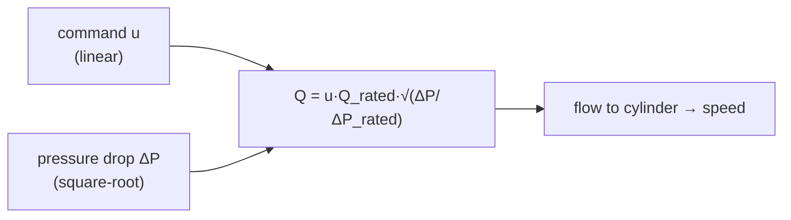

!!! abstract "You are here"
    **Module 2 — Hydraulic Actuation** · **Unit 2 — Valves, Flow & Pressure** · **Lesson 2.1 — The Valve Flow Law**

# Lesson 2.1 — The Valve Flow Law

> **Module 2 · Unit 2 · Lesson 2.1** · interactive
> The cylinder turns flow into speed — but what sets the flow? The valve. And the
> valve's flow law has a square root in it that surprises everyone the first time:
> halving the pressure drop does *not* halve the flow.

---

## 1. Why This Matters

The valve is the machine's throttle: the controller's command `u` opens it more or
less, metering oil to the cylinder. If you model the valve as linear ("twice the
command, twice the flow at any condition"), your controller will be mistuned across
the workspace, because the real valve's flow depends on pressure drop through a
**square root**. Understanding that nonlinearity is the difference between a loop
that tracks and one that hunts.

## 2. Physical Intuition

Think of water through a partly-open tap. Two things set the flow: **how far the tap
is open** (the command) and **how hard the water is pushed** (the pressure
difference across it). Open the tap twice as far and you roughly double the flow —
that part is linear. But push twice as hard and the flow only goes up by about 40%,
not double, because a faster stream meets more resistance. That diminishing return
is the square-root law.

## 3. Mathematical Foundations

The proportional-valve flow law:

\[
\boxed{\;Q = u \cdot Q_\text{rated}\,\sqrt{\dfrac{\Delta P}{\Delta P_\text{rated}}}\;}
\]

- \(u \in [-1, 1]\): the **command** (spool opening, sign sets direction) — linear.
- \(Q_\text{rated}\): the flow at full opening and rated pressure drop.
- \(\Delta P\): the actual pressure drop across the valve.
- \(\Delta P_\text{rated}\): the drop at which \(Q_\text{rated}\) is specified.

The command enters linearly; the pressure drop enters under a **square root**. That
\(\sqrt{\cdot}\) is the orifice equation in disguise — flow through a restriction
grows with the *square root* of the pressure pushing it.

## 4. Visual Explanation



The interactive demo plots this against a *naive linear* valve so you can see the
gap: at low pressure drop the real valve passes more flow than linear intuition
expects; the curves only meet at the rated point.

## 5. Engineering Example

Our valve is rated \(Q_\text{rated} = 15\) L/min. In the loop, the controller's
output `u` sets the opening, and the *available* pressure drop is whatever the
supply pressure minus the load pressure leaves. Near a heavy load, ΔP is small and
the valve passes less flow for the same command — so the same `u` produces a slower
cylinder when the load is high. A controller that doesn't know this feels
"sluggish under load"; one that does compensates for it.

## 6. Worked Example

Command \(u = 0.7\), rated flow 15 L/min, and the pressure drop is **half** rated
(\(\Delta P/\Delta P_\text{rated} = 0.5\)). What flow?

\[
Q = 0.7 \times 15 \times \sqrt{0.5} = 0.7 \times 15 \times 0.707 = 7.4\ \text{L/min}.
\]

Compare a *linear* guess (\(0.7 \times 15 \times 0.5 = 5.25\) L/min). The real valve
passes **7.4**, not 5.25 — about 40% more — because \(\sqrt{0.5} = 0.71\), not 0.5.
That gap is the whole point of the lesson.

## 7. Interactive Demonstration

<iframe src="../../demos/orifice-flow.html" title="Valve Flow Law — interactive demo" loading="lazy" style="width:100%;height:660px;border:1px solid var(--md-default-fg-color--lightest);border-radius:8px;background:#0e1217"></iframe>

[Open this demo full-screen in a new tab ↗](../demos/orifice-flow.html){ target=_blank }

Set \(u = 0.7\), \(Q_\text{rated} = 15\), and slide ΔP to 0.5 — confirm the flow
reads ~7.4 L/min on the blue (real) curve while the grey dashed (linear) line sits
lower at ~5.25. Sweep ΔP across its range and watch the square-root curve bow above
the straight line everywhere but the rated point.

## 8. Code & Computation

```python
from math import sqrt
def valve_flow(u, dP, Qrated=2.5e-4, dPrated=3.5e6):
    return u * Qrated * sqrt(max(0.0, dP / dPrated))
real   = valve_flow(0.7, 3.5e6/2) * 60000     # square-root law
linear = 0.7 * 15 * 0.5                        # naive linear guess
print(f"real = {real:.1f} L/min   linear = {linear:.2f} L/min")   # 7.4 vs 5.25
```

!!! tip "Run this yourself — three ways"
    The Python above is a ready-to-run cell from the **Module 2 notebook**. Pick whichever is easiest:

    1. **Run in your browser, no setup —** open it in Google Colab and press the ▶ button on each cell: [Open Module 2 in Colab ↗](https://colab.research.google.com/github/alibulentkoc/parallel-kinematics-hydraulics/blob/main/docs/notebooks/module02.ipynb){ target=_blank }
    2. **Run locally —** [view/download the notebook on GitHub ↗](https://github.com/alibulentkoc/parallel-kinematics-hydraulics/blob/main/docs/notebooks/module02.ipynb){ target=_blank }, then open it in Jupyter, JupyterLab, or VS Code (`pip install notebook`, then `jupyter notebook`).
    3. **Just try the snippet —** copy the code above into any Python 3 prompt; it needs only the standard library.

## 9. Knowledge Check

[Open the Lesson 2.2.1 check ↗](../quizzes/m2-l21.html){ target=_blank }

## 10. Challenge Problem

At full command (\(u = 1\)) you measure 12 L/min through the valve. The datasheet
rates it at 15 L/min at \(\Delta P_\text{rated}\). What fraction of rated pressure
drop are you operating at? (Solve \(12 = 15\sqrt{\Delta P/\Delta P_\text{rated}}\).)

## 11. Common Mistakes

- **Assuming flow is proportional to pressure drop.** It scales with the *square
  root* — the most common modelling error in hydraulics.
- **Ignoring the available pressure drop.** Under heavy load ΔP shrinks and the same
  command gives less flow.
- **Treating `u` and ΔP the same way.** Command is linear; pressure drop is under
  the root.

## 12. Key Takeaways

- Valve flow: \(Q = u\,Q_\text{rated}\sqrt{\Delta P/\Delta P_\text{rated}}\) —
  **linear in command, square-root in pressure drop**.
- Halving the pressure drop gives ~71% of the flow, not 50%.
- The available pressure drop depends on the **load**, so the same command can mean
  different speeds.
- This nonlinearity is why naive linear control struggles across the workspace.

## AI Learning Companion

**Tutor**
```
Explain the proportional-valve flow law Q = u·Q_rated·√(ΔP/ΔP_rated). Why is the
command linear but the pressure drop under a square root? Use the orifice analogy.
```
**Practice**
```
Give me 5 valve-flow problems: given u, Q_rated, and ΔP/ΔP_rated, compute Q, and
compare to a naive linear estimate. Include answers.
```

---

*Next lesson: [2.2 — Load Pressure & the Jacobian](2-2-load-pressure.md), where the platform's load becomes cylinder pressure.*
