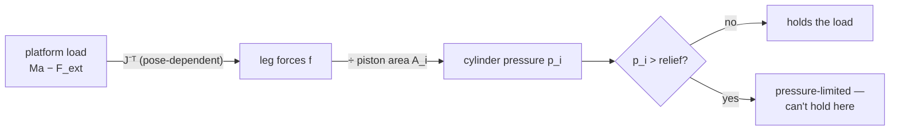

!!! abstract "Hydraulic Twin · C5 · load pressure · Milestone: midterm 2-DOF build (W8)"
    **Artifact contribution:** the load-pressure check feeding the Sizing Report

# Lesson 2.2 — Load Pressure & the Jacobian

!!! note "Why you need this — before the theory"
    How hard a leg must push depends on the pose through the Jacobian — load pressure rises where manipulability falls. Catching that early keeps the Sizing Report honest about worst-case pressure.

!!! info "Standards — read real documentation"
    Symbols in this lesson follow **ISO 1219 / ANSI Y32.10**. Learn to read them: these are the
    symbols on real hydraulic schematics and datasheets, not course-specific drawings.

---

## 1. Why This Matters

A load sitting on the platform doesn't press on the cylinders directly — it presses
through the *geometry*. How much pressure each cylinder needs depends on **where**
the platform is, because the Jacobian (Lesson 1.3.1) changes with pose. This is why
the same payload can be easy in one part of the workspace and pressure-saturating in
another, and why singularities are a hydraulic problem, not just a geometric one.

## 2. Physical Intuition

Imagine pushing a platform straight up while the legs splay out sideways. Only the
*vertical part* of each leg's push supports the load, so the legs must push much
harder along their length than the load itself — and that extra push is pressure.
When the legs are near-vertical the geometry is efficient; when they're near-flat
(approaching a singularity) the required leg force, and so the pressure, climbs
toward infinity.

## 3. Mathematical Foundations

From Lesson 1.3.1, leg forces \(f\) and platform wrench \(F\) are related by the
Jacobian transpose:

\[
F = J^{\mathsf T} f \quad\Longrightarrow\quad f = J^{-\mathsf T} F.
\]

To hold a payload of mass \(M\) (and accelerate it at \(a\)) against external force
\(F_\text{ext}\):

\[
f = J^{-\mathsf T}\,(M a - F_\text{ext}).
\]

Each leg force then becomes a **pressure** through the relevant piston area
(extend uses \(A_\text{cap}\), retract uses \(A_\text{rod}\)):

\[
p_i = \frac{f_i}{A_i}.
\]

As \(\det(J)\to 0\) near a singularity, \(J^{-\mathsf T}\) blows up, so \(f\) — and
the demanded pressure — diverges. The relief valve (next lesson) is what stops that
from destroying the machine.

!!! quote "Equation provenance"
    **Source:** Engine (src/hydraulics, load pressure; Jacobian) · B4 · A6 · Family 2

## 4. Visual Explanation



The chain is: **load → (Jacobian) → leg force → (area) → pressure**. Both
conversions can amplify: a bad pose inflates the leg force, a small area inflates
the pressure.

## 5. Engineering Example

In the simulator, the hydraulics module asks the kinematics for the current
Jacobian every cycle, computes the leg forces for the commanded motion and payload,
and converts them to the pressures it then checks against the relief limit. When you
drive a heavy preset toward the workspace edge, you can watch the demanded pressure
climb — and the fault engine raise an over-pressure warning before the relief opens.

## 6. Worked Example

Hold a 12 kg payload statically (\(a = 0\), \(F_\text{ext} = Mg\) downward) near a
healthy pose where, say, each leg must supply about 90 N of vertical-support force
that geometry turns into roughly 130 N along the leg. On the extend (cap) side:

\[
p = \frac{f}{A_\text{cap}} = \frac{130}{1257\times10^{-6}} \approx 0.10\ \text{MPa}.
\]

A trivial pressure — far below the 16 MPa supply. Now move the same load toward the
base line: the geometry factor inflates, the required leg force climbs by 10× or
more, and the pressure marches toward the relief limit. *Same load, same cylinders —
only the pose changed.*


*Read this directly — it is exported from the simulator at frozen parameters and feeds the artifact.*


*Read this directly — it is exported from the simulator at frozen parameters and feeds the artifact.*

## 7. Interactive Demonstration

<iframe src="../../demos/hydraulic-explorer.html" title="Hydraulic Explorer — interactive demo" loading="lazy" style="width:100%;height:780px;border:1px solid var(--md-default-fg-color--lightest);border-radius:8px;background:#0e1217"></iframe>

[Open this demo full-screen in a new tab](../demos/kinematics-explorer.html){ target=_blank }

While this demo shows manipulability rather than pressure directly, the connection
is exact: the dark (low-\(w\)) regions are precisely where \(J^{-\mathsf T}\) — and
therefore the required leg force and pressure — blow up. Drag toward the base line
and read the collapsing manipulability as a pressure-danger map.

!!! tip "Use the demo — Observe → Interpret → Apply"
    - **Observe:** Move toward a low-manipulability pose; watch load pressure climb.
    - **Interpret:** Load pressure ∝ 1/det(J): poor dexterity means high pressure demand.
    - **Apply:** Check the worst-case pose stays under the relief setting.

## 8. Code & Computation

```python
from math import pi
# leg force -> pressure through the piston area:  p = f / A
A_cap = pi * 0.040**2 / 4
f = 130.0                       # N along the leg (from J^-T * load, pose-dependent)
print(f"pressure = {f / A_cap / 1e6:.3f} MPa")     # ~0.10 MPa at a healthy pose
# near a singularity J^-T blows up, so f -- and this pressure -- diverge.
```

!!! tip "Run it"
    The code above is self-contained Python (standard library only) — paste it into any Python 3 prompt to run it. To run the whole module interactively with nothing to install, open it in Google Colab (opens in a new browser tab): [Open Module 2 in Colab](https://colab.research.google.com/github/alibulentkoc/parallel-kinematics-hydraulics/blob/main/docs/notebooks/module02.ipynb){ target=_blank }.

!!! success "Verify with the notebook"
    Run **[Notebook N2 — Hydraulics](../notebooks/index.md)** to reproduce these values from the exported CSV. The acceptance test (**hold pressure ≤ relief**) is owned by the artifact and stated in **[Handbook Ch 3 — Hydraulic Twin](../handbook/03-hydraulic-twin.md)**; this lesson references it, it is not re-defined here.

## 9. Knowledge Check

[Check your understanding — Quiz 2](../quizzes/quiz-2-hydraulic-sizing.md)

## 10. Challenge Problem

Explain, in two or three sentences, why a parallel machine can be perfectly
*reachable* at a pose yet still *unable to hold a load* there. Which quantity — leg
length or manipulability — warns you about each failure?

## 11. Common Mistakes

- **Assuming pressure depends only on the load.** It depends on the load *and the
  pose*, through the Jacobian.
- **Using the wrong area.** Extend pressure uses \(A_\text{cap}\); retract uses
  \(A_\text{rod}\) — mixing them gives the wrong number by the factor φ.
- **Forgetting the singularity blow-up.** Near \(\det(J)=0\), demanded pressure
  diverges no matter how light the load.

## 12. Key Takeaways

- Load becomes leg force through the **Jacobian transpose**: \(f = J^{-\mathsf T}(Ma
  - F_\text{ext})\).
- Leg force becomes **pressure** through the piston area: \(p_i = f_i/A_i\).
- Both conversions are **pose-dependent**, so the same load needs different pressure
  in different places.
- Near a **singularity**, demanded pressure **diverges** — geometry is a hydraulic
  constraint.

## AI Learning Companion

**Tutor**
```
Explain how a load on a parallel machine's platform becomes pressure in each
cylinder, via f = J⁻ᵀ(Ma − F_ext) and p = f/A. Why does pose matter so much?
```
**Explore**
```
Explain why the required cylinder pressure blows up near a kinematic singularity,
and what a real machine does (relief valve, motion limits) to survive it.
```

---

*Next lesson: [2.3 — Pump & Relief Sizing](2-3-pump-and-relief.md), where we size the power unit to supply the flow and cap the pressure.*

