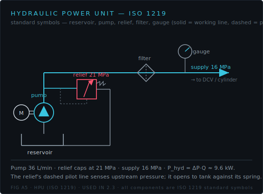
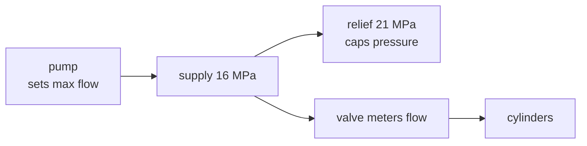

!!! abstract "You are here"
    **Module 2 — Hydraulic Actuation** · **Unit 2 — Valves, Flow & Pressure** · **Lesson 2.3 — Pump & Relief Sizing**

# Lesson 2.3 — Pump & Relief Sizing

> **Module 2 · Unit 2 · Lesson 2.3**
> The power unit that feeds everything: a pump that must supply enough *flow* for the
> fastest move across all legs at once, and a relief valve that caps the *pressure*
> so a singularity or a jam can't burst the system.

---

## 1. Why This Matters

A machine is only as fast as its pump can feed it and only as safe as its relief
valve. Undersize the pump and the platform starves and slows whenever several
cylinders move together; omit or misplace the relief and a pressure spike from a
singularity or mechanical jam goes unchecked. Sizing these two components correctly
is what turns a set of cylinders into a usable, safe machine.

## 2. Physical Intuition

The pump is the heart; it pushes a fixed volume of oil per second. Every moving
cylinder draws from that one supply, so the pump must provide the **sum** of all the
cylinders' flow demands at the worst moment — when they all move fast together. The
relief valve is the pressure safety: a spring-loaded escape that dumps oil back to
tank once pressure exceeds its setting, guaranteeing the system can never go above
that ceiling no matter what the load or geometry demands.

## 3. Mathematical Foundations

**Pump flow** must cover the worst-case total cylinder demand:

\[
Q_\text{pump} \ge \sum_i |v_i|\,A_i \quad\text{(worst case, all legs moving).}
\]

**Relief pressure** sits above the working supply but below the components' burst
rating:

\[
p_\text{supply} < p_\text{relief} < p_\text{burst}.
\]

**Hydraulic power** delivered is pressure times flow:

\[
P_\text{hyd} = p\,Q.
\]

This is the budget that ties the whole module together: areas and speeds set the
flow demand, the Jacobian and load set the pressure demand, and their product is the
power the unit must provide.

## 4. Visual Explanation



The schematic shows the power path: the **pump** lifts oil from tank to supply
pressure, the **relief valve** caps that pressure (dumping excess back to tank), and
the **proportional valve** meters flow onward to the **cylinder**. Size the pump for
flow, the relief for the pressure ceiling.



## 5. Engineering Example

Our default power unit: a pump rated \(6\times10^{-4}\ \text{m}^3/\text{s} = 36\)
L/min, a 16 MPa supply, and a 21 MPa relief. Why those numbers? One cylinder
retracting fast draws ~15 L/min; with all legs potentially moving, 36 L/min gives
comfortable headroom. The relief sits 5 MPa above supply — high enough not to nuisance-trip
during normal pressure swings, low enough to protect the components.

## 6. Worked Example

What hydraulic power does the unit deliver at full output?

\[
P_\text{hyd} = p\,Q = 16\times10^6 \times 6\times10^{-4} = 9{,}600\ \text{W} \approx 9.6\ \text{kW}.
\]

And a flow check: if two cylinders each retract at 0.28 m/s (\(A_\text{rod} = 877\
\text{mm}^2\)):

\[
Q_\text{demand} = 2 \times 0.28 \times 877\times10^{-6} = 4.9\times10^{-4}\ \text{m}^3/\text{s} = 29.5\ \text{L/min},
\]

inside the 36 L/min the pump supplies — so the move doesn't starve. Push to three
fast cylinders and you'd approach the limit, and the platform would slow: the pump
is the speed ceiling.

## 7. Interactive Demonstration

<iframe src="../../demos/hydraulic-explorer.html" title="Valve Flow Law — interactive demo" loading="lazy" style="width:100%;height:660px;border:1px solid var(--md-default-fg-color--lightest);border-radius:8px;background:#0e1217"></iframe>

[Open this demo full-screen in a new tab](../demos/hydraulic-explorer.html){ target=_blank }

The pump sets the *total* flow available; the valve demo shows how a single leg's
flow depends on command and pressure drop. Picture several of these running at once
sharing the 36 L/min supply — when their demands sum past the pump's output,
everyone slows together.

## 8. Code & Computation

```python
from math import pi
supply, pump_max_flow = 16e6, 6e-4         # 36 L/min
print(f"hydraulic power = {supply * pump_max_flow / 1e3:.1f} kW")   # 9.6 kW
A_rod = pi * (0.040**2 - 0.022**2) / 4
demand = 2 * 0.28 * A_rod                   # two legs retracting at 0.28 m/s
print(f"2-leg demand = {demand*60000:.1f} L/min (pump supplies {pump_max_flow*60000:.0f})")
```

!!! tip "Run it"
    The code above is self-contained Python (standard library only) — paste it into any Python 3 prompt to run it. To run the whole module interactively with nothing to install, open it in Google Colab (opens in a new browser tab): [Open Module 2 in Colab](https://colab.research.google.com/github/alibulentkoc/parallel-kinematics-hydraulics/blob/main/docs/notebooks/module02.ipynb){ target=_blank }.

## 9. Knowledge Check

[Open the Lesson 2.2.3 check](../quizzes/m2-l23.html)

## 10. Challenge Problem

You want every cylinder able to retract at 0.30 m/s *simultaneously* (three legs,
\(A_\text{rod} = 877\ \text{mm}^2\)). What minimum pump flow (in L/min) do you need?
Does the default 36 L/min pump suffice? If not, by how much is it short?

## 11. Common Mistakes

- **Sizing the pump for one cylinder.** It must feed the *sum* of all simultaneous
  demands.
- **Setting the relief at or below supply.** It would dump oil during normal
  operation; it must sit above working pressure.
- **Ignoring pump saturation.** When demand exceeds supply, the platform slows —
  that's a flow limit, not a control bug.

## 12. Key Takeaways

- The **pump** is sized for the worst-case *summed* flow; it is the machine's speed
  ceiling.
- The **relief** caps pressure between supply and burst, protecting against
  singularity and jam spikes.
- **Hydraulic power** \(P = pQ\) ties pressure and flow into one budget (~9.6 kW at
  defaults).
- Exceeding pump flow causes **saturation** — graceful slowing, not failure.

## AI Learning Companion

**Tutor**
```
Explain how to size a hydraulic pump (for flow) and a relief valve (for pressure)
for a multi-cylinder machine, and what hydraulic power P = pQ represents.
```
**Practice**
```
Give me 4 sizing problems: given cylinder speeds and areas, find the required pump
flow; given supply and burst, choose a relief setting. Include answers.
```

---

*Module 2 complete. Continue to [Module 3 — Closed-Loop Control](../module03/1-1-why-feedback.md).*

---
## Aligned assets
*This lesson uses existing course assets — it creates none.*

- **Read:** [HPU (ISO 1219)](../figures/A5-hpu-architecture.svg) · [Pump / power](../figures/B6-pump-power.svg)
- **Explore:** [Family 2 — Hydraulic demo](../demos/hydraulic-explorer.html) · Pump view
- **Procedure & acceptance test:** [Handbook Ch 3 — Hydraulic Twin](../handbook/03-hydraulic-twin.md)
- **Verify:** [Notebook N2 — Hydraulics](../notebooks/index.md) — φ ≤ 1.6 · F_ext ≥ load · flow ≤ pump max · hold ≤ relief
- **Check yourself:** [Quiz 2 — Hydraulic Sizing](../quizzes/quiz-2-hydraulic-sizing.md)
