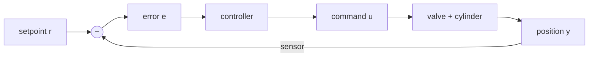

!!! abstract "You are here"
    **Module 3 — Closed-Loop Control** · **Unit 1 — The Feedback Loop** · **Lesson 1.1 — Why Feedback**

# Lesson 1.1 — Why Feedback

> **Module 3 · Unit 1 · Lesson 1.1**
> We can compute the leg lengths (Module 1) and the forces and flows (Module 2). But
> if we just command them and hope, the platform drifts. This module is about
> *closing the loop* — measuring what actually happened and correcting it.

---

## 1. Why This Matters

The real world never does exactly what you command. Friction, leaks, an unexpected
load, the valve's nonlinearity — all push the platform off target. **Open-loop**
control (command and hope) accumulates these errors with no way to notice or fix
them. **Closed-loop** control measures the actual position, compares it to the
target, and corrects — which is the only way a hydraulic machine holds a pose
accurately.

## 2. Physical Intuition

Pouring water to a line on a glass with your eyes **closed** is open-loop: you guess
the pour and stop, and you're usually off. Doing it with your eyes **open** is
closed-loop: you watch the level, slow as you approach, and stop exactly on the
line. The difference is *feedback* — using the measured result to shape the next
action. Every accurate machine works with its eyes open.

## 3. Mathematical Foundations

The loop is built around the **error**, the gap between where you want to be and
where you are:

\[
e(t) = r(t) - y(t),
\]

with \(r\) the setpoint (target) and \(y\) the measured output (actual position).
The controller is any rule that turns error into a command \(u\) that shrinks the
error:

\[
u(t) = C\big(e(t)\big).
\]

The loop runs forever: **sense** \(y\) → **compare** to \(r\) to get \(e\) →
**correct** with \(u\) → **actuate** → sense again. The art of control is choosing
\(C\) so the error goes to zero quickly and stays there (Lessons 1.2–1.3).

## 4. Visual Explanation


The figure is the loop in one picture: the setpoint enters, the sensor's measurement
is subtracted to form the error, the controller turns error into a command, the
plant (valve + cylinder) moves, and the sensor closes the loop.



## 5. Engineering Example

In the simulator, the position sensor is the cylinder's length transducer; forward
kinematics (Module 1) turns measured lengths into the platform pose; the controller
compares that to the commanded pose and adjusts the valve commands every cycle. Open
any dashboard and the strip-charts of error you see are this loop working — error
spikes when you move the target, then decays as the loop corrects.

## 6. Worked Example

Suppose the target leg length is 0.90 m and the sensor reads 0.87 m. The error is

\[
e = 0.90 - 0.87 = +0.03\ \text{m}.
\]

A positive error means "too short — extend." The controller sends a command to open
the valve toward extend; oil flows, the cylinder lengthens, the measured length
rises, and the error shrinks toward zero. Next cycle it measures again and repeats.
That repetition — not any single perfect command — is what makes the loop accurate.

## 7. Interactive Demonstration

<iframe src="../../demos/pid-tuning.html" title="PID Tuning — interactive demo" loading="lazy" style="width:100%;height:720px;border:1px solid var(--md-default-fg-color--lightest);border-radius:8px;background:#0e1217"></iframe>

[Open this demo full-screen in a new tab](../demos/pid-tuning.html){ target=_blank }

The demo shows the loop chasing a step setpoint. For now, just watch the response
curve climb toward the dashed target line and settle there — that climb *is*
feedback shrinking the error. The next lessons explain the three terms that shape
how it climbs.

## 8. Code & Computation

```python
r, y = 0.90, 0.87               # setpoint and measured length
e = r - y                       # the error the loop drives to zero
print(f"error = {e:+.3f} m  ->  positive means too short, so extend")
```

!!! tip "Run it"
    The code above is self-contained Python (standard library only) — paste it into any Python 3 prompt to run it. To run the whole module interactively with nothing to install, open it in Google Colab (opens in a new browser tab): [Open Module 3 in Colab](https://colab.research.google.com/github/alibulentkoc/parallel-kinematics-hydraulics/blob/main/docs/notebooks/module03.ipynb){ target=_blank }.

## 9. Knowledge Check

[Open the Lesson 3.1.1 check](../quizzes/m3-l11.html)

## 10. Challenge Problem

Give one example, from any machine you know, where open-loop control is *good
enough* and one where it's dangerous. What makes the difference — how predictable
the system is, or how costly an error is? Relate it to why our hydraulic platform
must be closed-loop.

## 11. Common Mistakes

- **Confusing setpoint with measurement.** The error is target minus *measured*; a
  controller that trusts the command instead of the sensor isn't closed-loop.
- **Thinking one good command is enough.** Accuracy comes from *continuous*
  correction, not a single perfect output.
- **Forgetting the loop runs at a fixed rate.** Feedback is only as fresh as the
  last measurement (Module 4 returns to timing).

## 12. Key Takeaways

- **Open-loop** commands and hopes; **closed-loop** measures and corrects.
- The loop is built on the **error** \(e = r - y\) and the cycle *sense → compare →
  correct → actuate*.
- Feedback is the only way a hydraulic machine holds a pose against friction, leaks,
  load, and valve nonlinearity.
- Accuracy comes from **repetition**, not a single perfect command.

## AI Learning Companion

**Tutor**
```
Explain the difference between open-loop and closed-loop control using a everyday
example, then connect it to error e = r − y and the sense-compare-correct-actuate
cycle.
```
**Explore**
```
Give me 5 real machines and say whether each is open-loop or closed-loop, and why
that choice fits the cost of being wrong.
```

---

*Next lesson: [1.2 — PID Control](1-2-pid-control.md), the three-term controller that does the correcting.*
