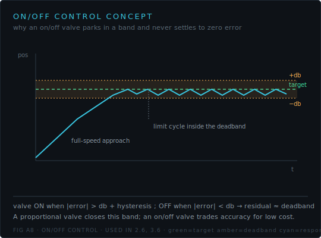
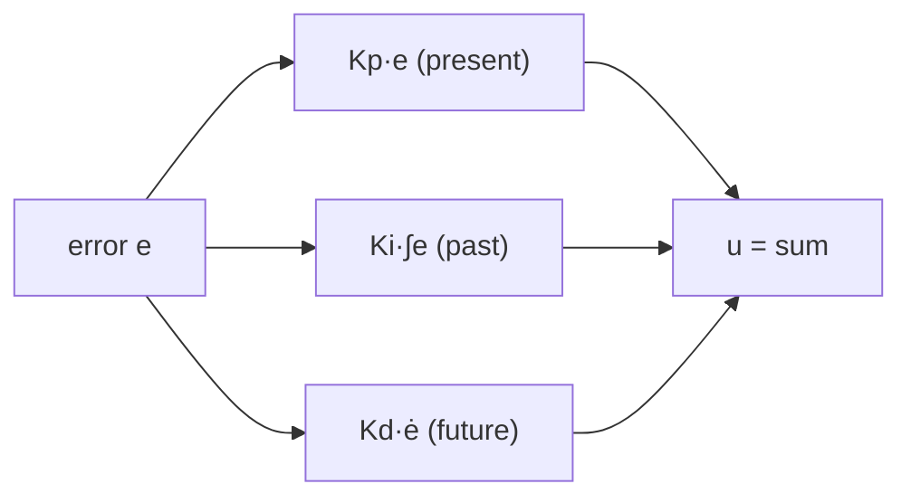

!!! abstract "Control Twin · C6/C7 · PWM position control · Milestone: control loop → final 3-DOF (W15)"
    **Artifact contribution:** the Path A signature: the Position-control / Duty-characterization result

# Lesson 1.2 — PID Control

!!! note "Why you need this — before the theory"
    PID computes how hard to push, but on this machine that command becomes a PWM duty on a solenoid on/off valve. This lesson is the Path A signature — position control with on/off valves via PWM — the result your Position-control demo must show.

!!! warning "Control identity — Path A (fluid-power control, not generic)"
    This is control of the **hydraulic PKM**. The controller's command `u` drives a
    **solenoid on/off DCV via PWM** (the signature path); a **proportional valve** appears only as a
    **benchmark**. The course outcome is **position control with on/off valves via PWM, and explaining
    its limits versus proportional** — not generic controls.

---

## 1. Why This Matters

PID is the controller running in your thermostat, your car's cruise control, and our
hydraulic platform. It's popular because it's simple, robust, and needs no model of
the plant — just three numbers to tune. Understanding what each term does turns
tuning from guesswork into reasoning, and explains every behaviour you'll see in the
demo and the dashboards.

## 2. Physical Intuition

Three instincts, combined:

- **Proportional** — push harder the farther you are from target. (reacts to the
  *present* error)
- **Integral** — if you've been off for a while, lean in more to erase the leftover
  gap. (accounts for the *past*)
- **Derivative** — if you're closing fast, ease off so you don't overshoot.
  (anticipates the *future*)

A skilled person filling a glass does all three without thinking: pour fast when
far, keep nudging if just under the line, and slow as the level races up.

## 3. Mathematical Foundations

The PID command is the sum of the three terms:

\[
\boxed{\;u(t) = K_p\,e(t) \;+\; K_i\!\int_0^t e(\tau)\,d\tau \;+\; K_d\,\frac{de(t)}{dt}\;}
\]

- \(K_p\): proportional gain — speed of response, but too much causes overshoot.
- \(K_i\): integral gain — removes steady-state error, but too much causes
  oscillation and windup.
- \(K_d\): derivative gain — damps overshoot, but amplifies sensor noise.

In practice the derivative is taken on the *measurement* (not the error) to avoid
spikes when the setpoint jumps, and the integral is *clamped* to prevent windup —
both of which the codebase implements.

!!! quote "Equation provenance"
    **Source:** Engine (src/control, PID; valve PWM) · A7 · A8 · B8 · Family 3

## 4. Visual Explanation



The controller block in the loop is the PID sum. Each term reads the same error and
contributes to the command; their balance is what you tune.



## 5. Engineering Example

!!! info "Where the wiring lives"
    This lesson is about the *control law* — the math the controller runs. How that
    loop is physically realized (controller/PLC, valve driver, position and pressure
    sensors, and their power) is covered in [Module 4 — From Simulator to Hardware](../module04/index.md)
    and, in full, in the handbook chapter [Electrical & Control Wiring](../handbook/06-wiring-and-io-appendix.md).
    You can tune the loop (next lesson) in simulation first; the same gains transfer to the wired rig.

Our controller is a PID with the production niceties: derivative
on measurement, an anti-windup clamp on the integral, and an optional feedforward
term (Lesson 2.2). It runs per-leg in joint space and can also run in task space on
the platform pose (Lesson 2.1). The same three gains you'll drag in the demo are the
ones the instructor sets in the dashboard presets.

## 6. Worked Example

Start with proportional only (\(K_i = K_d = 0\)). With a small \(K_p\), the platform
creeps toward target and stops slightly short — a **steady-state error**, because as
\(e\) shrinks so does the push, until it balances friction before reaching zero.
Add a little \(K_i\): the integral accumulates that leftover error over time and
slowly drives it to zero. Add a little \(K_d\): if you then raise \(K_p\) for speed,
the derivative term damps the overshoot that would otherwise appear. Three terms,
three jobs — you just tuned a controller by reasoning, not luck.


*Read this directly — exported from the simulator at frozen parameters; it backs the artifact.*


*Read this directly — exported from the simulator at frozen parameters; it backs the artifact.*

## 7. Interactive Demonstration

<iframe src="../../demos/pwm-control-lab.html" title="PID Tuning — interactive demo" loading="lazy" style="width:100%;height:720px;border:1px solid var(--md-default-fg-color--lightest);border-radius:8px;background:#0e1217"></iframe>

[Open this demo full-screen in a new tab](../demos/pwm-control-lab.html){ target=_blank }

Use the presets first: **too slow** (low \(K_p\)) creeps; **too hot** (high \(K_p\))
overshoots and rings; **well tuned** combines moderate \(K_p\) with a little \(K_i\)
and \(K_d\) for a fast, clean settle. Then drag each gain alone and watch which part
of the curve it changes — rise, overshoot, or steady offset.

!!! tip "Use the demo — Observe → Interpret → Apply"
    - **Observe:** Compare on/off, PWM, and proportional step responses in the demo.
    - **Interpret:** On/off parks short (deadband); PWM recovers fine positioning; proportional is the benchmark.
    - **Apply:** Tune the PWM duty onto target and explain why on/off alone cannot settle.

## 8. Code & Computation

```python
class PID:                       # derivative-on-measurement + anti-windup
    def __init__(self, Kp, Ki, Kd, i_max=1.0):
        self.Kp, self.Ki, self.Kd, self.i_max = Kp, Ki, Kd, i_max
        self.integ = self.prev = 0.0
    def update(self, e, meas, dt):
        self.integ = max(-self.i_max, min(self.i_max, self.integ + e*dt))
        deriv = -(meas - self.prev)/dt; self.prev = meas
        return self.Kp*e + self.Ki*self.integ + self.Kd*deriv
print(round(PID(3, 1.5, 0.4).update(0.03, 0.87, 0.02), 4))
```

!!! tip "Run it"
    The code above is self-contained Python (standard library only) — paste it into any Python 3 prompt to run it. To run the whole module interactively with nothing to install, open it in Google Colab (opens in a new browser tab): [Open Module 3 in Colab](https://colab.research.google.com/github/alibulentkoc/parallel-kinematics-hydraulics/blob/main/docs/notebooks/module03.ipynb){ target=_blank }.

!!! success "Verify with the notebook"
    Run **[Notebook N3 — PWM / Control](../notebooks/index.md)** to reproduce these values from the exported CSV. The acceptance test (**settling ≤ 2.5 s; on/off limit cycle bounded**) is owned by the artifact and stated in **[Handbook Ch 4 — Control Twin](../handbook/04-control-twin.md)**; this lesson references it, it is not re-defined here.

## 9. Knowledge Check

[Check your understanding — Quiz 3](../quizzes/quiz-3-pwm-position-control.md)

## 10. Challenge Problem

You have a controller with only \(K_p\) and it settles fast but with a small steady
offset. A colleague suggests "just raise \(K_p\) more." Explain what that actually
does to the offset and to overshoot, and which term you should add instead to remove
the offset cleanly.

## 11. Common Mistakes

- **Cranking \(K_p\) to kill steady error.** It reduces but never removes the offset,
  and brings overshoot — that's the integral's job.
- **Taking the derivative of the error.** A setpoint step makes \(de/dt\) spike;
  take the derivative of the *measurement* instead.
- **No anti-windup.** During saturation the integral grows unbounded and overshoots
  badly when it finally catches up — always clamp it.

## 12. Key Takeaways

- PID sums three terms: **P** (present error), **I** (accumulated past), **D**
  (anticipated future).
- \(K_p\) gives speed, \(K_i\) removes steady-state error, \(K_d\) damps overshoot.
- Production PID uses **derivative-on-measurement** and **anti-windup** — both in the
  codebase.
- Tuning is reasoning about which term shapes which part of the response.

## AI Learning Companion

**Tutor**
```
Explain the three terms of a PID controller (P, I, D) using the idea that they
react to the present, past, and future of the error. Say what each gain does and
its failure mode.
```
**Practice**
```
Give me 5 scenarios describing a control response (creeps short, overshoots, rings,
drifts) and ask which PID gain to change and why. Include answers.
```

---

*Next lesson: [1.3 — The Tuning Trade-off](1-3-tuning-tradeoff.md), where speed and stability pull against each other.*
