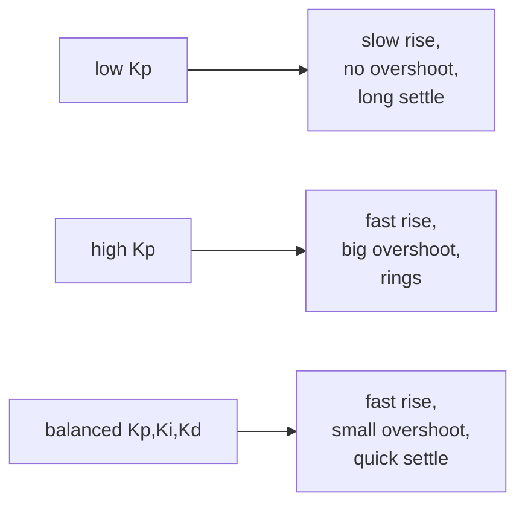

!!! abstract "You are here"
    **Module 3 — Closed-Loop Control** · **Unit 1 — The Feedback Loop** · **Lesson 1.3 — The Tuning Trade-off**

# Lesson 1.3 — The Tuning Trade-off

> **Module 3 · Unit 1 · Lesson 1.3** · interactive
> The deep truth of control: fast and stable pull in opposite directions. Good
> tuning is the narrow band that satisfies both — and the metrics that tell you when
> you've found it.

---

## 1. Why This Matters

There is no "best" set of gains, only the best *for your requirement*. Push for
speed and you risk overshoot and oscillation; push for stability and you get a
sluggish machine. Every real specification — like our assignment's "settle within X
seconds with under Y% overshoot" — is really asking you to find the sweet spot of
this trade-off. Knowing the metrics lets you aim instead of fiddle.

## 2. Physical Intuition

Imagine parking a car against a wall by feel. Approach fast and you'll bump it
(overshoot); approach timidly and you'll take forever (slow rise). The right
approach is brisk but easing off near the end. A controller faces the same tension:
high gains move quickly but ring; low gains are calm but slow. The skill is shaping
the approach, not just choosing "more" or "less."

## 3. Mathematical Foundations

A step response is judged by a few standard numbers:

- **Rise time** — how fast it first reaches the target. Smaller \(\to\) faster.
- **Overshoot** — how far it passes the target, as a percentage:
  \(\text{OS} = (y_\text{peak} - r)/r \times 100\%\).
- **Settling time** — when it stays within a band (typically ±2%) of target.
- **Steady-state error** — the leftover gap once it settles.

Raising \(K_p\) cuts rise time but raises overshoot; the two move in opposite
directions, which is the trade-off made quantitative. Good tuning minimizes settling
time subject to an overshoot cap.

## 4. Visual Explanation



The interactive demo draws the actual step-response curve and computes overshoot and
settling time live, so you can *see* the trade-off instead of just reading about it.

## 5. Engineering Example

The student assignment **M3 — Tuning trade-off** grades exactly these metrics: it
asks for a response that settles quickly *and* keeps overshoot under a limit, and the
grader (Module 4) scores the recorded trace against both. A submission that's fast
but rings fails the overshoot criterion; one that's calm but slow fails the settling
criterion. Only the balanced tuning passes — which is the lesson, enforced by the
rubric.

## 6. Worked Example

In the demo, start at the **too hot** preset (high \(K_p\), no \(K_d\)): the curve
shoots well past the target — say 40% overshoot — and takes a long time to stop
ringing, so settling time is *long* despite the fast rise. Now add derivative: the
overshoot drops toward 10% and the curve settles much sooner. The rise time barely
changed, but the *settling* time — the metric that actually matters — improved
dramatically. That's the trade-off resolved: \(K_d\) bought stability without
sacrificing speed.

## 7. Interactive Demonstration

[Open the PID Tuning demo ↗](../demos/pid-tuning.html){ target=_blank }

Watch the **overshoot** and **settling time** readouts as you move the gains. Try to
beat the "well tuned" preset: find gains with overshoot under 20% *and* the shortest
settling time you can. Notice you can't drive both to zero — that impossibility *is*
the trade-off.

## 8. Code Pointer

The response metrics the demo shows are the same ones the grader computes from a
recorded trace, in
[`src/student/metrics.js`](https://github.com/alibulentkoc/parallel-kinematics-hydraulics/blob/main/src/student/metrics.js):

```js
// from a recorded position trace vs target:
const overshoot = (peak - target) / target;          // fraction
const settle    = lastTimeOutsideBand(trace, 0.02);   // ±2% settling time
const ssError   = Math.abs(trace.at(-1) - target);
```

## 9. Knowledge Check

[Open the Lesson 3.1.3 check ↗](../quizzes/m3-l13.html){ target=_blank }

## 10. Challenge Problem

Your spec is "settle within 1.0 s with no more than 15% overshoot." Using the demo,
find a set of gains that meets it, and write down the rise time, overshoot, and
settling time you achieved. Then explain which single gain you'd change if the spec
tightened the overshoot limit to 5%.

## 11. Common Mistakes

- **Optimizing rise time alone.** A fast rise that rings has a *long* settling time —
  the metric that usually matters.
- **Chasing zero overshoot blindly.** Often a small overshoot with fast settling
  beats a slow, overshoot-free crawl.
- **Tuning without a spec.** "Best" is undefined; tune to the required settling and
  overshoot numbers.

## 12. Key Takeaways

- **Speed and stability trade off**: higher gains rise faster but overshoot more.
- Judge a response by **rise time, overshoot, settling time, steady-state error**.
- Good tuning **minimizes settling time subject to an overshoot cap** — exactly what
  the M3 rubric grades.
- Derivative action can buy stability without losing speed.

## AI Learning Companion

**Tutor**
```
Explain the fundamental trade-off in controller tuning between fast response and
low overshoot, and define rise time, overshoot, settling time, and steady-state
error.
```
**Practice**
```
Give me 5 step-response descriptions with rough rise/overshoot/settling numbers and
ask me to judge whether each meets a given spec, and which gain to change. Answers
included.
```

---

*Next lesson: [2.1 — Joint-Space vs Task-Space](2-1-joint-vs-task-space.md), where we control a whole parallel machine, not one cylinder.*
