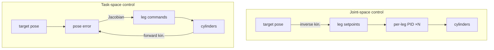

!!! abstract "You are here"
    **Module 3 — Closed-Loop Control** · **Unit 2 — Controlling a Parallel Machine** · **Lesson 2.1 — Joint-Space vs Task-Space**

# Lesson 2.1 — Joint-Space vs Task-Space

> **Module 3 · Unit 2 · Lesson 2.1**
> One PID controls one cylinder. But the platform is held by several at once. There
> are two ways to wire the control — per-leg or per-pose — and the choice shapes how
> the whole machine behaves.

---

## 1. Why This Matters

A single-cylinder PID doesn't know about the platform; it only chases its own length
setpoint. For a parallel machine you must decide *what* the loop regulates: each
leg's length (**joint space**) or the platform's pose directly (**task space**).
The choice affects accuracy, coupling between legs, and how naturally the machine
follows a path — so it's a real design decision, not a detail.

## 2. Physical Intuition

Two ways to steer a platform held by two cylinders:

- **Joint space:** convert the target pose to leg lengths (inverse kinematics), then
  give each leg its own PID to hit its length. Simple, decoupled — but each leg is
  "blind" to the platform; small length errors combine into a pose error nobody is
  directly correcting.
- **Task space:** measure the *platform pose* (forward kinematics), compare to the
  target pose, and use the Jacobian to turn the pose error into coordinated leg
  commands. The loop regulates what you actually care about — the pose — at the cost
  of needing the kinematics every cycle.

## 3. Mathematical Foundations

**Joint space:** per-leg error and per-leg PID,

\[
e_i = L_i^* - L_i, \qquad u_i = \text{PID}(e_i).
\]

**Task space:** pose error mapped through the Jacobian to leg commands,

\[
e_\text{pose} = P^* - P, \qquad u = \text{PID}\big(J\,e_\text{pose}\big)\ \text{(schematically).}
\]

The Jacobian \(J\) (Module 1) is what lets a *pose* error become the right *leg*
commands — task-space control literally cannot work without the kinematics, which is
why we built them first.

## 4. Visual Explanation



Joint space converts to leg lengths *once* at the input; task space keeps the
platform pose in the loop and uses the Jacobian every cycle.

## 5. Engineering Example

Our controller supports both modes. Joint space is the default for its simplicity
and is plenty for point-to-point moves. Task space shines for *path following* and
near awkward geometry, because it corrects the pose directly rather than hoping
independent legs combine correctly. The instructor presets choose the mode that best
exposes the concept the assignment targets.

## 6. Worked Example

Command the platform from \((0, 0.7)\) to \((0.1, 0.7)\).

- **Joint space:** IK gives leg setpoints \(L_1: 0.922\to0.990\), \(L_2:
  0.922\to0.860\); each leg's PID chases its own number. If leg 1 lags slightly, the
  platform momentarily tilts off the straight path — nobody is correcting the *pose*.
- **Task space:** the loop watches the platform pose and drives the *pose* error to
  zero, so the platform tracks the straight line more faithfully even if one leg is
  slower.

Same target, same cylinders — different fidelity to the actual path.

## 7. Interactive Demonstration

<iframe src="../../demos/kinematics-explorer.html" title="Kinematics Explorer — interactive demo" loading="lazy" style="width:100%;height:780px;border:1px solid var(--md-default-fg-color--lightest);border-radius:8px;background:#0e1217"></iframe>

[Open this demo full-screen in a new tab](../demos/kinematics-explorer.html){ target=_blank }

The explorer shows the IK that joint-space control uses (pose → leg lengths) and the
Jacobian that task-space control needs. Drag the platform and watch both update:
joint space consumes the leg lengths; task space consumes the Jacobian.

## 8. Code & Computation

```python
from math import hypot
b = 0.6
def ik(x, y): return hypot(x + b, y), hypot(x - b, y)
# joint space: convert the target pose to per-leg setpoints, each chased by its own PID
target = (0.10, 0.70)
L1_star, L2_star = ik(*target)
print(f"leg setpoints: L1*={L1_star:.3f}, L2*={L2_star:.3f}")
# task space instead regulates the pose directly via the Jacobian (see Lesson 3.1).
```

!!! tip "Run it"
    The code above is self-contained Python (standard library only) — paste it into any Python 3 prompt to run it. To run the whole module interactively with nothing to install, open it in Google Colab (opens in a new browser tab): [Open Module 3 in Colab](https://colab.research.google.com/github/alibulentkoc/parallel-kinematics-hydraulics/blob/main/docs/notebooks/module03.ipynb){ target=_blank }.

## 9. Knowledge Check

[Open the Lesson 3.2.1 check](../quizzes/m3-l21.html)

## 10. Challenge Problem

For a quick point-to-point move where only the final pose matters, which mode is
simpler and probably sufficient? For drawing a straight line across the workspace,
which mode is likely more faithful, and why does it *need* the Jacobian to work?

## 11. Common Mistakes

- **Assuming decoupled legs give the right pose.** Independent leg PIDs can each be
  "on target" while the platform pose is slightly off.
- **Trying task space without kinematics.** It depends on forward kinematics and the
  Jacobian every cycle — there's no shortcut.
- **Using one mode everywhere.** Point-to-point favours joint space; path-following
  favours task space.

## 12. Key Takeaways

- **Joint space:** IK once, then a PID per leg — simple and decoupled.
- **Task space:** regulate the platform pose directly via the Jacobian — faithful
  but kinematics-hungry.
- The choice trades **simplicity against path fidelity**.
- Task space is impossible without the Module 1 kinematics — which is why they came
  first.

## AI Learning Companion

**Tutor**
```
Explain the difference between joint-space and task-space control for a parallel
machine. Why does task-space control need the Jacobian and forward kinematics?
```
**Explore**
```
Give me 3 tasks (point-to-point move, straight-line path, holding a pose under load)
and say which control mode fits each and why.
```

---

*Next lesson: [2.2 — Feedforward & Trajectory Tracking](2-2-feedforward.md), where we stop reacting and start anticipating.*
