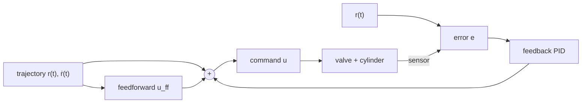

!!! abstract "You are here"
    **Module 3 — Closed-Loop Control** · **Unit 2 — Controlling a Parallel Machine** · **Lesson 2.2 — Feedforward & Trajectory Tracking**

# Lesson 2.2 — Feedforward & Trajectory Tracking

> **Module 3 · Unit 2 · Lesson 2.2**
> Feedback reacts *after* an error appears. Feedforward anticipates the motion you
> already know is coming. Together they let the platform follow a moving target —
> a trajectory — far better than feedback alone.

---

## 1. Why This Matters

Pure feedback always lags: it can only respond once the platform has already fallen
behind a moving setpoint. For point-to-point holds that's fine, but to *track a
trajectory* — a smooth path the platform must follow in time — lag means the
platform is perpetually a step behind. Feedforward closes that gap by sending the
command the motion needs *before* the error shows up.

## 2. Physical Intuition

Carrying a full cup while walking, you don't wait for it to spill and then react —
you *anticipate* the turn and tilt the cup ahead of time. That anticipation is
feedforward: using what you know about the planned motion to pre-compute most of the
command. Feedback then only has to clean up the small, unpredictable remainder
(a bump, a gust), not do all the work.

## 3. Mathematical Foundations

The command becomes the sum of an anticipatory term and a corrective term:

\[
u = \underbrace{u_\text{ff}(\text{planned motion})}_{\text{feedforward}} \;+\; \underbrace{\text{PID}(e)}_{\text{feedback}}.
\]

The feedforward term comes from the **trajectory** — the planned position, velocity,
and sometimes acceleration at each instant. Knowing the target velocity, you can
pre-command the flow that produces it (recall \(v = Q/A\)); feedback then only
corrects the leftover error. A smooth trajectory \(r(t)\) with known \(\dot r(t)\) is
what makes feedforward possible.

## 4. Visual Explanation



Feedforward provides the bulk of the command from the known plan; feedback trims the
unpredictable remainder. The result tracks a moving setpoint with far less lag.

## 5. Engineering Example

Our trajectory generator (`trajectory.js`) produces smooth setpoints — position and
velocity over time — and the controller's feedforward term uses that velocity to
pre-command flow, while the PID corrects residual error. This is what lets the
student "trajectory tracking" assignment achieve low tracking error: feedback alone
would lag the moving target, but feedforward + feedback stays on it.

## 6. Worked Example

Track a setpoint moving at a steady 0.1 m/s.

- **Feedback only:** the loop must first *develop* an error before it commands flow,
  so the platform settles to a constant lag behind the moving target — it follows,
  but always a little behind.
- **Feedforward + feedback:** the feedforward term pre-commands the flow for 0.1 m/s
  (\(Q = vA\)) right away, so the platform moves *with* the target from the start;
  the PID only corrects small disturbances. The steady lag essentially disappears.

Same loop, same gains — anticipation removed the tracking lag.

## 7. Interactive Demonstration

<iframe src="../../demos/pid-tuning.html" title="PID Tuning — interactive demo" loading="lazy" style="width:100%;height:720px;border:1px solid var(--md-default-fg-color--lightest);border-radius:8px;background:#0e1217"></iframe>

[Open this demo full-screen in a new tab ↗](../demos/pid-tuning.html){ target=_blank }

The demo tracks a *step* (the hardest case for feedback, since the setpoint jumps).
Notice how much the response lags the instant the target moves — that lag is exactly
what feedforward removes for a *smooth* trajectory. Imagine the dashed target line
ramping instead of jumping: feedforward would let the curve ride along it.

## 8. Code & Computation

```python
from math import pi
A_cap = pi * 0.040**2 / 4
v_target = 0.10                 # m/s of a moving (ramp) setpoint
Q_ff = v_target * A_cap         # feedforward: pre-command the flow the motion needs
print(f"feedforward flow = {Q_ff*60000:.1f} L/min  (sent before any error appears)")
# command u = u_ff + PID(e): feedback only trims the small remainder.
```

!!! tip "Run this yourself — three ways"
    The Python above is a ready-to-run cell from the **Module 3 notebook**. Pick whichever is easiest:

    1. **Run in your browser, no setup —** open it in Google Colab and press the ▶ button on each cell: [Open Module 3 in Colab ↗](https://colab.research.google.com/github/alibulentkoc/parallel-kinematics-hydraulics/blob/main/docs/notebooks/module03.ipynb){ target=_blank }
    2. **Run locally —** [view/download the notebook on GitHub ↗](https://github.com/alibulentkoc/parallel-kinematics-hydraulics/blob/main/docs/notebooks/module03.ipynb){ target=_blank }, then open it in Jupyter, JupyterLab, or VS Code (`pip install notebook`, then `jupyter notebook`).
    3. **Just try the snippet —** copy the code above into any Python 3 prompt; it needs only the standard library.

    Feedforward is in [`src/control/controller.js`](https://github.com/alibulentkoc/parallel-kinematics-hydraulics/blob/main/src/control/controller.js), fed by [`trajectory.js`](https://github.com/alibulentkoc/parallel-kinematics-hydraulics/blob/main/src/control/trajectory.js).

## 9. Knowledge Check

[Open the Lesson 3.2.2 check ↗](../quizzes/m3-l22.html){ target=_blank }

## 10. Challenge Problem

Explain why feedforward helps a *moving* setpoint but does nothing for a *stationary*
one. Then explain why feedforward alone (no feedback) is dangerous — what happens
when reality differs from the plan (a heavier load, a leak)?

## 11. Common Mistakes

- **Expecting feedback alone to track without lag.** It structurally lags a moving
  target; feedforward is the fix.
- **Using feedforward without feedback.** Feedforward is open-loop; it can't correct
  disturbances or model errors — you need both.
- **Feeding feedforward a non-smooth plan.** A jerky trajectory makes the
  feedforward term jump; smooth \(r(t)\) and \(\dot r(t)\) are required.

## 12. Key Takeaways

- **Feedback reacts; feedforward anticipates.** Tracking a trajectory needs both.
- Feedforward pre-commands from the planned **velocity** (\(u = u_\text{ff} +
  \text{PID}(e)\)); feedback trims the remainder.
- It removes the steady **lag** that feedback alone suffers on a moving setpoint.
- Feedforward needs a **smooth trajectory** and must always be paired with feedback.

## AI Learning Companion

**Tutor**
```
Explain the difference between feedback and feedforward control, and why tracking a
moving trajectory benefits from adding feedforward. Use u = u_ff + PID(e).
```
**Practice**
```
Give me 4 scenarios (hold a pose, track a ramp, reject a bump, follow a fast path)
and ask whether feedforward, feedback, or both is the right tool, and why.
```

---

*Module 3 complete. Continue to [Module 4 — From Simulator to Hardware](../module04/1-1-three-domains.md).*
