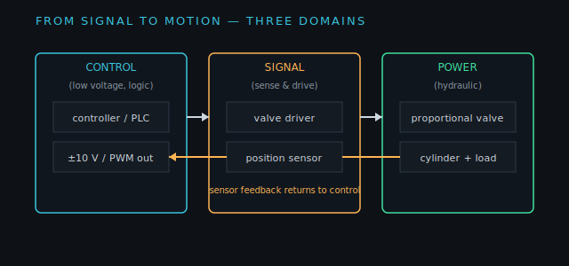
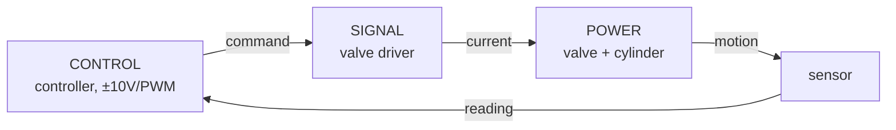

!!! abstract "You are here"
    **Module 4 — From Simulator to Hardware** · **Unit 1 — Electrical & Control Wiring** · **Lesson 1.1 — The Three Domains**

# Lesson 1.1 — The Three Domains: Power, Signal, Control

> **Module 4 · Unit 1 · Lesson 1.1**
> The simulator computes commands and reads sensors as clean numbers. A real machine
> has to carry those numbers as actual voltages and currents through real wires. This
> module maps every simulator signal to the hardware that would carry it.

---

## 1. Why This Matters

The gap between "the controller outputs `u = 0.7`" and "the valve spool moves" is
filled with electronics: a low-voltage logic signal, a power amplifier, a solenoid,
a sensor, and the wiring that connects them. To take this project from simulation
toward a bench, you need to know which domain each signal lives in and where the
boundaries are — because mixing them up is how equipment gets damaged and people get
hurt.

## 2. Physical Intuition

Think of three rooms with locked doors between them:

- **Control** — the quiet room: tiny logic-level signals (a few volts), the
  controller's commands and the sensor readings. Safe to touch.
- **Signal** — the translator room: amplifiers and drivers that turn a small command
  into enough current to move a valve, and conditioners that turn raw sensor outputs
  into clean readings.
- **Power** — the loud room: high-pressure hydraulics and the high currents that
  drive the actuators. *Not* safe to touch.

The art of wiring is keeping the rooms separate and the doors well-defined.

## 3. Mathematical Foundations

The mapping is mostly about *signal levels and conversions*, not heavy math, but two
relationships matter:

- **Command scaling:** the controller's normalized command \(u \in [-1, 1]\) maps to
  a physical drive signal, e.g. \(\pm 10\ \text{V}\) or a PWM duty cycle: \(V =
  10\,u\).
- **Sensor scaling:** a sensor's output maps linearly to the physical quantity,
  e.g. a transducer giving \(0\text{–}10\ \text{V}\) over a 0–0.6 m stroke:
  \(L = L_\text{closed} + 0.06\,V\).

Everything else is wiring discipline: grounding, shielding, separation, and a safety
chain (Lesson 1.3).

## 4. Visual Explanation



The figure lays out the three domains left to right, with the command flowing from
control through signal into power, and the sensor feedback returning the other way.
Each box is a real component; each arrow is a real wire carrying a signal in a
specific domain.



## 5. Engineering Example

In the simulator, the controller emits `u` and reads a leg length — both pure
numbers. On hardware, `u` becomes a ±10 V signal into a **valve driver** (signal
domain) that delivers solenoid current (power domain) to move the spool; the
cylinder's **position transducer** (signal domain) returns a voltage the controller
converts back to a length. The handbook's wiring chapter maps each simulator variable
to its real-world wire on exactly these boundaries.

## 6. Worked Example

The controller commands \(u = 0.7\). Trace it across the domains:

1. **Control:** \(u = 0.7\) (a number).
2. **Signal:** scaled to \(V = 10 \times 0.7 = 7\ \text{V}\) into the valve driver.
3. **Power:** the driver pushes solenoid current; the spool opens ~70%; oil flows.
4. **Back:** the cylinder extends; the transducer outputs, say, 8.2 V; the controller
   reads \(L = 0.4 + 0.06 \times 8.2 = 0.892\ \text{m}\).

One command crossed three domains and came back as a measurement — the full
round-trip a real loop makes thousands of times a second.

## 7. Interactive Demonstration

[Open the demos gallery ↗](../demos/index.html){ target=_blank }

The interactive demos live in the *control* domain (pure numbers, like the
simulator). This lesson is the reminder that on hardware, each of those numbers is a
voltage on a wire — the demos show the logic; the wiring carries it.

## 8. Code Pointer

The simulator deliberately stays in the control domain (numbers), which is what makes
the sim-to-hardware mapping clean. The full mapping table is in the handbook:
[Electrical & Control Wiring](../04-electrical-and-control-wiring.md). The command and
sensor scaling would wrap the existing
[`controller.js`](https://github.com/alibulentkoc/parallel-kinematics-hydraulics/blob/main/src/control/controller.js)
I/O.

## 9. Knowledge Check

[Open the Lesson 4.1.1 check ↗](../quizzes/m4-l11.html){ target=_blank }

## 10. Challenge Problem

Pick one simulator quantity (a valve command or a leg-length reading) and describe
its full path on real hardware: what domain it starts in, what component converts it,
what voltage or current it becomes, and where it ends up. Name one thing that could
go wrong at a domain boundary.

## 11. Common Mistakes

- **Blurring the domains.** A logic-level command can't drive a valve directly; it
  needs the signal-domain driver in between.
- **Forgetting scaling.** A normalized `u` must be scaled to the driver's voltage
  range; a raw sensor voltage must be scaled back to a length.
- **Treating the power domain casually.** High-pressure hydraulics and high currents
  are hazardous — the separation exists for safety.

## 12. Key Takeaways

- Hardware signals live in three domains: **control** (logic), **signal**
  (drive/sense), and **power** (hydraulics/high current).
- The command flows control → signal → power; sensor feedback returns the other way.
- Conversions are mostly **linear scaling** (\(V = 10u\), \(L = L_0 + kV\)) plus
  wiring discipline.
- Keeping the simulator in the **control domain** is what makes the hardware mapping
  clean.

## AI Learning Companion

**Tutor**
```
Explain the three domains (control, signal, power) of a hydraulic machine's wiring,
and how a normalized controller command becomes valve motion across them.
```
**Explore**
```
Give me a table mapping each simulator quantity (command u, leg length, pressure)
to the real-world wire/component and domain that would carry it.
```

---

*Next lesson: [1.2 — Sensors & Valve Drivers](1-2-sensors-and-drivers.md), the components at the signal-domain boundary.*
