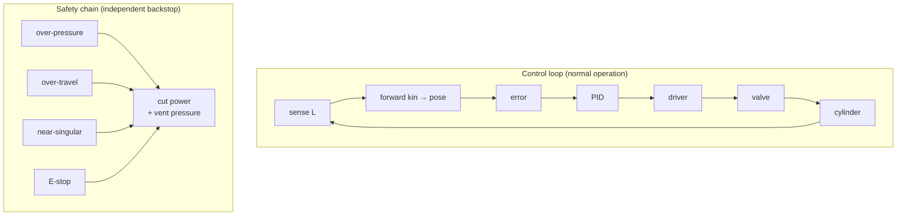

!!! abstract "You are here"
    **Module 4 — From Simulator to Hardware** · **Unit 1 — Electrical & Control Wiring** · **Lesson 1.3 — The Closed-Loop Wiring & Safety Chain**

# Lesson 1.3 — The Closed-Loop Wiring & Safety Chain

> **Module 4 · Unit 1 · Lesson 1.3**
> Connecting all three domains into one working loop — and wrapping it in a safety
> chain so that when something fails (and it will), the machine fails *safe*.

---

## 1. Why This Matters

A high-pressure hydraulic machine that loses control is dangerous. Wiring the loop is
only half the job; the other half is the **safety chain** that detects faults and
brings the machine to a safe state. The simulator's fault engine is a preview of this
chain — every warning and limit it raises corresponds to a real protective action on
hardware.

!!! warning "Scope"
    This lesson is descriptive engineering, not a certified electrical design. Real
    machines require qualified engineers, standards compliance, and safety
    certification. Use this to understand the *principles*, not as a wiring diagram to
    build from.

## 2. Physical Intuition

A safe machine is built like a building with smoke detectors and fire doors. Normal
operation is the loop running. But there are independent watchers — pressure
switches, limit switches, an emergency stop — that can cut power and vent pressure
regardless of what the controller is doing. The controller can be wrong; the safety
chain is the backstop that doesn't depend on the controller being right.

## 3. Mathematical Foundations

The control loop you've built (Module 3) wired across the domains (Lessons 1.1–1.2):

\[
\text{sense } L \;\to\; \text{FK} \to \text{pose} \;\to\; e = P^* - P \;\to\; \text{PID} \;\to\; u \;\to\; \text{driver} \;\to\; \text{valve} \;\to\; \text{cylinder}.
\]

Layered *over* it, the safety chain is a set of guards, each a simple threshold that
triggers a protective action:

\[
\text{if } p > p_\text{relief},\ L \notin [\,L_\text{min}, L_\text{max}\,],\ w < w_\text{crit},\ \text{or E-stop} \;\Rightarrow\; \text{safe state}.
\]

These are exactly the fault detectors the simulator already implements — warn, limit,
or fault — now read as the hardware's protective interlocks.

## 4. Visual Explanation



The loop runs the machine; the safety chain watches it and can override everything.

## 5. Engineering Example

The simulator's fault engine has eleven detectors that classify conditions as
**warn**, **limit**, or **fault** — over-pressure, stroke-max/min, near-singular,
pump saturation, and more. On hardware, each maps to a protective response: a
pressure switch venting through the relief, a limit switch stopping travel, an
emergency-stop dropping power. The simulator lets you *practice* responding to these
faults before they cost anything real.

## 6. Worked Example

Drive a heavy preset toward the base line. The manipulability \(w\) falls; at
\(w < w_\text{crit}\) the engine raises **NEAR\_SINGULAR**, then the demanded pressure
climbs toward the relief setting and an **over-pressure** warning fires. On hardware
the parallel responses would be: the controller limits motion away from the
singularity, and if pressure still reaches the relief setting, the relief valve vents
— a hardware backstop that doesn't need the controller's cooperation. *Two
independent layers caught one dangerous condition.*

## 7. Interactive Demonstration

<iframe src="../../demos/kinematics-explorer.html" title="Kinematics Explorer — interactive demo" loading="lazy" style="width:100%;height:780px;border:1px solid var(--md-default-fg-color--lightest);border-radius:8px;background:#0e1217"></iframe>

[Open this demo full-screen in a new tab ↗](../demos/kinematics-explorer.html){ target=_blank }

Drag toward the base line and watch the status escalate **OK → NEAR SINGULAR →
SINGULAR**. That escalation is the software half of the safety chain. On hardware, the
same thresholds would arm the physical interlocks described above.

## 8. Code & Computation

```python
L_CLOSED, STROKE, RELIEF = 0.4, 0.6, 21e6
def guards(p, L, manip):         # independent safety thresholds -> safe state
    out = []
    if p > RELIEF: out.append("OVER_PRESSURE")
    if not (L_CLOSED <= L <= L_CLOSED + STROKE): out.append("OVER_TRAVEL")
    if manip < 0.05: out.append("NEAR_SINGULAR")
    return out or ["ok"]
print(guards(22e6, 0.9, 0.30))   # ['OVER_PRESSURE']
print(guards(10e6, 0.9, 0.02))   # ['NEAR_SINGULAR']
```

!!! tip "Run this yourself — three ways"
    The Python above is a ready-to-run cell from the **Module 4 notebook**. Pick whichever is easiest:

    1. **Run in your browser, no setup —** open it in Google Colab and press the ▶ button on each cell: [Open Module 4 in Colab ↗](https://colab.research.google.com/github/alibulentkoc/parallel-kinematics-hydraulics/blob/main/docs/notebooks/module04.ipynb){ target=_blank }
    2. **Run locally —** [view/download the notebook on GitHub ↗](https://github.com/alibulentkoc/parallel-kinematics-hydraulics/blob/main/docs/notebooks/module04.ipynb){ target=_blank }, then open it in Jupyter, JupyterLab, or VS Code (`pip install notebook`, then `jupyter notebook`).
    3. **Just try the snippet —** copy the code above into any Python 3 prompt; it needs only the standard library.

## 9. Knowledge Check

[Open the Lesson 4.1.3 check ↗](../quizzes/m4-l13.html){ target=_blank }

## 10. Challenge Problem

Why should the safety chain be *independent* of the controller rather than
implemented inside it? Give a failure scenario where a controller-only safety check
would fail to protect the machine but an independent interlock would still work.

## 11. Common Mistakes

- **Putting all safety inside the controller.** If the controller hangs, its internal
  checks hang too; safety must have an independent backstop.
- **Treating warnings as faults (or vice versa).** Warn, limit, and fault are
  different severities with different responses; collapsing them is unsafe or
  needlessly disruptive.
- **Building from this lesson as a wiring diagram.** It's descriptive; real designs
  need certified engineering.

## 12. Key Takeaways

- The full loop wires **sense → FK → error → PID → driver → valve → cylinder** across
  the three domains.
- A **safety chain** of independent guards (over-pressure, over-travel,
  near-singular, E-stop) can override the loop and force a safe state.
- The simulator's **fault engine** previews this chain — its warn/limit/fault
  detectors map to hardware interlocks.
- Safety must be **independent** of the controller, not buried inside it.

## AI Learning Companion

**Tutor**
```
Explain why a hydraulic machine needs a safety chain that is independent of its
controller, and give examples of guards (over-pressure, over-travel, E-stop) and
what each protects against.
```
**Explore**
```
Map the simulator's fault detectors (over-pressure, stroke limits, near-singular,
pump saturation) to the real hardware interlock that would handle each.
```

---

*Next lesson: [2.1 — Logging & the Canonical Schema](2-1-logging-and-schema.md), where the machine records what it did.*
