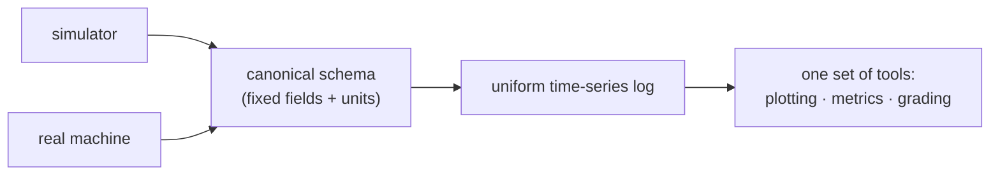

!!! abstract "You are here"
    **Module 4 — From Simulator to Hardware** · **Unit 2 — The Digital Twin** · **Lesson 2.1 — Logging & the Canonical Schema**

# Lesson 2.1 — Logging & the Canonical Schema

> **Module 4 · Unit 2 · Lesson 2.1**
> A machine that doesn't record what it did can't be graded, debugged, or trusted.
> This lesson is about the single, fixed data format — the canonical schema — that
> makes the simulator and a real machine produce *identical* logs.

---

## 1. Why This Matters

The whole "digital twin" idea rests on one thing: the simulator and the hardware must
speak the same language. If both emit the same log format — the same fields, the same
units, the same timing — then any tool that reads a sim log also reads a hardware log,
and a student's work can be graded the same way whether it ran in a browser or on a
bench. The canonical schema is that shared language.

## 2. Physical Intuition

Think of a flight recorder. It doesn't matter which aircraft it's in; it records the
same channels (altitude, speed, control inputs) in the same format, so one analysis
tool works for every flight. Our logger is the machine's flight recorder: every
cycle it writes a fixed set of channels — time, setpoint, measured pose, leg lengths,
pressures, command, faults — into one agreed structure. Same recorder, sim or
hardware.

## 3. Mathematical Foundations

A log is a time-series of records, one per control cycle at the fixed timestep \(\Delta t\):

\[
\text{log} = \{\,r_k\,\}_{k=0}^{N}, \qquad t_k = k\,\Delta t,
\]

where each record \(r_k\) has a **fixed schema** — the same keys in the same units
every time:

\[
r_k = \big(\,t_k,\ P^*_k,\ P_k,\ L_k,\ p_k,\ u_k,\ \text{faults}_k\,\big).
\]

Because the timestep is fixed (Module 3's fixed-rate loop), the log is uniformly
sampled, which is what makes metrics like settling time and tracking error
well-defined and comparable across runs.

## 4. Visual Explanation



Two different sources, one schema, one log format, one set of tools — that
convergence is the entire point of the canonical schema.

## 5. Engineering Example

Our logger writes records validated against a fixed schema, and
a trace utility replays them. Every dashboard strip-chart, every graded
metric, and every fault timeline reads from this one format. Because the schema is
enforced, a malformed record is caught immediately rather than silently corrupting an
analysis — the engine's automated tests check exactly this
validation.

## 6. Worked Example

A single log record at \(t = 0.42\) s might carry: time `0.42`, target pose `(0.10,
0.70)`, measured pose `(0.098, 0.701)`, leg lengths `[0.95, 0.86]`, pressures `[2.1e6,
1.8e6]`, command `[0.31, -0.12]`, faults `[]`. A grader reading this knows the
tracking error is \(\sqrt{0.002^2 + 0.001^2} \approx 0.0022\) m at that instant —
*without knowing or caring* whether the record came from the simulator or a real
machine. The schema made the source irrelevant.

## 7. Interactive Demonstration

[Open the demos gallery](../demos/index.html){ target=_blank }

The demos render live values that, in the full simulator, are exactly the channels
the logger records each cycle. Picture each number you see being appended to a row in
the canonical log — that stream of rows is what the next lesson grades.

## 8. Code & Computation

```python
from math import hypot
b = 0.6
def ik(x, y): return [hypot(x + b, y), hypot(x - b, y)]
# one canonical record per cycle -- same fields for simulator and hardware
record = {"t": 0.42, "target": (0.10, 0.70), "pose": (0.098, 0.701),
          "L": ik(0.098, 0.701), "faults": []}
print(record)
```

!!! tip "Run it"
    The code above is self-contained Python (standard library only) — paste it into any Python 3 prompt to run it. To run the whole module interactively with nothing to install, open it in Google Colab (opens in a new browser tab): [Open Module 4 in Colab](https://colab.research.google.com/github/alibulentkoc/parallel-kinematics-hydraulics/blob/main/docs/notebooks/module04.ipynb){ target=_blank }.

## 9. Knowledge Check

[Open the Lesson 4.2.1 check](../quizzes/m4-l21.html)

## 10. Challenge Problem

Why is a *fixed* timestep important for the log? Explain what would go wrong with a
metric like settling time if records were logged at irregular intervals, and how the
uniform sampling from the fixed-rate loop avoids that.

## 11. Common Mistakes

- **Logging different fields in sim vs hardware.** Any divergence breaks the shared
  tooling — the schema must be identical.
- **Skipping schema validation.** An unvalidated malformed record silently corrupts
  downstream analysis.
- **Irregular sampling.** Metrics assume uniform \(\Delta t\); variable timing makes
  settling time and tracking error ambiguous.

## 12. Key Takeaways

- A **canonical schema** is the fixed log format both the simulator and hardware emit.
- Each cycle records a uniform set of channels at the **fixed timestep**, giving a
  uniformly sampled time-series.
- One schema means **one set of tools** for plotting, metrics, and grading,
  regardless of source.
- **Schema validation** catches bad records before they corrupt analysis.

## AI Learning Companion

**Tutor**
```
Explain why a digital twin needs the simulator and the real machine to log data in
one canonical schema, and why a fixed timestep matters for the log.
```
**Explore**
```
Design a canonical log schema for a hydraulic machine: list the fields, their units,
and why each is needed for grading and debugging.
```

---

*Next lesson: [2.2 — Grading Simulator and Hardware Identically](2-2-grading-sim-and-hardware.md), where the schema pays off.*
