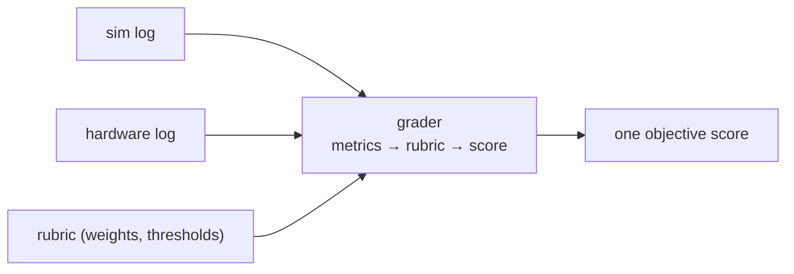

!!! abstract "You are here"
    **Module 4 — From Simulator to Hardware** · **Unit 2 — The Digital Twin** · **Lesson 2.2 — Grading Simulator and Hardware Identically**

# Lesson 2.2 — Grading Simulator and Hardware Identically

> **Module 4 · Unit 2 · Lesson 2.2** · *final lesson*
> The payoff of everything before it: because sim and hardware emit the same log
> (Lesson 2.1), one grader scores both. A student's solution that passes in the
> browser passes on the bench — by construction.

---

## 1. Why This Matters

This is the keystone of the whole course design. A digital twin is only useful if
"it works in the simulator" *means* "it works on the machine." That equivalence isn't
a hope — it's engineered: the same canonical log, fed to the same grader, against the
same rubric, produces the same score. This lesson closes the loop from Module 1's
geometry all the way to an objective, transferable grade.

## 2. Physical Intuition

Imagine two athletes judged by the same stopwatch and the same rulebook — one running
on a treadmill, one on a track. If the measurements and rules are identical, the
scores are comparable and fair. Our grader is that stopwatch-and-rulebook: it doesn't
look at *where* the run happened, only at the recorded log and the rubric. Sim and
hardware become interchangeable inputs to one fair judge.

## 3. Mathematical Foundations

A grade is a rubric applied to metrics extracted from a log:

\[
\text{grade} = \sum_j w_j \cdot \text{score}_j\big(\text{metric}_j(\text{log})\big),
\]

where each \(\text{metric}_j\) (settling time, overshoot, tracking error,
steady-state error, fault-free completion) is computed from the canonical log, and
each \(\text{score}_j\) maps it to points by the rubric, weighted by \(w_j\). Because
the log format is identical for sim and hardware, the *same* function evaluates both:

\[
\text{grade}(\text{log}_\text{sim}) \equiv \text{grade}(\text{log}_\text{hw}) \quad\text{when the runs match.}
\]

## 4. Visual Explanation



Two log sources enter; one grader and one rubric produce one score. The source of the
log never enters the calculation — that's what makes the grade transferable.

## 5. Engineering Example

Our grader (`grader.js`) reads a recorded trace, computes the response metrics
(`metrics.js`, the same ones from Module 3's tuning lesson), and scores them against a
rubric (`rubric.js`) for each assignment — M1–M3 and the finals F1–F4. The `grade.html`
app runs this in the browser today on simulator logs; point it at a hardware log in
the canonical schema and it grades that identically, because it only ever sees the
log, never the machine.

## 6. Worked Example

A student submits the M3 tuning assignment. The grader reads the log, computes
overshoot = 12% and settling time = 0.8 s, and the rubric says "≤ 15% overshoot and
≤ 1.0 s settling = full marks." The student passes. Now imagine the *same* controller
gains run on real hardware, producing a hardware log with overshoot = 13% and settling
= 0.85 s — still within the rubric, still full marks. The grade transferred because
the grader judged the *log*, not the venue. (If the hardware run had rung at 20%
overshoot, it would fail — correctly exposing a sim-to-real gap to investigate.)

## 7. Interactive Demonstration

<iframe src="../../demos/pid-tuning.html" title="PID Tuning — interactive demo" loading="lazy" style="width:100%;height:720px;border:1px solid var(--md-default-fg-color--lightest);border-radius:8px;background:#0e1217"></iframe>

[Open this demo full-screen in a new tab ↗](../demos/pid-tuning.html){ target=_blank }

The overshoot and settling-time readouts in this demo are the very metrics the grader
computes. Tune until you'd pass a "≤ 15% overshoot, ≤ 1.0 s settling" rubric — you're
doing, by hand, exactly what the automated grader does to a recorded log.

## 8. Code & Computation

```python
def grade(overshoot, settling, max_os=0.15, max_ts=1.0):
    return "PASS" if (overshoot <= max_os and settling <= max_ts) else "FAIL"
# the SAME rubric judges a sim log or a hardware log -- only the log matters
print("sim run:   ", grade(0.12, 0.80))
print("hw  run:   ", grade(0.13, 0.85))
print("ringing hw:", grade(0.20, 1.40))
```

!!! tip "Run this yourself — three ways"
    The Python above is a ready-to-run cell from the **Module 4 notebook**. Pick whichever is easiest:

    1. **Run in your browser, no setup —** open it in Google Colab and press the ▶ button on each cell: [Open Module 4 in Colab ↗](https://colab.research.google.com/github/alibulentkoc/parallel-kinematics-hydraulics/blob/main/docs/notebooks/module04.ipynb){ target=_blank }
    2. **Run locally —** [view/download the notebook on GitHub ↗](https://github.com/alibulentkoc/parallel-kinematics-hydraulics/blob/main/docs/notebooks/module04.ipynb){ target=_blank }, then open it in Jupyter, JupyterLab, or VS Code (`pip install notebook`, then `jupyter notebook`).
    3. **Just try the snippet —** copy the code above into any Python 3 prompt; it needs only the standard library.

## 9. Knowledge Check

[Open the Lesson 4.2.2 check ↗](../quizzes/m4-l22.html){ target=_blank }

## 10. Challenge Problem

The point of a digital twin is that sim success predicts hardware success. Describe
one realistic way a solution could pass in simulation but *fail* on hardware (think
about what the simulator idealizes — sensor noise, valve deadband, leaks). How does
grading *both* with the same rubric turn that gap into useful information rather than
a hidden surprise?

## 11. Common Mistakes

- **Grading the machine instead of the log.** The grader must depend only on the
  canonical log, or sim and hardware grades won't be comparable.
- **Different rubrics for sim and hardware.** The equivalence requires the *same*
  rubric and thresholds for both.
- **Assuming sim success guarantees hardware success.** It strongly predicts it, but
  the idealizations (noise, deadband, leaks) mean a hardware run can still reveal
  gaps — which is exactly what identical grading surfaces.

## 12. Key Takeaways

- One **grader** + one **rubric** + the **canonical log** = one objective score for
  either source.
- Grading depends on the **log alone**, so the venue (sim or hardware) never enters
  the score.
- This makes "passes in simulation" *mean* "passes on hardware" — the core promise of
  the digital twin.
- When a hardware run *does* differ, identical grading turns the gap into actionable
  feedback.

## AI Learning Companion

**Tutor**
```
Explain how using one canonical log, one grader, and one rubric lets a hydraulic
machine's work be graded identically in simulation and on real hardware.
```
**Explore**
```
Design a grading rubric for a trajectory-tracking assignment: list the metrics,
their weights, and the pass thresholds, and explain why each is fair for both sim
and hardware.
```

---

*🎓 You've completed the curriculum — from kinematics, through hydraulics and control, to a hardware-ready digital twin. Revisit the [Reference Handbook](../handbook.md) or the [Interactive Demos](../demos/index.html) any time.*
