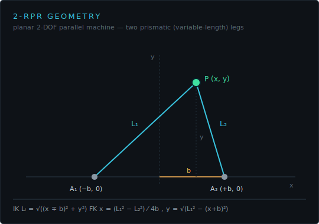
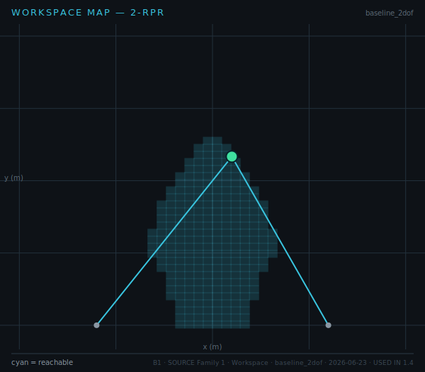

# Quiz 1 — Kinematics

**Lessons** 1.1–1.4 · **Competencies** C2–C4 · **Artifacts** Geometry config, IK/FK implementation, Workspace map
**Asset-grounded: 5 / 8**

Each question verifies an artifact behind a competency — not a definition. Refer to the figures as marked.

---

## Questions

**1.** The 2-RPR machine has anchors at (−b, 0) and (+b, 0) with b = 0.6 m.

For the platform pose P = (0.10, 0.70), compute the two leg lengths L₁ and L₂. Show the formula you used.

**2.** Using the forward-kinematics relation x = (L₁² − L₂²)/4b, find x when L₁ = 0.990 and L₂ = 0.860. Confirm it matches the pose in Q1.

**3.** The workspace map below was exported from the Kinematics Explorer.

Describe the reachable region's boundary and state **one** reason a pose can fall outside it.

**4.** A student commands a pose and the simulator returns **UNREACHABLE**. In terms of the leg-stroke limits L ∈ [0.4, 1.0], what does this fault mean, and how would you move the target to clear it?

**5.** For the 2-DOF machine, det J = |2by/(L₁L₂)|. At what platform positions does det J → 0, and why is that a problem for control?

**6.** From the workspace map (Fig B1), explain why the reachable region does **not** extend down to the baseline y = 0 even though the anchors sit there.

**7.** Verify the IK round-trip: starting from pose (0.10, 0.70), the legs are [0.990, 0.860]; feeding those back through FK should return the original pose to < 1 mm. Why is this round-trip test part of the Geometry/IK artifact's acceptance check?

**8.** A target sits at (0.85, 0.30). Without computing exactly, argue whether it is likely reachable given the anchor positions and L ∈ [0.4, 1.0].

---

## Answer key

**1.** Lᵢ = √((x ∓ b)² + y²). L₁ = √((0.10+0.6)² + 0.70²) = √(0.49+0.49) = **0.990 m**; L₂ = √((0.10−0.6)² + 0.70²) = √(0.25+0.49) = **0.860 m**. _verifies: C2 · IK implementation · Fig A1_

**2.** x = (0.990² − 0.860²)/(4·0.6) = (0.980−0.740)/2.4 = 0.240/2.4 = **0.10 m** ✓ matches Q1. _verifies: C3 · FK implementation · Fig A1_

**3.** The reachable region is the lens-shaped intersection of the two leg-length annuli (each leg constrained to [0.4, 1.0]); a pose falls outside when **either** leg would be shorter than 0.4 or longer than 1.0 m. _verifies: C4 · Workspace map · Fig B1_

**4.** UNREACHABLE means at least one required leg length lies outside [0.4, 1.0] — the target is beyond the stroke envelope. Move the target toward the centre of the reachable lens (lower |x| and/or moderate y). _verifies: C4 · Workspace map · (fault diagnosis)_

**5.** det J → 0 when y → 0 (platform on the baseline). There the two legs become collinear with the base, the mechanism loses a controllable direction (singularity), and joint rates blow up for finite task velocity. _verifies: C4 · Geometry config_

**6.** Near y = 0 the required leg lengths drop below L_min = 0.4 (the anchors are only 1.2 m apart), and det J → 0, so the band along the baseline is both unreachable and singular — excluded from the map. _verifies: C4 · Workspace map · Fig B1_

**7.** Round-trip closure (IK then FK returns the start) proves the two implementations are mutually consistent; it is the objective, simulator-checkable acceptance test for the IK/FK artifact rather than a subjective "looks right." _verifies: C2,C3 · IK/FK implementation_

**8.** Distance from the right anchor (0.6, 0) to (0.85, 0.30) ≈ √(0.0625+0.09) ≈ 0.39 m — just below L_min = 0.4, so likely **unreachable** at that anchor. _verifies: C4 · Workspace map_
