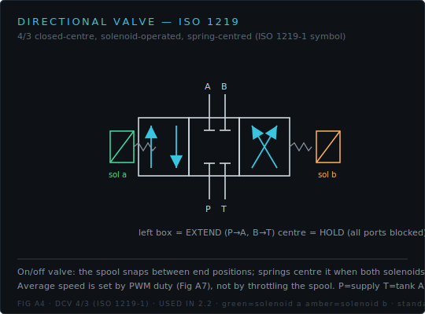
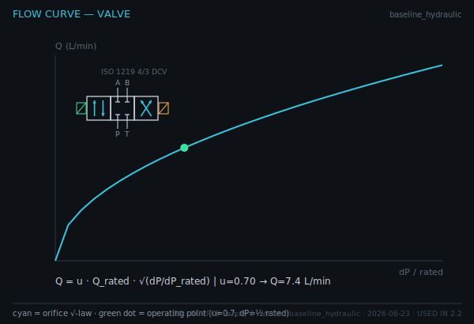
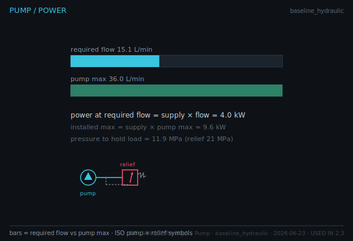

# Quiz 2 — Hydraulic Sizing

**Lessons** 2.1–2.4 · **Competency** C5 · **Artifact** Hydraulic Sizing Report
**Asset-grounded: 6 / 8**

Standards items use the committed ISO 1219 figures verbatim. Read the symbols and the exported plots.

---

## Questions

**1.** The cylinder below is drawn with the ISO 1219-1 symbol.

Which port (A or B) pressurises the **cap side**, and why does pressurising it produce the larger force? Reference the area annotation.

**2.** The directional valve is the ISO 1219 4/3 symbol.

Identify the **centre** position's behaviour and explain, from the symbol alone, what happens to a suspended load when both solenoids are de-energised.

**3.** Read the power-unit schematic.

State the function of the **pressure-relief valve** and explain what its **dashed line** represents in ISO 1219 notation.

**4.** From the force/area figure, explain why extend force (20.1 kN) exceeds retract force (14.0 kN) for the same supply pressure.

**5.** From the valve flow curve, read the flow at command u = 0.7 and ΔP = ½ rated. Why is the curve a square-root, not a straight line?

**6.** From the pump/power figure, the required flow at 0.20 m/s is 15 L/min and the pump maximum is 36 L/min. Is the pump saturated? What target speed would saturate it?

**7.** A load requires 23 MPa to hold, but the relief is set at 21 MPa. Using the HPU schematic, predict what happens and which fault the simulator would flag.

**8.** For bore 40 mm and rod 22 mm, compute the area ratio φ and state whether it meets the sizing rule φ ≤ 1.6.

---

## Answer key

**1.** **Port A** (cap side). The cap-side area A_cap (full bore, 1257 mm²) is larger than the rod-side annular area A_rod (877 mm²); since F = P·A, the same pressure on the larger area gives the larger force. _verifies: C5 · Hydraulic Sizing Report · Fig A3 (ISO 1219)_

**2.** Closed centre — all four ports blocked. With both solenoids off the springs centre the spool, so flow to and from the cylinder is blocked and the load is **hydraulically locked** (holds position). _verifies: C5 · Hydraulic Sizing Report · Fig A4 (ISO 1219)_

**3.** The relief valve caps system pressure: when pressure exceeds its setting (21 MPa) it opens to tank, protecting the circuit. The **dashed line** is the pilot line — it senses upstream pressure to actuate the valve against its spring. _verifies: C5 · Hydraulic Sizing Report · Fig A5 (ISO 1219)_

**4.** Extend uses the full-bore cap area (1257 mm²); retract uses the smaller annular area (877 mm²) because the rod occupies part of the piston face. F = P·A, so the larger cap area yields the larger force at equal pressure. _verifies: C5 · Hydraulic Sizing Report · Fig B4_

**5.** Q ≈ **7.4 L/min**. The orifice law is Q = u·Q_rated·√(ΔP/ΔP_rated); flow scales with the **square root** of pressure drop, so doubling ΔP increases flow by only √2. _verifies: C5 · Hydraulic Sizing Report · Fig B5_

**6.** Not saturated (15 < 36 L/min). Saturation occurs when required flow = target speed × A_cap exceeds 36 L/min → about **0.48 m/s** at this bore. _verifies: C5 · Hydraulic Sizing Report · Fig B6_

**7.** Pressure rises to the relief setting (21 MPa) and the relief opens to tank; the cylinder cannot generate the 23 MPa needed, so the load is not held — the simulator flags **OVER_PRESSURE** (demand exceeds relief). _verifies: C5 · Hydraulic Sizing Report · Fig A5 (fault diagnosis)_

**8.** A_cap = π/4·40² = 1257 mm²; A_rod = 1257 − π/4·22² = 877 mm²; φ = 1257/877 = **1.43 ≤ 1.6** ✓. _verifies: C5 · Hydraulic Sizing Report_
