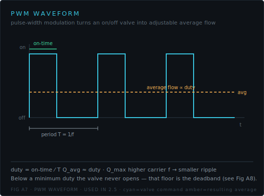
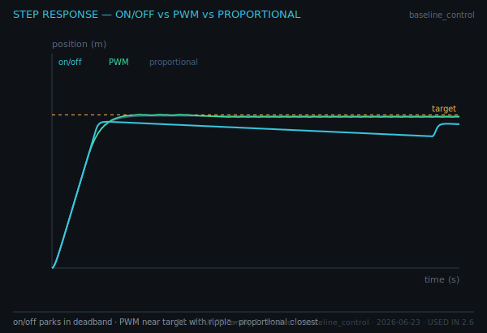

# Quiz 3 — PWM & Position Control

**Lessons** 2.5–2.6 · **Competencies** C6–C7 · **Artifacts** Duty-cycle characterization, Position-control demo
**Asset-grounded: 6 / 8**

This is the signature Path A content: position control with on/off valves via PWM. Read the symbol and the exported plots.

---

## Questions

**1.** The PWM concept is shown below.

Define **duty cycle** from the waveform and state how average flow depends on it.

**2.** From the duty-cycle characterization, identify the **deadband** and state what the actuator does for any duty below it.

**3.** Using the 4/3 DCV symbol below, explain how an **on/off** valve produces a *variable* average speed even though its spool only snaps between discrete positions.

**4.** The step response overlays three valve models.

Identify which trace is on/off, which is PWM, and which is proportional, and explain why the on/off trace plateaus short of the target line.

**5.** From Fig B8, the on/off final error is ≈ 11 mm versus ≈ 0.7 mm for proportional (~16×). Interpret what this ratio tells a designer choosing between valve types.

**6.** A position run with an on/off valve never settles — it oscillates about the target. Name the behaviour and its two causes.

**7.** If the PWM carrier frequency is increased, what happens to the position ripple, and why?

**8.** State the signature learning outcome: explain **how** on/off valves achieve position control via PWM and **one** fundamental limit versus a proportional valve.

---

## Answer key

**1.** Duty cycle = on-time / period (fraction of each cycle the valve is open). Average flow ≈ duty × Q_max, so commanding duty sets average speed. _verifies: C6 · Duty-cycle characterization · Fig A7_

**2.** The deadband is the duty range near zero where the curve stays at zero speed; below it the valve never opens long enough to move the actuator, so **no motion** occurs. _verifies: C6 · Duty-cycle characterization · Fig B7_

**3.** The spool snaps between EXTEND and RETRACT (or centre); by rapidly switching and varying the **fraction of time** spent open (PWM duty), the *time-averaged* flow — and thus average speed — is continuously adjustable. _verifies: C6 · Position-control demo · Fig A4 (ISO 1219)_

**4.** On/off = cyan (parks below target in its deadband); PWM = green (reaches target with tight ripple); proportional = ghost/grey (closest). On/off plateaus because once |error| < deadband the valve shuts off, leaving a residual ≈ the deadband. _verifies: C7 · Position-control demo · Fig B8_

**5.** The ~16× larger residual quantifies the accuracy cost of on/off control; a designer trades positioning precision for the lower cost/simplicity of on/off valves, choosing PWM modulation to recover much of the performance. _verifies: C7 · Position-control demo · Fig B8_

**6.** A **limit cycle**, caused by (1) the deadband/hysteresis switching and (2) load drift pushing the actuator back out of the band, so the valve repeatedly re-fires. _verifies: C7 · Position-control demo · (fault diagnosis)_

**7.** Ripple **decreases**: a higher carrier frequency means shorter on/off pulses, so the actuator (with its velocity lag) averages them more smoothly between switching events. _verifies: C6 · Duty-cycle characterization · Fig A7_

**8.** PWM modulates the on/off valve's time-in-state to set average speed, and a closed loop drives it toward the target; the fundamental limit is the residual **deadband** — an on/off valve cannot settle to zero error the way a proportional valve can. _verifies: C7 · Position-control demo (signature outcome)_
