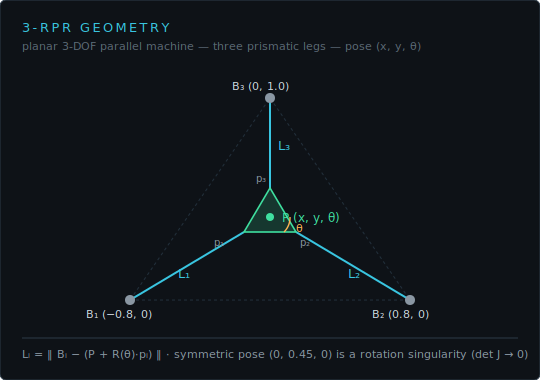
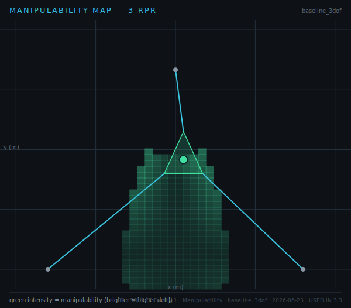
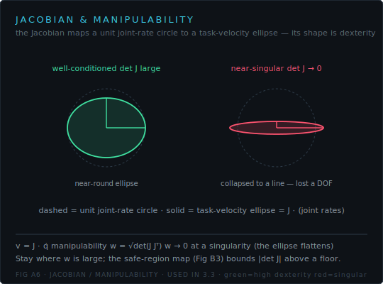
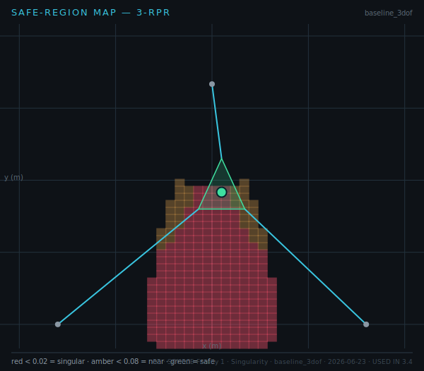

# Quiz 4 — 3-DOF Kinematics, Manipulability & Singularities

**Lessons** 3.1–3.4 · **Competencies** C10–C12 · **Artifacts** 3-DOF IK/FK, Manipulability map, Safe-region map
**Asset-grounded: 6 / 8**

Read the geometry, the concept diagram, and the two exported field maps.

---

## Questions

**1.** The 3-RPR geometry is shown below.

Name the three base anchors and the three platform attach points, and state which pose is the **rotation singularity** flagged in the figure.

**2.** The manipulability field was exported from the demo.

Where in the workspace is manipulability highest, and where does it collapse? What quantity is being mapped?

**3.** Interpret the velocity-ellipse concept.

What does a **flattened** (near-line) ellipse tell you about the machine's state at that pose?

**4.** The safe-region map colours the workspace by |det J|.

Identify the **red** region and state the |det J| floor that defines it.

**5.** At the symmetric home pose (0, 0.45, 0) the 3-DOF det J → 0. Explain what this does to controllability and why the course forbids parking there.

**6.** Why should a commanded path avoid the low-manipulability (amber/red) regions even if every pose on it is technically reachable?

**7.** The reference pose (0.05, 0.55, 0.10) gives det J = 0.0338, while (0, 0.45, 0) gives 0.0000. Interpret the difference for path planning.

**8.** A target lies in the amber band of the safe-region map. Is it safe to operate there continuously? Justify using the floor and the manipulability concept.

---

## Answer key

**1.** Anchors B₁(−0.8, 0), B₂(0.8, 0), B₃(0, 1.0); attach points p₁, p₂, p₃ on the moving platform. The symmetric pose **(0, 0.45, 0)** is the rotation singularity (det J → 0). _verifies: C10 · 3-DOF IK/FK · Fig A2_

**2.** Manipulability is highest in the central/off-symmetric region and collapses toward the singular configurations (symmetric pose, workspace edges). The map shows **w = √det(JJᵀ)** intensity (brighter = higher det J). _verifies: C11 · Manipulability map · Fig B2_

**3.** A flattened ellipse means the Jacobian maps unit joint rates to task velocity in essentially one direction only — the machine is **near-singular** and has effectively lost a controllable degree of freedom. _verifies: C11 · Manipulability map · Fig A6_

**4.** The red region is where |det J| < **0.02** (the safe-region floor) — singular/near-singular poses to be avoided. _verifies: C12 · Safe-region map · Fig B3_

**5.** With det J → 0 the Jacobian is non-invertible: finite task motion demands unbounded joint rates and one platform DOF becomes uncontrollable. Parking there risks loss of control, so the course bounds |det J| above the floor. _verifies: C12 · Safe-region map · (fault diagnosis)_

**6.** Near low-manipulability regions small task moves require large, fast leg motions; control becomes ill-conditioned and error/actuator effort spike — so paths stay in the high-manipulability interior. _verifies: C11,C12 · Manipulability / Safe-region maps_

**7.** 0.0338 is a well-conditioned pose (controllable, round-ish velocity ellipse); 0.0000 is the singularity. Plan paths through the higher-det J interior and route **around** the symmetric pose. _verifies: C10,C11 · 3-DOF IK/FK · Manipulability map_

**8.** Continuous operation in the amber band is risky: it is above the hard floor (0.02) but low-manipulability, so control is ill-conditioned. Acceptable to pass through briefly, not to dwell. _verifies: C12 · Safe-region map · Fig B3_
