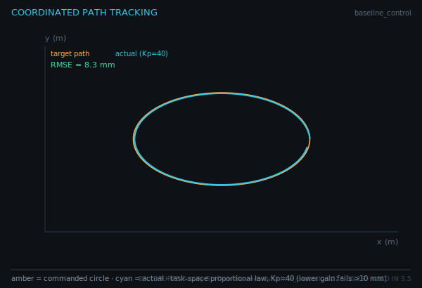

# Quiz 5 — Coordinated Control & Tuning

**Lessons** 3.5–3.6 · **Competencies** C13–C14 · **Artifacts** Coordinated / task-space runs, Tuned Control Report
**Asset-grounded: 5 / 8**

Read the exported tracking and tuning plots and reason about gain and settling.

---

## Questions

**1.** The coordinated tracking run is shown below.

The actual path (cyan) tracks the commanded circle (amber) with RMSE = 8.3 mm at Kp = 40. Does this meet the ≤ 10 mm acceptance threshold? What does the gap between the curves represent?

**2.** At Kp = 20 the same path gives RMSE = 15.8 mm (fail); at Kp = 40 it gives 8.3 mm (pass). Explain why raising the gain improves tracking here, and name one risk of raising it too far.

**3.** The tuned response is shown below.

Interpret the annotated settling time (0.48 s) and the ripple relative to the ±2% band.

**4.** Why is the **PWM** model used for the "tuned response" rather than the on/off model? Tie your answer to what "settling" requires.

**5.** A coordinated run shows good tracking on the slow arcs but large lag on the fast portion of the path. Diagnose the likely cause and a fix.

**6.** What two quantities define a "tuned" response in the Tuned Control Report, and what are their acceptance bounds?

**7.** When is task-space (coordinated) control necessary rather than independent joint-space control? Give a concrete PKM example.

**8.** Using the tracking log (B9 CSV), describe how you would locate the point of maximum tracking error along the circle.

---

## Answer key

**1.** Yes — 8.3 mm ≤ 10 mm passes. The gap between commanded and actual is the **tracking error** (the controller lagging the moving setpoint). _verifies: C13 · Coordinated runs · Fig B9_

**2.** Higher proportional gain produces a larger corrective command for the same error, so the actual path follows the moving target more tightly. Too-high gain risks overshoot, oscillation/limit cycling, and actuator saturation. _verifies: C13 · Coordinated runs · (fault diagnosis)_

**3.** The PWM controller reaches the target in 0.48 s and holds inside the ±2% settling band with ≈ 0.1 mm ripple — a well-tuned, settled response. _verifies: C14 · Tuned Control Report · Fig B10_

**4.** "Settling" means staying within a tight tolerance (±2%); an on/off valve's deadband limit cycle (~8 mm) exceeds that tolerance, so it can never "settle" by this definition. PWM modulates the on/off valve finely enough to settle, so it is the model that can actually be tuned. _verifies: C14 · Tuned Control Report · Fig B10_

**5.** The setpoint moves fastest on the fast portion, so a fixed gain that suffices on slow arcs lags there; raise the gain (toward Kp = 40) or add feed-forward of the path velocity. _verifies: C13 · Coordinated runs · (fault diagnosis)_

**6.** Settling time (≤ 2.5 s) and limit-cycle amplitude (≤ the deadband bound). Both must pass for the response to count as tuned. _verifies: C14 · Tuned Control Report_

**7.** When the platform must follow a Cartesian path/orientation (e.g., a straight edge or circle), independent joint loops do not coordinate the legs to keep the end-effector on the path — task-space control closes the loop on the pose, as in the circle-tracking run. _verifies: C13 · Coordinated runs_

**8.** Compute the per-sample error √((tx−px)² + (ty−py)²) from the log columns and find its maximum; the corresponding timestamp/angle locates the worst point (typically where the path is fastest). _verifies: C13 · Coordinated runs · Fig B9 (log)_
