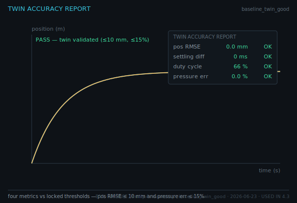
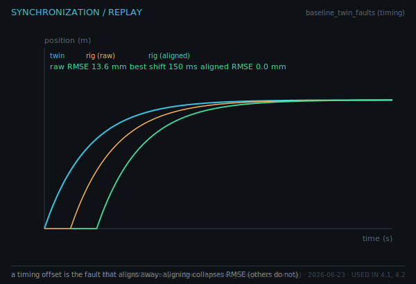

# Quiz 6 — Twin Validation & Discrepancy Diagnosis

**Lessons** 4.1–4.4 · **Competencies** C15–C16 · **Artifacts** Twin Accuracy Report, Twin Discrepancy Analysis, Integrated 3-DOF system
**Asset-grounded: 7 / 8**

This is the capstone skill: validate the twin, then **explain** the discrepancy. Read the exported plots and the diagnostic signatures.

---

## Questions

**1.** A twin-vs-rig overlay is shown below.

Is this twin well-matched to the rig? State the evidence you used.

**2.** The accuracy report is shown below.

Does the twin pass validation? Quote the two threshold criteria it is judged against.

**3.** The synchronization view is shown below.

Why does time-aligning the logs collapse the RMSE almost to zero, and which fault does that behaviour uniquely identify?

**4.** The discrepancy signatures are catalogued below.

Match each signature to its cause: (a) constant position offset, (b) error that grows with travel, (c) large hold ripple, (d) pressure error only, (e) error that vanishes after time-alignment.

**5.** A rig log gives pos RMSE = 18 mm and pressure error = 0%, with the position error roughly **constant** across the whole stroke. Diagnose the cause and justify.

**6.** Another log gives pressure error = 20% but position RMSE ≈ 0. Diagnose the cause.

**7.** Distinguish **model comparison** from **model validation**, and explain why "explain the discrepancy" — not just "measure RMSE" — is the engineering skill the Twin Discrepancy Analysis assesses.

**8.** What must be true for an integrated 3-DOF system to be declared **validated** at the final? List the conditions.

---

## Answer key

**1.** Yes — the twin and rig position traces overlay almost exactly (pos RMSE ≈ 0 mm, pressure error ≈ 0%), so the model reproduces the rig. _verifies: C15 · Twin Accuracy Report · Fig B11_

**2.** Pass — both criteria are met: **position RMSE ≤ 10 mm** and **pressure error ≤ 15%**. _verifies: C15 · Twin Accuracy Report · Fig B13_

**3.** A timing offset shifts the whole rig trace in time; cross-correlating and applying the best shift re-aligns them, collapsing RMSE. Only a **timing mismatch** has this "aligns-away" fingerprint — the other faults are not removed by time alignment. _verifies: C16 · Twin Discrepancy Analysis · Fig B12_

**4.** (a) **geometry** (wrong anchor → constant offset); (b) **sensor scaling** (error ∝ travel); (c) **deadband mismatch** (hold ripple); (d) **pressure model mismatch** (pressure-only error); (e) **timing mismatch** (aligns away). _verifies: C16 · Twin Discrepancy Analysis · Fig B14_

**5.** **Wrong geometry.** A constant position offset with no pressure error is the geometry signature (a wrong anchor/length shifts every point by the same amount); sensor scaling would grow with travel, deadband would show hold ripple. _verifies: C16 · Twin Discrepancy Analysis · (log)_

**6.** **Pressure-model mismatch.** Position tracks correctly while only the pressure prediction is off — the pressure-only signature. _verifies: C16 · Twin Discrepancy Analysis · (log)_

**7.** Comparison reports *how far apart* twin and rig are (a number); validation explains *why* and whether the model is fit for purpose. Naming the cause from its signature — geometry, sensor, deadband, pressure, or timing — is the diagnostic engineering skill, which is what the Twin Discrepancy Analysis grades. _verifies: C16 · Twin Discrepancy Analysis · Fig A10_

**8.** The 3-DOF twin must (1) synchronise with the rig log, (2) pass the accuracy thresholds (RMSE ≤ 10 mm, pressure ≤ 15%), and (3) have any residual discrepancy diagnosed/explained — i.e., a passing Twin Accuracy Report plus a Twin Discrepancy Analysis for what remains. _verifies: C16 · Integrated 3-DOF system_
