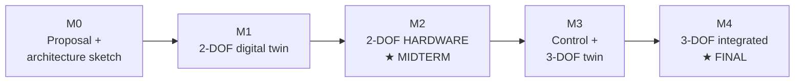

# Gate 1 — Curriculum Architecture Review

**Stage-gate status:** Gate 0.1 approved (**Option B — Fluid Power core**, with five
modifications). Gate 1 submitted for review. **No lessons, notebooks, quizzes, figures, or
demos are generated here** — this is module-level architecture only.

## Approved identity (Gate 0, as revised by the five modifications)

> **Mission.** Students design, simulate, build, control, and evaluate **electrohydraulic
> parallel robots using digital twins**, with **Physical AI presented as an advanced
> extension and future direction.**

Baked-in rules from the modifications:

1. **Module 4 renamed** to **"System Integration and Advanced Applications."**
2. **The digital twin is a required engineering competency, not optional software** — it
   appears in **every** module.
3. **Every module carries a "Future Directions / Physical AI Connection" section** — keeps
   Physical AI visible **without** making RL / vision / autonomy required outcomes.
4. **Hardware reality (confirmed working basis):** physical **2-DOF build (midterm)** and
   **3-DOF build (final)** on an **instructor-provided kit** — hydraulic power pack,
   cylinders, **DCVs**. *(Still listed YELLOW until formally locked; see Risk note.)*
5. **Mission revised** as above (identity conflict removed).

**The four alignment anchors.** Every module must advance at least one of:
**(A) the 2-DOF midterm build · (B) the 3-DOF final build · (C) the digital twin ·
(D) system integration.** Any module that cannot is flagged for redesign/removal below.

---

## Deliverable 1 — Module structure (M0–M4)

| Module | Purpose | Core topics *(introduced only as the project needs them)* | Digital-twin role (required) | Deliverable |
|---|---|---|---|---|
| **M0 — The Machine & the Digital Twin** | Orient: show the destination, fluid-power systems thinking, the project roadmap | What a PKM is; fluid-power system overview; the digital-twin concept; the build plan | First exposure: students see the twin they will build, and why twin-first | Project proposal + machine architecture sketch |
| **M1 — Create the 2-DOF Digital Twin** | Build the simulator before hardware | Coordinate systems, IK, FK, workspace analysis | **This module *is* the twin build** for 2-DOF | Working 2-DOF digital twin (IK/FK + workspace map) |
| **M2 — Electrohydraulic Actuation & the Physical 2-DOF Build** ⟵ *midterm* | The fluid-power core; size and build the real machine | Cylinders, valves (DCV + proportional), flow & pressure, power units, sensors | Twin validates sizing & behavior before/with the rig; twin-vs-rig comparison | **Working 2-DOF hardware system (midterm)** |
| **M3 — Control & Extension to 3-DOF** | Close the loop; extend to 3 DOF | Jacobian, manipulability, singularities, coordinated / task-space control, 3-RPR kinematics, tuning | Tune control in the twin first; build the 3-DOF twin | Tuned closed-loop control + 3-DOF digital twin |
| **M4 — System Integration and Advanced Applications** ⟵ *final* | Integrate, validate, evaluate; build 3-DOF; optional advanced | Digital-twin synchronization · validation & verification · performance evaluation · **Physical AI extensions** · vision / learning control *(optional)* | Twin↔hardware synchronization; twin as validation oracle & performance benchmark | **Integrated, validated 3-DOF system (final)** |

*Every module also carries a "Future Directions / Physical AI Connection" section per rule 3.*

---

## Deliverable 2 — Project milestone map

| Milestone | Module | Type | Build target |
|---|---|---|---|
| Project proposal & architecture | M0 | Gate | — |
| 2-DOF digital twin complete | M1 | Twin | 2-DOF |
| **2-DOF hardware commissioned — MIDTERM** | M2 | Hardware | 2-DOF |
| Closed-loop control + 3-DOF twin | M3 | Twin + control | 3-DOF |
| **3-DOF integrated & validated — FINAL** | M4 | Integration | 3-DOF |

---

## Deliverable 3 — Dependency map

| Module | Requires (from) | Provides (to) |
|---|---|---|
| M0 | — | spec, machine architecture → M1, M2 |
| M1 | M0 spec | IK/FK, workspace, the twin → M2, M3 |
| M2 | M1 twin (to size & validate) | hydraulic sizing, the physical 2-DOF rig → M3, M4 |
| M3 | M1 kinematics + M2 hydraulics/rig | control, Jacobian/singularity, 3-DOF twin → M4 |
| M4 | M1–M3 (twin, rig, control) | integrated/validated 3-DOF system, performance data |

No forward dependencies; the chain is strictly M0→M1→M2→M3→M4. Kinematics (M1) and
hydraulics (M2) are introduced **before** the control that needs them (M3), and the twin
(M1) precedes every hardware activity.

---

## Deliverable 4 — Curriculum map (module-level audit)

| Module | Milestone supported | Deliverable produced | Simulator feature used | Hardware activity | Assessment method |
|---|---|---|---|---|---|
| M0 | Kickoff → digital twin (C) | Proposal + architecture sketch | Preset machine demo (read-only viz) | Identify the kit (power pack, cylinders, DCVs) | Proposal rubric |
| M1 | 2-DOF build (A) + twin (C) | 2-DOF digital twin | Kinematics (2-DOF IK/FK), workspace/reachability, kinematics-explorer viz | none (twin-first) | Twin functionality check + workspace map |
| M2 | 2-DOF build (A) — **midterm** | 2-DOF hardware system | Hydraulics (cylinder/valve/pump), faults, logger | Assemble & commission power pack, cylinders, DCVs, sensors | **Midterm:** working prototype + sizing justification + twin-vs-rig |
| M3 | 3-DOF build (B) + twin (C) | Tuned control + 3-DOF twin | Kinematics (3-DOF), Jacobian, control (PID/trajectory), singularity fault, grading | Closed-loop control of the 2-DOF rig | Control meets spec (sim + rig); 3-DOF twin verified |
| M4 | System integration (D) + 3-DOF build (B) — **final** | Integrated validated 3-DOF system | Logger/trace/schema (sync), grading (V&V), full stack | 3-DOF assembly, integration, validation | **Final:** integrated system + performance/validation report (+ optional AI extension) |

---

## Deliverable 5 — Simulator alignment map

| Curriculum activity | Simulator capability | Status |
|---|---|---|
| 2-DOF IK/FK, workspace | `kinematics2dof`, reachability, heatmap viz | ✅ supported |
| Hydraulic sizing (cylinder/valve/pump/power) | `hydraulics` (cylinder, valve, pump models) | ✅ supported |
| Closed-loop control & tuning | `control` (PID, anti-windup, trajectory), grading metrics | ✅ supported |
| 3-DOF kinematics, Jacobian, singularity | `kinematics3dof`, Jacobian, singularity fault detector | ✅ supported |
| Validation / grading | `logger`, `schema`, `trace`, `grading` rubric | ✅ supported |
| **Twin ↔ hardware synchronization (M4)** | logging/replay exists; **live HIL sync interface does not** | ⚠️ **partial — needs definition** |
| **DCV (directional control valve) behavior** | simulator models **proportional** valves | ⚠️ **gap — hardware kit uses DCVs; confirm valve type & add a DCV mode if needed** |
| Physical AI (vision / learning) extensions | not modeled (by design — optional elective) | ➖ out of core scope |

**Unused simulator features:** none material — the engine's modules all map to a milestone.
**Missing support:** (1) live twin↔hardware sync interface; (2) a DCV valve mode if the kit
uses simple directional (not proportional) valves. **Redundant features:** none identified.

---

## Orphan check — every module ties to an anchor

| Module | A: 2-DOF build | B: 3-DOF build | C: digital twin | D: integration | Orphan? |
|---|:---:|:---:|:---:|:---:|:---:|
| M0 | ○ (sets up) | | ● | | **No** |
| M1 | ● | | ● | | **No** |
| M2 | ● | | ○ (validate) | | **No** |
| M3 | | ● | ● | | **No** |
| M4 | | ● | ○ (sync) | ● | **No** |

**No orphan modules. No theory-only modules.** Every module advances at least one anchor.

---

## Gate 1 dashboard

**Alignment:** Project-based **100 %** (5/5 modules tied to an anchor) · Digital-twin
presence **100 %** (every module) · Fluid-power core **GREEN** · Physical AI **contained**
(optional M4 + per-module "Future Directions" only).

**Risk register:**

| Risk | Level | Note |
|---|---|---|
| Twin↔hardware sync interface undefined | **MEDIUM** | Needed for M4; engine has logging/replay but no live HIL |
| DCV vs proportional-valve mismatch (sim vs kit) | **MEDIUM** | Confirm kit valve type; may need a sim DCV mode |
| Hardware kit not yet formally locked | **YELLOW** | Working basis per modification 4; confirm to close |
| Student cohort level | **YELLOW** | Affects Gate 2 lesson depth |

**No RED items.**

---

## Decision requested

Approve **Gate 1** (this module architecture + the five maps), or mark changes. On
approval, **Gate 2 (Learning Progression Review)** will, for each module, define the
lessons — each with: learning objective · project milestone supported · artifact produced ·
simulator feature used · hardware activity · assessment method — and any lesson that does
not produce project progress will be redesigned or cut **before** content is written.

Two items I recommend confirming alongside Gate 1 approval (both currently MEDIUM/YELLOW):
the **valve type in the kit** (DCV vs proportional) and whether **live twin↔hardware sync**
is in scope for M4 or a future extension.
